<div class="MCWHeader1">
OSS PaaS and DevOps
</div>

<div class="MCWHeader2">
Hands-on lab step-by-step
</div>

<div class="MCWHeader3">
April 2018
</div>

Information in this document, including URL and other Internet Web site references, is subject to change without notice. Unless otherwise noted, the example companies, organizations, products, domain names, e-mail addresses, logos, people, places, and events depicted herein are fictitious, and no association with any real company, organization, product, domain name, e-mail address, logo, person, place or event is intended or should be inferred. Complying with all applicable copyright laws is the responsibility of the user. Without limiting the rights under copyright, no part of this document may be reproduced, stored in or introduced into a retrieval system, or transmitted in any form or by any means (electronic, mechanical, photocopying, recording, or otherwise), or for any purpose, without the express written permission of Microsoft Corporation.

Microsoft may have patents, patent applications, trademarks, copyrights, or other intellectual property rights covering subject matter in this document. Except as expressly provided in any written license agreement from Microsoft, the furnishing of this document does not give you any license to these patents, trademarks, copyrights, or other intellectual property.

The names of manufacturers, products, or URLs are provided for informational purposes only and Microsoft makes no representations and warranties, either expressed, implied, or statutory, regarding these manufacturers or the use of the products with any Microsoft technologies. The inclusion of a manufacturer or product does not imply endorsement of Microsoft of the manufacturer or product. Links may be provided to third party sites. Such sites are not under the control of Microsoft and Microsoft is not responsible for the contents of any linked site or any link contained in a linked site, or any changes or updates to such sites. Microsoft is not responsible for webcasting or any other form of transmission received from any linked site. Microsoft is providing these links to you only as a convenience, and the inclusion of any link does not imply endorsement of Microsoft of the site or the products contained therein.
© 2018 Microsoft Corporation. All rights reserved.

Microsoft and the trademarks listed at https://www.microsoft.com/en-us/legal/intellectualproperty/Trademarks/Usage/General.aspx are trademarks of the Microsoft group of companies. All other trademarks are property of their respective owners.

**Contents**

<!-- TOC -->

- [OSS PaaS and DevOps hands-on lab step-by-step](#oss-paas-and-devops-hands-on-lab-step-by-step)
    - [Abstract and learning objectives](#abstract-and-learning-objectives)
    - [Overview](#overview)
    - [Solution architecture](#solution-architecture)
    - [Requirements](#requirements)
    - [Exercise 1: Run starter application](#exercise-1-run-starter-application)
        - [Task 1: Connect to your Lab VM](#task-1-connect-to-your-lab-vm)
        - [Task 2: Grant permissions to Docker](#task-2-grant-permissions-to-docker)
        - [Task 3: Integrate GitHub into VS Code](#task-3-integrate-github-into-vs-code)
        - [Task 4: Clone the starter application](#task-4-clone-the-starter-application)
        - [Task 5: Launch the starter application](#task-5-launch-the-starter-application)
    - [Exercise 2: Migrate the database to Cosmos DB](#exercise-2-migrate-the-database-to-cosmos-db)
        - [Task 1: Provision Cosmos DB using the MongoDB API](#task-1-provision-cosmos-db-using-the-mongodb-api)
        - [Task 2: Update database connection string](#task-2-update-database-connection-string)
        - [Task 3: Pre-create and scale collections](#task-3-pre-create-and-scale-collections)
        - [Task 4: Import data to the API for MongoDB using mongoimport](#task-4-import-data-to-the-api-for-mongodb-using-mongoimport)
        - [Task 5: Install Azure Cosmos DB extension for VS Code](#task-5-install-azure-cosmos-db-extension-for-vs-code)
        - [Task 6: Decrease collection throughput](#task-6-decrease-collection-throughput)
    - [Exercise 3: Containerize the app](#exercise-3-containerize-the-app)
        - [Task 1: Create an Azure Container Registry](#task-1-create-an-azure-container-registry)
        - [Task 2: Install Docker extension in VS Code](#task-2-install-docker-extension-in-vs-code)
        - [Task 3: Create Docker image and run the app](#task-3-create-docker-image-and-run-the-app)
        - [Task 4: Run the containerized App](#task-4-run-the-containerized-app)
        - [Task 5: Push image to Azure Container Registry](#task-5-push-image-to-azure-container-registry)
    - [Exercise 4: Set up Web App for Containers](#exercise-4-set-up-web-app-for-containers)
        - [Task 1: Provision Web App for Containers](#task-1-provision-web-app-for-containers)
        - [Task 2: Navigate to the deployed app](#task-2-navigate-to-the-deployed-app)
    - [Exercise 5: Configure CI/CD pipeline](#exercise-5-configure-cicd-pipeline)
        - [Task 1: Prepare GitHub account for service integrations](#task-1-prepare-github-account-for-service-integrations)
        - [Task 2: Configure Continuous Integration (CI) with Jenkins](#task-2-configure-continuous-integration-ci-with-jenkins)
        - [Task 3: Trigger CI build](#task-3-trigger-ci-build)
        - [Task 4: Create Free Visual Studio Team Services Account](#task-4-create-free-visual-studio-team-services-account)
        - [Task 5: Create a VSTS personal access token](#task-5-create-a-vsts-personal-access-token)
        - [Task 6: Configure Jenkins for Team Services integration](#task-6-configure-jenkins-for-team-services-integration)
        - [Task 7: Create a Jenkins service endpoint is VSTS](#task-7-create-a-jenkins-service-endpoint-is-vsts)
        - [Task 8: Create a Team Services release definition](#task-8-create-a-team-services-release-definition)
        - [Task 9: Trigger CI/CD pipeline](#task-9-trigger-cicd-pipeline)
    - [Exercise 6: Create Azure Function for order processing](#exercise-6-create-azure-function-for-order-processing)
        - [Task 1: Provision a Function App](#task-1-provision-a-function-app)
        - [Task 2: Configure storage queues](#task-2-configure-storage-queues)
        - [Task 3: Create Cosmos DB trigger function](#task-3-create-cosmos-db-trigger-function)
        - [Task 4: Create Queue function](#task-4-create-queue-function)
    - [Exercise 7: Create Logic App for sending SMS notifications](#exercise-7-create-logic-app-for-sending-sms-notifications)
        - [Task 1: Create Free Twilio account](#task-1-create-free-twilio-account)
        - [Task 2: Create Logic App](#task-2-create-logic-app)
    - [After the hands-on lab](#after-the-hands-on-lab)
        - [Task 1: Delete Azure resource groups](#task-1-delete-azure-resource-groups)
        - [Task 2: Delete WebHooks and Service Integrations](#task-2-delete-webhooks-and-service-integrations)
    - [Appendix A: Lab VM setup](#appendix-a-lab-vm-setup)
        - [Task 1: Create VM config script](#task-1-create-vm-config-script)
        - [Task 2: Create a Linux virtual machine](#task-2-create-a-linux-virtual-machine)

<!-- /TOC -->


# OSS PaaS and DevOps hands-on lab step-by-step

## Abstract and learning objectives

This workshop is designed to help students gain a better understanding of how to integrate and deploy complex Open Source Software (OSS) workloads into Azure PaaS. Attendees will migrate an existing MERN (MongoDB, Express.js, React.js, Node.js) stack application from a hosted environment into Azure PaaS services, and fully embrace modern DevOps tools.

Attendees will learn how to:

-   Provision Web App for Containers for hosting OSS applications

-   Migrate a MongoDB instance into Cosmos DB

-   Implement serverless technologies, such as Logic Apps and Azure Functions, to enhance OSS app functionality

-   Provision an Azure Container Registry

-   Build Docker images and push them into the Azure Container Registry

-   Enable continuous deployment with Jenkins and Visual Studio Team Services (VSTS)

## Overview

Best For You Organics Company is one of the leading health food suppliers in North America, serving customers in Canada, Mexico, and the United States. They have a MERN stack web application which they host on-premises and are looking to migrate their OSS application into Azure. They will be creating a custom Docker image for their application and using a Jenkins and Visual Studio Team Services (VSTS) continuous integration/continuous delivery (CI/CD) pipeline to deploy the application into a Web App for Containers instance. In addition, they will be setting up Azure Cosmos DB, and using the MongoDB APIs, so they do not have to make application code changes to leverage the power of Cosmos DB.

In this hands-on lab, you will assist with completing the OSS application and database migrations into Azure. You will create a custom Docker image, provision an Azure Container Registry, push the image to the registry, and configure the CI/CD pipeline to deploy the application to a Web App for Containers instance. You will also help them implement functionality enhancements using serverless architecture.

## Solution architecture

Below is a diagram of the solution architecture you will build in this lab. Please study this carefully, so you understand the whole of the solution as you are working on the various components.

![This diagram consists of icons that are connected by arrows. On the left, the Developer icon (VS Code) points in a linear fashion to GitHub Repo, Jenkins, and the VSTS icons. The previous three icons are enclosed in a box labeled CI/CD Pipeline. VSTS points to Web App for Containers on the right. Various arrows point from Web App for Container to: Azure Container Registry (a double-sided arrow); Logic Apps (a linear arrow that also points from Logic Apps to Customers); Customers (a linear arrow); and Azure Cosmos DB (a double-sided arrow that also points from Azure Cosmos DB to Azure Functions with another double-sided arrow).](images/Hands-onlabstep-bystep-OSSPaaSandDevOpsimages/media/image2.png "Solution architecture diagram")

The solution begins with developers using Visual Studio Code (VS Code) as their code editor, so they can leverage its rich integration with GitHub, Docker, and Azure. From a high level, developers will package the entire OSS application inside a custom Docker container using the Docker extension in VS Code. The image will be pushed to an Azure Container Registry as part of a continuous integration/continuous delivery (CI/CD) pipeline using GitHub, Jenkins, and Visual Studio Team Services (VSTS). This Docker image will then be deployed to a Web App for Containers instance, as part of their continuous delivery process using Release Management in VSTS.

The MongoDB database will be imported into Azure Cosmos DB, using mongoimport.exe, and access the database from the application will continue to use the MongoDB APIs. The database connection string in the application will be updated to point to the new Cosmos DB.

Serverless architecture will be applied to order processing and customer notifications. Azure Functions will be used to automate the processing of orders. Logic Apps will be applied to send SMS notifications, via a Twilio connector, to customers informing them that their order has been processed and shipped.

## Requirements

1.  Microsoft Azure subscription must be pay-as-you-go or MSDN

    -   Trial subscriptions will *not* work

2.  Linux virtual machine configured with:

    -   Visual Studio Code

    -   Azure CLI

    -   Docker

    -   Node.js and npm

    -   MongoDB Community Edition


## Exercise 1: Run starter application

Duration: 30 minutes

In this exercise, you will create a local copy of the starter application on your Lab VM, add some sample data to the local MongoDB database, and run the application.

### Task 1: Connect to your Lab VM

In this task, you will create an RDP connection to your Lab VM. If you are already connected, skip to [Task 2](#task-2-grant-permissions-to-docker).

1.  Navigate to the Azure portal and select **Resource groups** from the left-hand menu, then select the **hands-on-lab-SUFFIX resource group** from the list. If there are too many, enter "hands-on-lab" into the filter box to reduce the resource groups displayed the list. 
    
    

2.  Next, select **LabVM** from the list of available resources. 
    
    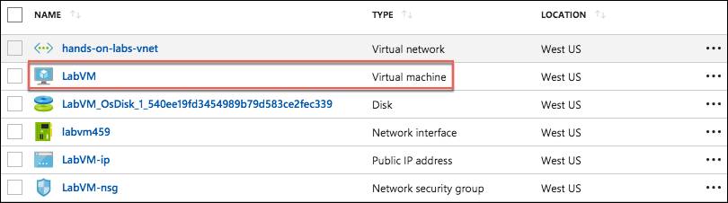

3.  On the **LabVM** blade, copy the Public IP address from the Essentials area on the Overview screen. 
    
    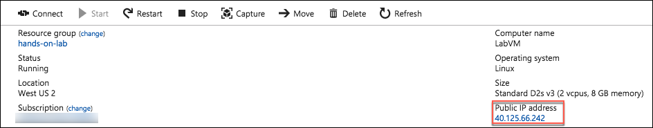

4.  Open a Remote Desktop Client (RDP) application and enter or paste the Public IP address of your Lab VM into the computer name field.

5.  Select **Connect** on the Remote Desktop Connection dialog.

6.  Select **Yes** to connect, if prompted that the identity of the remote computer cannot be verified.
    
    

7.  Enter the following credentials (or the non-default credentials if you changed them):

    -   **User name:** demouser

    -   **Password:** Password.1!!

        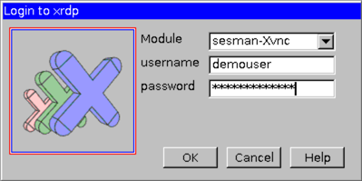

8.  Select **OK** to log into the Lab VM.

### Task 2: Grant permissions to Docker

In this task, you will grant permissions to the demouser account to access the Unix socket needed to communicate with the Docker engine.

1.  On your Lab VM, open a bash shell.

2.  At the command prompt, enter the following command:
    ```
    sudo usermod -a -G docker $USER
    ```

3.  After running the command, you will need **completely log out of the Lab VM** and log back in (if in doubt, reboot).

4.  After logging back in, run the following command to test that the demouser account has proper permissions:
    ```
    docker run hello-world
    ```

    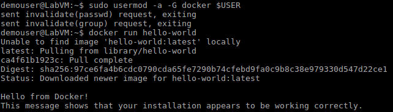

### Task 3: Integrate GitHub into VS Code

In this task, you will install the GitHub extension in VS Code, and configure a service integration with your GitHub account. This integration will allow you to push your code changes to GitHub directly from VS Code.

1.  On your Lab VM, open **VS Code**.

2.  In VS Code, select the **Extensions** icon from the left-hand menu, enter "github" into the **Extensions** search box, and select the **GitHub** extension.
    
    

3.  Select **Install** in the Extension: GitHub window. 
    
    

4.  Close VS Code. Note: VS Code must be restarted to enable the extension.

5.  To connect VS Code with your GitHub account, you need to generate a Personal access token.

6.  Open a browser window and navigate to your GitHub account (<https://github.com>).

7.  Within your GitHub account, select **your user profile icon** in the top right, then select **Settings** from the menu.

    

8.  On the Settings screen, select **Developer settings** at the bottom of the Personal settings menu on the left-hand side of the screen.

    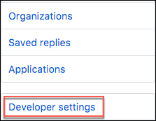

9.  On the Developer settings page, select **Personal access tokens** from the left-hand menu. 
    
    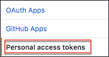

10. Select **Generate new token**. 
    
    

11. Enter a token description, such as "VS Code Integration", and check the box next to **repo** under **Select scopes**. This will select all the boxes under it. 
    
    

12. Select **Generate token** near the bottom of the screen.

    

13. Select the **copy** button next to the token that is generated. Make sure you copy the new personal access token before you navigate away from the screen, or you will need to regenerate the token. 
    
    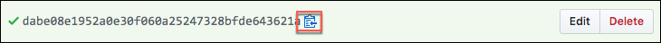

14. Open **VS Code** on your Lab VM.

15. Select the **View** menu, then select **Command Palette...** from the menu. 
    
    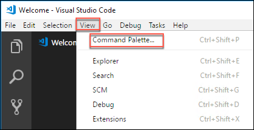

16. In the box that appears at the top center of the VS Code window, enter "Set Personal Access Token," then select **GitHub: Set Personal Access Token**, when it appears. 
    
    

17. Paste the Personal access token you copied from GitHub into the box, and press **Enter**.
    
    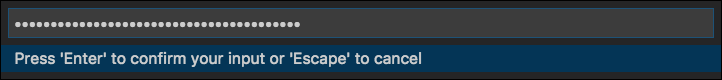

18. VS Code is now connected to your GitHub account.

19. Close VS Code.

### Task 4: Clone the starter application

In this task, you will clone the starter application, creating a local copy on your Lab VM.

1.  On your Lab VM, open a browser, and navigate to your GitHub account. (<https://github.com>)

2.  Within your GitHub account, navigate to the forked copy of the *mcw-oss-paas-devops* application page, select **Clone or download**, then select the **copy** link next to the web URL.

    

3.  Open a new bash shell, and enter the following command:
    ```
    cd ~
    ```

4.  Next, enter the following command, replacing \[EMAIL\] with the email address you used when creating your GitHub account. This will associate your git username with the commits made from the Lab VM.
    ```
    git config --global user.email "[EMAIL]"
    ```

    

5.  At the prompt, enter the following command, replacing \[CLONE\_URL\] with URL you copied from GitHub in step 2 above:
    ```
    git clone [CLONE_URL]
    ```

    

6.  Now, change the directory to the cloned project by entering the following at the prompt:
    ```
    cd mcw-oss-paas-devops
    ```

    

7.  Finally, issue a command to open the starter project in VS Code by typing:
    ```
    code .
    ```

8.  A new VS Code window will open, with the mcw-oss-paas-devops folder opened. 
    
    

9.  You are now ready to begin working with the project in VS Code.

### Task 5: Launch the starter application

In this task, you will seed the MongoDB with sample data, then run the application locally, connected to your MongoDB instance. This task is to verify the connection to MongoDB and that it contains the seeded plan data, before we migrate the application and data to Azure Cosmos DB.

1.  Return to VS Code, select **View** from the menu, and select **Integrated Terminal**. 
    
    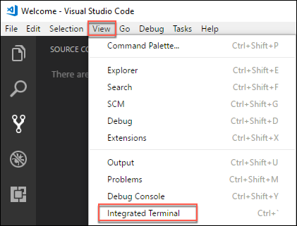

2.  This will open a new bash terminal window at the bottom of the VS Code dialog.

3.  At the bash prompt, enter:
    ```
    npm install
    ```

    

4.  Next, enter the following to seed the local MongoDB database with plans, user accounts, and orders.
    ```
    node data/Seed.js
    ```

    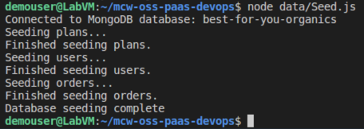

5.  Next, build the application using the following:
    ```
    npm run build
    ```

6.  Finally, enter the following to launch the application.
    ```
    npm start
    ```

7.  Open a browser and navigate to <http://localhost:3000> to view the landing page of the starter application. You will see three plans listed on the application home page, which are pulled from the local MongoDB database.
    
    

8.  Return to the VS Code integrated terminal window, and press **CTRL+C** to stop the application.

## Exercise 2: Migrate the database to Cosmos DB

Duration: 30 minutes

In this exercise, you will provision an Azure Cosmos DB account, and then update the starter application's database connection string to point to your new Azure Cosmos DB account. You will then, use *mongoimport.exe* to migrate the data in your MongoDB database into Cosmos DB collections, and verify with the application that you are connected to your Cosmos DB database.

### Task 1: Provision Cosmos DB using the MongoDB API

In this task, you will provision a new Azure Cosmos DB account using the MongoDB API.

1.  In the Azure portal, select **+Create a resource**, **Databases**, the select **Azure Cosmos DB**. 
    
    

2.  On the **Azure Cosmos** **DB** blade, enter the following:

    -   **ID**: Enter "best-for-you-db-SUFFIX," where SUFFIX is your Microsoft alias, initials, or another value to ensure the name is unique (indicated by a green check mark).

    -   **API:** Select **MongoDB**.

    -   **Subscription:** Select the subscription you are using for this hands-on lab.

    -   **Resource Group:** Select **Use existing** and choose the **hands-on-lab-SUFFIX resource group** you created previously.

    -   **Location:** Select a location near you from the list (Note: not all locations are available for Cosmos DB)

    -   **Enable geo-redundancy:** Unchecked

    -   Select **Create** to provision the new Azure Cosmos DB account 
    
    

### Task 2: Update database connection string

In this task, you will retrieve the connection string for your Azure Cosmos DB database and update the starter application's database connection string.

1.  When your Cosmos DB account is provisioned, navigate to it in the Azure portal.

2.  On the **Azure Cosmos DB account** blade, select **Connection String** under **SETTINGS** in the left-hand menu, and copy the **PRIMARY connection string**.
    
    

3.  Return to VS Code.

4.  Open app.js from the root directory of the application and locate the line that starts with var **databaseUrl**.
    
    

5.  Replace the value of the **databaseUrl** variable with the Cosmos DB connection string you copied from the Azure portal.
    
    

6.  Scroll to the end of the value you just pasted in and locate **10255/?ssl=** in the string.
    
    

7.  Between the "/" and the "?" insert **best-for-you-organics** to specify the database name.
    
    

8.  Save **app.js**.

9.  In the VS Code integrated terminal, enter the following command to rebuild the application.
    ```
    npm run build
    ```

10. When the build completes, start the application by typing the following:
    ```
    npm start
    ```

11. Return to your browser and refresh the application page. Note: You may need to press **CTRL+F5** in your browser window to clear the browser cache while refreshing the page.

    

12. Notice the three plans that were displayed on the page previously are no longer there. This is because the application is now pointed to your Azure Cosmos DB, and there is no plan data in that database yet.

13. Let's move on to copying the data from the local MongoDB instance into Cosmos DB.

### Task 3: Pre-create and scale collections

In this task, you will create the collections needed for your database migration and increase each collections' throughput from the default 1,000 RUs to 2,500 RUs. This is done to avoid throttling during the migration, and reduce the time required to import data.

1.  In the Azure portal, navigate to your Azure Cosmos DB account, select **Browse** from the left-hand menu, under **COLLECTIONS**, and select **+Add Collection**.
    
    

2.  In the **Add Collection** dialog, enter the following:

    -   **Database id:** Select **Create new**, and enter "best-for-you-organics."

    -   **Collection Id:** Enter "orders."

    -   **Storage capacity:** Select **Fixed (10 GB)**.

    -   **Throughput:** Enter "2500."

    -   Select **OK** to create the collection. 
        
        

3.  If they do not already exist, repeat steps 1 and 2 to create collections for:

    -   users

    -   plans

4.  If the users and plans collections already exist from your application connecting, edit each collection to increase their throughput using the following steps.

    -   Expand the existing collection and select **Scale & Settings**.

    -   Enter "2500" into the **Throughput** box and select **Save**.
    
    

### Task 4: Import data to the API for MongoDB using mongoimport

In this task, you will use **mongoimport.exe** to import data to your Cosmos DB account. There is a shell script located in the *mcw-oss-paas-devops* solution which handles exporting each collection to a JSON file.

1.  Next, you will execute a script file, included in the project files you downloaded, to handle exporting the data out of your MongoDB into .JSON files on the local file system. These files will be used for the import into Cosmos DB.

2.  On your Lab VM, open a new integrated bash prompt in VS Code by selecting the **+** next to the shell dropdown in the integrated terminal pane. 

    

3.  At the prompt, enter the following command to grant execute permissions on the export script:
    ```
    chmod +x ~/mcw-oss-paas-devops/data/mongo-export.sh
    ```

4.  Next, run the script by entering the following command:
    ```
    ~/mcw-oss-paas-devops/data/mongo-export.sh
    ```

    

5.  The script creates the folder \~/MongoExport, and exports each of the collections in your MongoDB to JSON files.

6.  You are now ready to import the data into Azure Cosmos DB using mongoimport.ex*e*.

7.  Use the following command template for executing the data import:
    ```
    mongoimport --host <your_hostname>:10255 -u <your_username> -p <your_password> --db <your_database> --collection <your_collection> --ssl --sslAllowInvalidCertificates --type json --file ~/MongoExport/<your_collection>.json
    ```

8.  To get the values needed for the template command above, return to the **Connection string** blade for your Azure Cosmos DB account in the Azure portal. Leave this window up, as will need the **HOST, USERNAME**, and **PRIMARY PASSWORD** values from this page to import data to your Cosmos DB account. 
    
    

9.  Replace the values as follows in the template command above:

    -   \<your\_hostname\>: Copy and paste the **Host** value from your **Cosmos DB Connection String** blade.

    -   \<your\_username\>: Copy and paste the **Username** value from your **Cosmos DB Connection String** blade.

    -   \<your\_password\>: Copy and paste the **Primary Password** value from your **Cosmos DB Connection** **String** blade.

    -   \<your\_database\>: Enter "best-for-you-organics."

    -   \<your\_collection\>: Enter "plans" (Note there are two instances of \<your-collection\> in the template command).

10. Your final command should look something like:
    ```
    mongoimport --host best-for-you-db.documents.azure.com:10255 -u best-for-you-db -p miZiDmNrn8TnSAufBvTQsghbYPiQOY69hIHgFhSn7Gf10cvbRLXvqxaherSKY6vQTDrvHHqYyICP4OcLncqWew== --db best-for-you-organics --collection plans --ssl --sslAllowInvalidCertificates --type json --file ~/MongoExport/plans.json
    ```

11. Copy and paste the final command at the command prompt to import the plans collection into Azure Cosmos DB. 

    

12. You will see a message indicating the number of documents imported, which should be 3 for plans.

13. Verify the import by selecting **Data Explorer** in your Cosmos DB account in the Azure portal, expanding plans, and selecting **Documents**. You will see the three documents imported listed.
    
    

14. Repeat step 8 for the users and orders collections, replacing the **\<your\_collection\>** values with:

    -   users
    ```
    mongoimport --host best-for-you-db.documents.azure.com:10255 -u best-for-you-db -p miZiDmNrn8TnSAufBvTQsghbYPiQOY69hIHgFhSn7Gf10cvbRLXvqxaherSKY6vQTDrvHHqYyICP4OcLncqWew== --db best-for-you-organics --collection users --ssl --sslAllowInvalidCertificates --type json --file ~/MongoExport/users.json
    ```

    -   orders
    ```
    mongoimport --host best-for-you-db.documents.azure.com:10255 -u best-for-you-db -p miZiDmNrn8TnSAufBvTQsghbYPiQOY69hIHgFhSn7Gf10cvbRLXvqxaherSKY6vQTDrvHHqYyICP4OcLncqWew== --db best-for-you-organics --collection orders --ssl --sslAllowInvalidCertificates --type json --file ~/MongoExport/orders.json
    ```

15. To verify the starter application is now pulling properly from Azure Cosmos DB, return to your browser running the starter application (<http://localhost:3000>), and refresh the page. You should now see the three plans appear again on the home page. These were pulled from your Azure Cosmos DB database. 
    
    

16. You have successfully migrated the application and data to use Azure Cosmos DB with MongoDB APIs.

17. Return to the Integrated terminal window of VS Code which is running the application, and press **CTRL+C** to stop the application.

### Task 5: Install Azure Cosmos DB extension for VS Code

In this task, you will install the Azure Cosmos DB extension for VS Code, to take advantage of the integration with Azure Cosmos DB. This extension allows you to view and interact with your Cosmos DB databases, collections, and documents directly from VS Code.

1.  Select the **Extensions** icon, enter "cosmos" into the search box, select the **Azure Cosmos DB** extension, and then select **Install** in the Extension: Azure Cosmos DB window. 
    
    

2.  Once the extension installation completes, restart VS Code, and reopen the **mcw-oss-paas-devops** project folder.

3.  At the bottom left-hand corner of VS Code, you will now see **AZURE COSMOS DB**. Expand that, and select **Sign in to Azure**...

    

4.  An info banner will pop up at the top of your VS Code window. Copy the code provided and select **Open**. 
    
    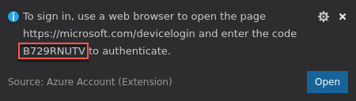

5.  In the browser window that opens, paste the copied code into the **Code** box, and select **Continue**. 
    
    

6.  On the following screens, log in with your Azure account credentials.

7.  Once you have signed in, you will be taken to a new page in the browser. You can close the browser window. 
    
    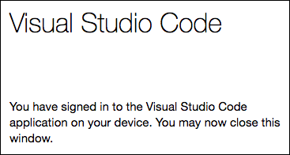

8.  If presented with a prompt to enter a password for a new keyring, enter "**Password.1!!**" as the password, and select **Continue**.
    
    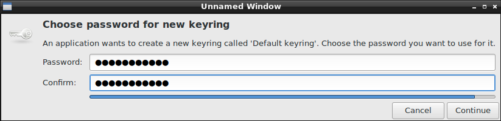

9.  Back in VS Code, you should now see your Azure account listed under Azure Cosmos DB, along with your Azure account email listed in the status bar of VS Code.

    

10. From here, you can view your databases, collections, and documents, as well as edit documents directly in VS Code, and push the updated documents back into your database.

### Task 6: Decrease collection throughput

In this task, you will decrease the throughput on your collections. Azure Cosmos DB uses an hourly billing rate, so reducing the throughput after the data migration will help save costs.

1.  In the Azure portal, navigate to your Azure Cosmos DB account, select **Scale** from the left-hand menu, under **COLLECTIONS.**

2.  Expand the **users** collection and select **Scale & Settings**.

3.  Change the **Throughput** value to "500," and select **Save**.
    
    

4.  Repeat steps 2 & 3 for the **plans** and **orders** collections.

## Exercise 3: Containerize the app

Duration: 30 minutes

This exercise walks you through containerizing an existing MERN application using Docker, pushing the image to an **Azure Container Registry**, then deploying the image to **Web App for Containers** directly from VS Code.

### Task 1: Create an Azure Container Registry

In this task, you will be creating a private Docker registry in the Azure portal, so you have a place to store the custom Docker image you will create in later steps.

1.  In the Azure portal, select **+Create a resource**, **Containers**, and select **Azure Container Registry**. 
    
    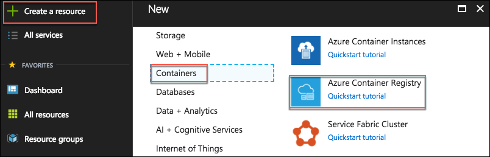

2.  On the **Create container registry** blade, enter the following:

    -   **Registry name:** Enter "bestforyouregistrySUFFIX," where SUFFIX is your Microsoft alias, initials, or another value to ensure the name is unique (indicated by a green check mark).

    -   **Subscription:** Select the subscription you are using for this hands-on lab.

    -   **Resource group:** Select **Use existing** and select the **hands-on-lab-SUFFIX** resource group created previously.

    -   **Location:** Select the location you are using for resources in this hands-on lab.

    -   **Admin user:** Select **Enable**.

    -   **SKU:** Select **Basic**.

    -   Select **Create** to provision the new Azure Container Registry
        
        

### Task 2: Install Docker extension in VS Code

The Docker extension for VS Code is used to simplify the management of local Docker images and commands, as well as the deployment of a built app image to Azure.

1.  On your Lab VM, return to VS Code, and the open starter project.

2.  Select the **Extensions icon** from the left-hand menu, enter "Docker" into the search box, select the **Docker** extension, and in the **Extension: Docker** window, select **Install**. 

    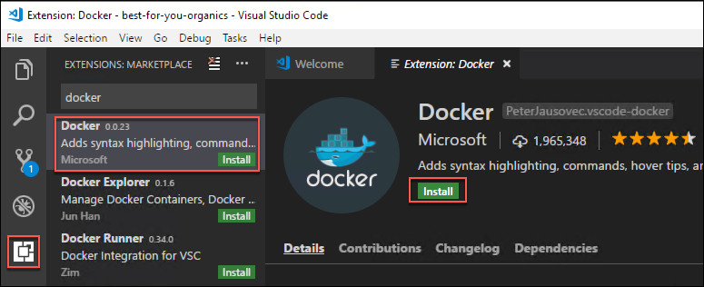

3.  Close and reopen VS Code, and the **mcw-oss-paas-devops** project.

4.  Expand the **DOCKER** extension block, then expand **Registries** and **Azure**, and you should see your Azure Container Registry listed. You should already be logged into your Azure subscription, but if not, follow the steps in [Exercise 2, Task 5 Step 3](#task-5-install-azure-cosmos-db-extension-for-vs-code) to sign in.

    

### Task 3: Create Docker image and run the app

In this task, you will use VS Code, and the Docker extension, to add the necessary files to the project to create a custom Docker image for the **mcw-oss-paas-devops** app.

1.  On your Lab VM, return to VS Code, and the mcw-oss-paas-devops project.

2.  Open the VS Code Command Palette, by selecting **View** from the menu, then **Command Palette**.

3.  Enter "add docker" into the Command Palette and select **Docker: Add docker files to workspace**. 
    
    

4.  At the **Select Application Platform** prompt, select **Node.js**. 
    
    

5.  Ensure port "3000" is entered on the next screen, and press **Enter**. 
    
    

6.  This will add Dockerfile, along with several configuration files for Docker compose to the project.
    
    

7.  Select **Dockerfile** from the file navigator and observe the contents. This file provides the commands required to assemble a Docker image for the mcw-oss-paas-devops application. 
    
    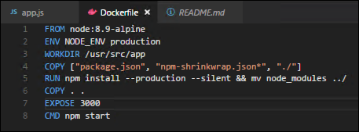

8.  Next, you will tell Docker to build and image for your app. Open the **VS Code Command Palette** again and run **Docker: Build Image** to build the image you just created. 
    
    

9.  In the **Choose Dockerfile to build** box, select **Dockerfile** (the Dockerfile that was just created). 
    
    

10. In the next box, you will provide a **registry**, **image name**, and **tag**, using the following format. This format will allow the image to be pushed to your container registry.

> \[registry\]/\[image name\]:\[tag\]

11. For this, you will need the Login server value from your Azure Container registry's **Access keys** blade. 
    
    

12. Entry the following into the **Tag image as...** box, where \[Login server\] is the Login server value from Azure:
    ```
    [Login server]/best-for-you-organics:latest
    ```

13. For example:
    ```
    bestforyouregistry.azurecr.io/best-for-you-organics:latest
    ```

14. Enter your value, and press **Enter**, which will trigger the build of the image. 
    
    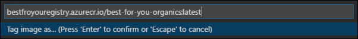

15. In the terminal window, you will see the following docker build commands execute: 
    
    

16. Once the build completes, you will see the image show up in the **DOCKER** extension explorer, under **Images**. 

    

17. You can also use the docker images command in the Integrated terminal to list the images.

### Task 4: Run the containerized App

In this task, you will run the app from the container you built in the previous task.

1.  In the **Images** area of the Docker extension in VS Code, right-click your image, and select **Run Interactive**.
    
    

2.  Notice in the Interactive terminal that a docker run command is issued. Using the VS Code Docker extension, you can issue some docker commands, without needing to work from the command line. 

3.  Verify the web app and container are functioning by opening a browser window and navigating to <http://localhost:3000>. 

4.  In the Integrated terminal of VS Code, for the interactive session, press **CTRL+C** to stop the container.

### Task 5: Push image to Azure Container Registry

In this task, you are going to push the image to your Azure Container Registry.

1.  In the Azure portal, navigate to the hands-on-lab-SUFFIX resource group, and select the **bestforyouregistrySUFFIX** Container registry from the list of resources. 
    

2.  On the **bestforyouregistrySUFFIX** blade, select **Access keys** under settings in the left-hand menu, and leave this page up as you will be referencing the **Login server**, **Username**, and **password** in the next task.

    

3.  Return to the Integrated terminal window in VS Code and enter the following command to log in to your Azure Container registry, replacing the bracketed values with those from the container registry access keys page.
    ```
    docker login [Login Server] -u [Username]
    ```

4.  For example:
    ```
    docker login bestforyouregistry.azurecr.io -u bestforyouregistry
    ```

5.  Enter the password when prompted to complete the login process. 
    
    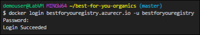

6.  Once you are successfully logged in, find your image in the Docker extension section of the VS Code, right-click your image, and select **Push.**

    

7.  Note the "docker push" command issued in the terminal window. 
    
    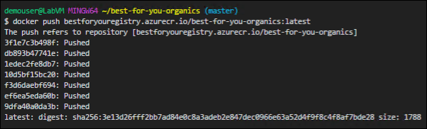

8.  To verify the push, return to the **bestforyouregistry** blade in the Azure portal, and select **Repositories** under **SERVICES** on the left-hand side, and note the **best-for-you-organics** repository. 
    
    

## Exercise 4: Set up Web App for Containers

Duration: 10 minutes

In this exercise, you will deploy the containerized app to a Web App for Containers instance from the image stored in your Azure Container Registry.

### Task 1: Provision Web App for Containers

1.  In the Azure portal, select **+Create a resource**, **Web + Mobile**, and select **Web App for Containers**. 
    
    

2.  On the **Create** blade, enter the following:

    -   **App name**: Enter "best-for-you-app-SUFFIX" (the name must be unique).

    -   **Subscription**: Select the subscription you are using for this lab.

    -   **Resource group**: Select **Use existing** and choose the hands-on-lab-SUFFIX resource group.

    -   **App Service plan/Location**: Accept the default assigned value, which will create a new App Service plan.

    -   Select **Configure container**, and enter the following:

        -   **Image source:** Select **Azure Container Registry**.

        -   **Registry**: Select **bestforyouregistrySUFFIX**.

        -   **Image**: Select **best-for-you-organics**.

        -   **Tag**: Select **latest**.

        -   **Startup File**: Leave blank.

        -   Select **OK**.

    -   Select **Create**. 
    
    

### Task 2: Navigate to the deployed app

In this task, you will navigate to the deployed app, and log in to verify it is functioning correctly.

1.  When you receive the notification that the Web App for Containers deployment has completed, navigate to the Web App by selecting the **notifications icon**, and selecting **Go to resource**. 

    

2.  On the **Overview** blade of **App Service**, select the URL for the App Service. 

    

3.  A new browser window or tab will open, and you should see the *mcw-oss-paas-devops* application's home page displayed.

4.  Sign in to the site with the following credentials to verify everything is working as expected.

    -   <demouser@bfyo.com>

    -   Password.1!!
    
    

## Exercise 5: Configure CI/CD pipeline

Duration: 60 minutes

In this exercise, you are going to add continuous delivery (CD) to a Jenkins continuous integration (CI) using Release Management in VSTS.

### Task 1: Prepare GitHub account for service integrations

In this task, you will be adding a Jenkins service integration into your GitHub account. This integration will enable a Jenkins continuous integration build job to be triggered when code is checked in to your GitHub repository.

1.  On your Lab VM, navigate to your Jenkins VM in the [Azure portal](https://portal.azure.com/).

    -   Select **Resource groups** from the left-hand menu, then enter "Jenkins" into the search box, and select your **Jenkins-SUFFIX** resource group from the list. 
    
    

    -   On the Jenkins-SUFFIX Resource group blade, select your **Jenkins** virtual machine. 
    
    

2.  On the **Overview** blade of your Jenkins virtual machine, locate the **DNS name**, and copy the value.
    
    

3.  Return to your forked **mcw-oss-paas-devops** application page in your GitHub account, select **Settings**, then select **Integrations & services** from the left-hand menu.

    

4.  Select **Add service**, enter "Jenkins" into the search filter, and select **Jenkins (GitHub plugin)**. 
    
    

5.  When prompted, enter your GitHub account password to continue. 
    
    

6.  In the Jenkins hook URL text box, enter "http://\[YOUR\_JENKINS\_URL\]/github-webhook/\" replacing **\[YOUR\_JENKINS\_URL\]** with the Jenkins DNS name you copied from the Azure portal, and select **Add service**.

    

7.  You will see the Jenkins (GitHub plugin) under the list of services. 

    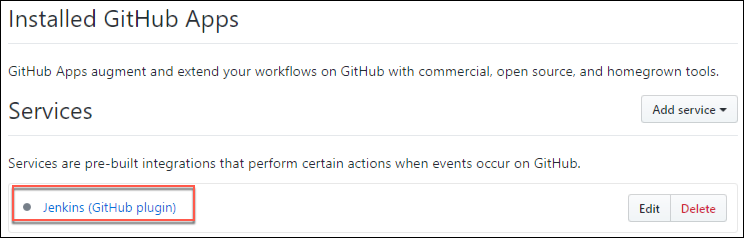

8.  Next, you need to grant the Jenkins user access to your GitHub repository by adding a deploy key in the GitHub settings.

9.  Return to your Jenkins virtual machine page in the Azure portal, select **Connect**, and copy the SSH command. 

    

10. Open a new bash shell and paste the SSH command you copied above at the prompt. Enter "yes" if prompted about continuing to connect, and enter the jenkinsadmin password, "Password.1!!," when prompted. 

    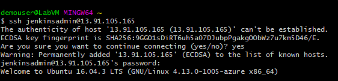

11. At the jenkinsadmin\@Jenkins prompt, enter:
    ```
    ssh-keygen
    ```

12. Press **Enter** to accept the default file in which to save the key.

13. Press **Enter** to use an empty passphrase, and re-enter it to confirm. (Note: This is done only for simplicity in this hands-on lab, and is not recommend for actual environments.)

14. Copy the location into which your public key has been saved. 
    
    

15. Show the public key using the following command, replacing \[KEY\_PATH\] with the location of your public key.
    ```
    cat [KEY_PATH]
    ```

16. Copy the key displayed, so it can be added to GitHub. 
    
    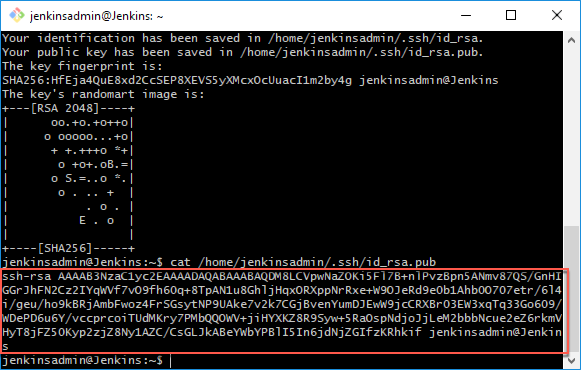

17. Return to you GitHub account in the browser, select the **Deploy keys** option from the left-hand menu, and select **Add deploy key**. 
    
    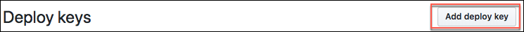

18. Enter "Jenkins" for the title, paste the SSH key you copied above into the Key field, removing any trailing spaces, and select **Add key**. 
    
    

19. To ensure that everything is working, return to the Jenkin's bash shell, and enter the below command which will check the connection to GitHub.
    ```
    ssh git@github.com
    ```

20. Enter "yes" when prompted about continuing.

21. You should see a message like the following, indicating a successful connection. 
    
    

22. The GitHub side of the integration with Jenkins is complete. Next, you will configure Jenkins as part of your CI/CD pipeline.

### Task 2: Configure Continuous Integration (CI) with Jenkins

In this task, you will set up a simple Jenkins CI pipeline, which will build the **mcw-oss-paas-devops** application with every code commit into GitHub.

1.  Return to your **Jenkins** VM blade in the Azure portal.

2.  On the **Overview** blade of your Jenkins VM, locate the **DNS name**, and copy the value.
    
    

3.  Open a new browser window or tab and paste the copied DNS name into the browser's address bar to navigate to your Jenkins server.

4.  On the Jenkins on Azure screen, you will see a message that this Jenkins instance does not support https, so logging in through a public IP address has been disabled. You will need to create an SSH tunnel to securely connect to the Jenkins instance.

5.  To set up an SSH tunnel to Jenkins, copy the ssh command provided in the Jenkins on Azure window, as highlighted in the screen shot below.
    
    

6.  Open a new bash shell, and at the command prompt paste the copied ssh command, replacing username with **jenkinsadmin**. The command will resemble the following:
    ```
    ssh -L 127.0.0.1:8080:localhost:8080 jenkinsadmin@jenkins-kb.westus.cloudapp.azure.com
    ```

7.  If prompted that authenticity of the Jenkins host cannot be established, enter "yes" to continue.

8.  Enter the **jenkinsadmin** password, "Password.1!!". 
    
    

9.  After you have started the SSH tunnel, open a new browser tab or window, and navigate to <http://localhost:8080/>. 
    
    

10. To get the initial password, copy the path provided, return to the SSH tunnel bash window, and run the following command:
    ```
    sudo cat /var/lib/jenkins/secrets/initialAdminPassword
    ```

11. Copy the password returned.
    
    

12. Return to the Getting Started screen in your browser, paste the password into the **Administrator password** box, and select **Continue**. 
    
    

13. On the Customize Jenkins screen, select **Install suggested plugins**. 
    
    

14. On the Create First Admin User screen, enter the following:

    -   **Username**: Enter a username, such as your first name

    -   **Password**: Password.1!!

    -   **Confirm Password**: Password.1!!

    -   **Full name**: Enter your first name

    -   **E-mail address**: Enter your email address

    -   Select **Save and Finish** 
        
        

15. Select **Start using Jenkins** on the Jenkins is ready screen. 
    
    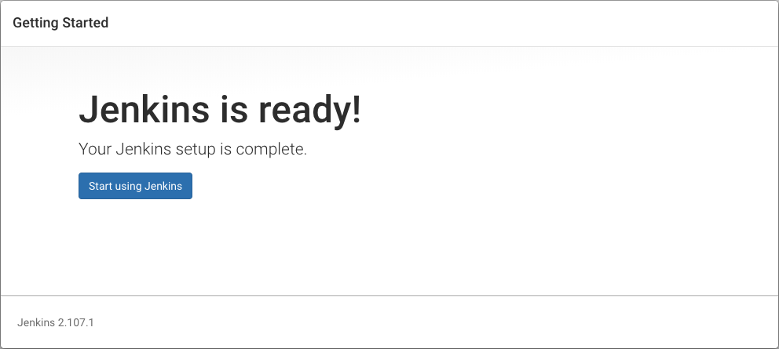

16. You will be redirected to the Jenkins dashboard. 
    
    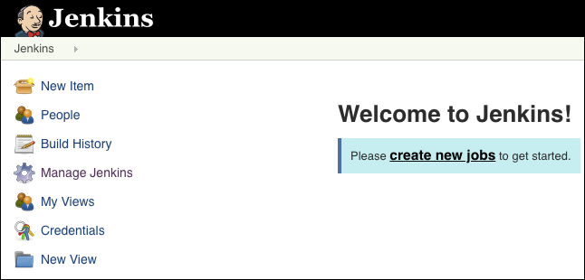

17. Select **Manage Jenkins** from the left-hand menu and select **Manage Plugins**. 
    
    

18. To install the VS Team Services Continuous Deployment plug-in, enter **vs team services continuous deployment** into the Filter box, select the **VS Team Services Continuous** **Deployment** plug-in, and select **Install without restart**. 
    
    

19. Now, change the Filter text to **nodejs**, select the **NodeJS** plug-in, and select **Install without restart**. 
    
    

20. Scroll up to the top the screen, select **Manage Jenkins** from the left-hand menu.

    

21. Select **Global Tool Configuration**. 

22. Find **NodeJS** and select **Add NodeJS** next to NodeJS installations.

23. Enter a name, ensure **Install automatically** is checked, and accept the default (latest) version of nodejs.
    
    

24. Select **Save**.

    

25. Return to the **Jenkins** dashboard, and select **New Item** from the left-hand menu.

26. Enter "best-for-you-build" as the name, select **Freestyle project**, and select **OK**. 
    
    

27. On the **General** tab of the project page, select **GitHub project**, and enter the URL for your forked copy of the best-for-you-organics project page in your GitHub account. 
    
    

28. Next, scroll down to the **Source Code Management** section, select **Git**, and enter the URL to your project, including the ".git" extension. 
    
    

29. Scroll down to the **Build Triggers** section and select **GitHub hook trigger for GITScm polling**. 
    
    

30. Finally, select **Save**.

    

31. Your Jenkins CI build job should now be triggered whenever a push is made to your repository.

### Task 3: Trigger CI build

In this task you will commit your pending changes in VS Code to you GitHub repo, and trigger the Jenkins CI build job.

1.  Return to VS Code on your Lab VM, and the open mcw-oss-paas-devops project.

2.  Observe that the **source control icon** on the left-hand navigation bar has a badge indicating you have uncommitted changes. Select the **icon**. 
    
    

3.  In the **SOURCE CONTROL: GIT** pane, enter a commit message, such as "Added Docker configuration," and select **+** next to **CHANGES** to stage all the pending changes. 
    
    

4.  Select the **checkmark** to commit the changes. 
    
    

5.  Next, select the **ellipsis** to the right of the check mark, and select **Push** from the dropdown.
    
    

6.  If prompted, enter your GitHub account credentials to log into your GitHub account.

7.  Return to your best-for-you-build job in Jenkins, and locate the **Build History** block on the left-hand side. Select **\#1** to view the details of the build job, caused by your GitHub commit.
    
    

8.  On the build page, you can see the changes you committed. 
    
    

9.  You have successfully set up your CI pipeline.

### Task 4: Create Free Visual Studio Team Services Account

In this task, you will create a free Visual Studio Team Services (VSTS) account. If you already have a VSTS account, you can skip this task.

1.  In a browser, navigate to <https://www.visualstudio.com/>, and select **Get started for free** under **Visual Studio Team Services**. 
    
    

2.  Sign into your Microsoft account when prompted.

3.  At the **Host my project at:** page, enter a unique name, and select **Continue** to create your VSTS account.
    
    

4.  In your VSTS account home page, select **New Project**. 
    
    

5.  On the **Create new project** screen, enter "BestForYouOrganics" for the Project name, and select **Create**. 
    
    

### Task 5: Create a VSTS personal access token

In this task, you will create a personal access token with the Release (read, write, execute, and manage) permission in VSTS, which will allow Jenkins to communicate with Team Services account.

1.  From your VSTS home page, open your profile, and select **Security**. 
    
    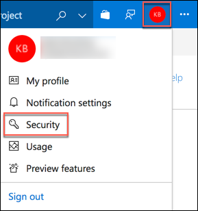

2.  On the **Security** page, select **Personal access tokens**, then select **Add**. 
    
    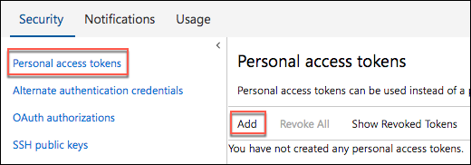

3.  On the **Create a personal access token screen**, enter a **description,** such as "best-for-you-organics," select an **expiration period** for the token, and select your **account**.
    
    

4.  Under **Authorized Scopes**, choose **Selected scopes**, and select **Release (read, write, execute and manage)**. 
    
    

5.  Select **Create Token**.

6.  Copy the generated token, and paste it into a text editor, such as Notepad, for later use. Make sure you copy the token and save it in a file, as it will no longer be accessible once you navigate away from the screen. 
    
    

### Task 6: Configure Jenkins for Team Services integration

In this task, you will add the necessary configuration information to allow Jenkins to send build artifacts to a VSTS release.

1.  Return to your **Jenkins** dashboard, and select the [best-for-you-build]** project. 
    
    

2.  Select **Configure** from the left-hand menu.

    

3.  Select the **Post-build Actions** tab, then select **Add** **post-build action**, and select **Archive the artifacts** from the list. 
    
    

4.  Enter "\*\*/\*" in the Files to archive box. 
    
    

5.  Select **Add post-build action** again and select **VS Team Services Continuous Deployment**. 
    
    

6.  In the **VS Team Services Continuous Deployment** block, enter the following:

    -   **Collection url**: Enter the URL to your VSTS account, such as

    -   **Team project**: Enter "BestForYouOrganics."

    -   **Release definition**: Enter "BestForYouOrganics CD."

    -   **Username**: Enter "admin."

    -   **Password**: Paste the personal access token you copied previously from you VSTS account.
        
        

7.  Select **Save**.

    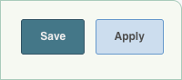

### Task 7: Create a Jenkins service endpoint is VSTS

In this task, you will configure a service endpoint for your Jenkins server in VSTS.

1.  Open the **Services** page from your **BestForYouOrganics** project home page in VSTS, and select **New Service** **Endpoint**, and select **Jenkins**. 
    
    

2.  In the **Add new Jenkins Connection** dialog, enter the following:

    -   **Connection name**: Enter "BestForYouJenkins."

    -   **Server URL**: Enter the URL of your Jenkins server, such as "http://{YourJenkinsUrl}.westus.cloudapp.azure.com."

3.  You can obtain this by navigating to your Jenkins VM in the Azure portal and copying the *DNS name* on the VM's overview blade.

    -   **Accept untrusted SSL certificates**: Check this.

    -   **Username**: Enter the username you created in [Exercise 5, Task 2, Step 14](#task-2-configure-continuous-integration-ci-with-jenkins).

    -   **Password**: Enter "Password.1!!".

    -   Select **Verify connection**, to check that the information is correct.

    -   Select **OK**. 
    
    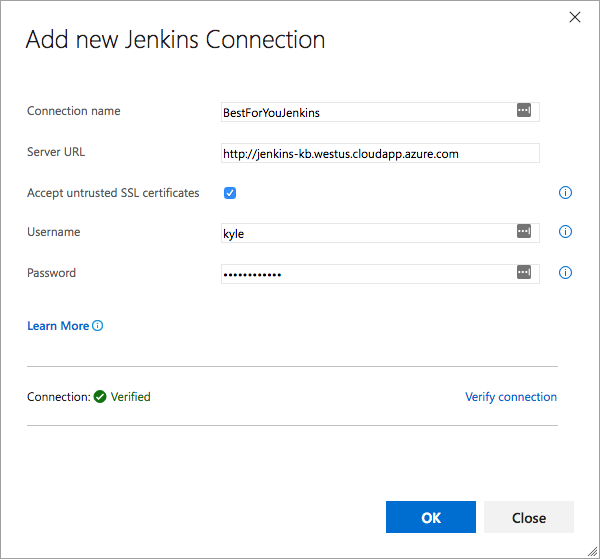

### Task 8: Create a Team Services release definition

In this task, you will create the release definition in VSTS, which will take the build artifacts from Jenkins, and push them to the Azure Container Registry associated with your Web App for Containers.

1.  In VSTS, select **Build and Release**, **Releases**, and select **+New** **definition**. 

    

2.  In the **Select a Template** dialog that appears, select **start with an** **Empty process**. 

    

3.  In the **Environment** dialog that appears next, select the **X** to close the dialog. 

    

4.  Next, select **+Add** **Artifact**. 

    

5.  In the **Add artifact** dialog, under **Source type**, select **3 more artifact types** to expand the entire list. 

    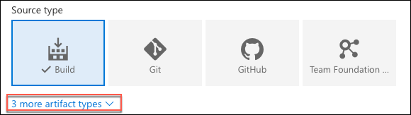

6.  Select **Jenkins**. 

    

7.  In the Add artifact form, set the following:

    -   **Service Endpoint**: Select the **BestForYouJenkins** endpoint

    -   **Jenkins Job**: Select best-for-you-build

    -   **Default Version**: Leave Specify at the time of release creation selected

    -   **Source alias**: Enter "best-for-you-build"

    -   Select **Add**.
    
    

8.  Select **Tasks** from the menu. 
    
    

9.  Select **Agent phase** and change the **Agent queue** to **Hosted Linux Preview**. 

    

10. Next, select the **+** in **Agent phase**, enter "Docker" in the Search box, and select **Add** next to the **Docker** task.

    

11. Repeat the previous step to add a second Docker task to the phase.

12. Now, change the text in the **Add tasks** search box to **Azure app service**, and select **Add** for the **Azure App Service Deploy** task. 

    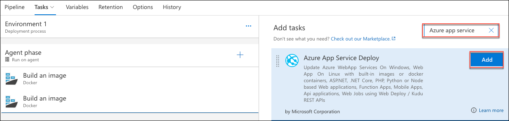

13. Your Environment should now look like the following. 

    

14. Select the first Docker **Build an image** task under **Agent phase**, and set the following:

    -   **Container Registry Type**: **Azure Container Registry**

    -   **Azure subscription**: Select your subscription. You may need to select the **Authorize** button and enter your credentials first.

    -   **Azure Container Registry**: Select **bestforyouregistrySUFFIX**.

    -   **Action**: Leave as Build an image.

    -   **Image name**: Enter **\[Your Registry Name\].azurecr.io/best-for-you-organics:v1**, for example, bestforyouregistry.azurecr.io/best-for-you-organics:v1.

    -   **Include Latest Tag**: Check this.

    -   Leave all other fields set to their defaults.
    
    

15. Select the second **Docker Build an image** task under Agent phase, and set the following:

    -   **Container Registry Type**: **Azure Container Registry**

    -   **Azure subscription:** Select your subscription.

    -   **Azure Container Registry:** Select **bestforyouregistrySUFFIX**.

    -   **Action:** Select **Push an image** (this will change the display name to Push an image as well).

    -   **Image name:** Enter \[Your Registry Name\].azurecr.io/best-for-you-organics:v1; for example, bestforyouregistry.azurecr.io/best-for-you-organics:v1.

    -   **Include Latest Tag**: Check this.

    -   Leave all other fields set to their defaults
    
    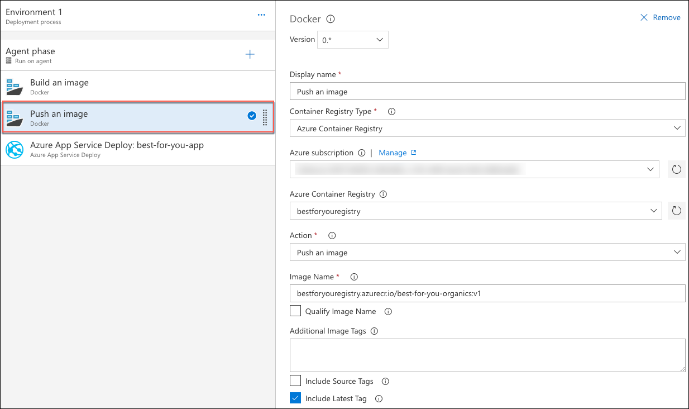

16. Select the **Azure App Service Deploy**: task, and, enter the following:

    -   **Azure Subscription:** Select your subscription. Select **Authorize**, and enter your Azure account credentials, if prompted.

    -   **App type:** Select **Linux App**.

    -   **App service name:** Enter "best-for-you-app-SUFFIX" (you may have to manually enter this, if it does not show up in the list).

    -   **Image source**: **Container Registry**.

    -   **Registry or Namespace:** Enter "\[Your Registry Name\].azurecr.io," for example, bestforyouregistry.azurecr.io.

    -   **Image**: Enter "best-for-you-organics."

    -   **Tag:** Enter v1
        
        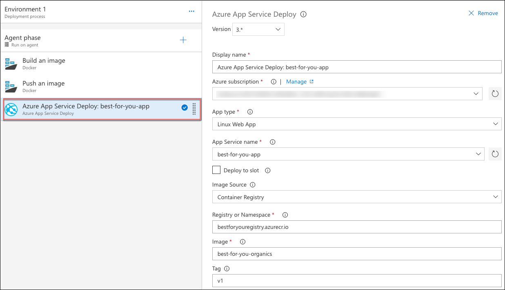

17. Finally, enter "BestForYouOrganics CD" for the release definition name, and select **Save**. (Note: the release definition name must match the release definition name you entered in your Jenkins build definition.)

    

### Task 9: Trigger CI/CD pipeline

In this task, you will commit a change to the mcw-oss-paas-devops starter application and trigger the full CI/CD pipeline through Jenkins and VSTS.

1.  Return to VS Code on your Lab VM, open the src/components/plan/Plans.js file, and insert the following markup between \<div class="container"\> and \<Grid\>.
    ```
    <h3>Welcome to Best for You Organics Company</h3>
    ```

    

2.  Save the file.

3.  Run the following command in the Integrated terminal.
    ```
    npm run build
    ```

4.  As you did in [Task 3](#task-3-trigger-ci-build), above, select the **Source Control icon** from the left-hand menu, enter a commit comment, select **+** to stage the change, and select the **checkmark** to commit the change, and push to GitHub. This will trigger the CI/CD pipeline, starting with the Jenkins build.

5.  Return to your Jenkins dashboard, and select the **best-for-you-build project**, select the **latest build**, and note the build number.

    

6.  Next, go to the **Releases** page in your VSTS account, and you will see an active release, with the same build number as you noted in Jenkins.

    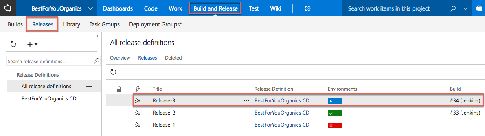

7.  Select the **ellipsis** next to the active release and select **Open**. 

    

8.  On the summary tab, you can see that the release is in progress. Select the **Logs** tabs to see that real-time progress of the release. 

    

9.  When the deployment is complete, check change in by going to Azure reloading the web page for your App Service in the browser. The deployment can take 30+ minutes, so move on to the next exercise, and come back and check the deployment progress periodically.

10. When the deployment is complete you should see the home page, with a new header above the three plans on the page. 

    

## Exercise 6: Create Azure Function for order processing

Duration: 45 minutes

In this task, you will create an Azure Function that will be triggered by orders being added to the Orders collection in Azure Cosmos DB. This Function will trigger whenever a document in the orders collection is inserted or updated. The function checks the processed field on the order document, ensuring only unprocessed orders are sent to the processing queue.

### Task 1: Provision a Function App

In this task, you will create a Function App in Azure, which will host your Functions.

1.  In the Azure portal, select **+Create a resource**, enter "function app" in to the **Search the marketplace** box, and select **Function App** from the results. 

    

2.  On the **Function App** blade, select **Create**.

3.  On the **Create Function App** blade, enter the following:

    -   **App name:** Enter a unique name, such as "bestforyouordersSUFFIX."

    -   **Subscription:** Select the subscription you are using for this hands-on lab.

    -   **Resource group:** Select **Use existing** and choose the **hands-on-lab-SUFFIX** resource group.

    -   **OS:** Select Windows.

    -   **Hosting Plan:** Choose Consumption Plan.

    -   **Location:** Select the location you have been using for resources in this hands-on lab.

    -   **Storage:** Select **Create new** and enter "bestforyouorders" for the name.

    -   Select **Create** to provision the new Function App. 
        
        

### Task 2: Configure storage queues

In this task, you will add two storage queues to the storage account provisioned when you created your Function App. These queues will be used to store orders and notifications needing to be processed.

1.  In the Azure portal, navigate to the new **bestforyouorders storage account** that was created when you provisioned your Function App, by selecting **Resource groups** from the left-hand menu, selecting your **hands-on-lab-SUFFIX** resource group from the list, and then selecting the **bestforyouorders storage account**. 
    
    

2.  Select **Queues** from the **Services** area of the **Overview** blade.

    

3.  On the **Queue service** blade, select **+Queue** to add a new queue. 

    

4.  In the **Add** queue dialog, enter **orderqueue** for the **Queue name**, and select **OK**.

    

5.  Select **+Queue** again, and this time enter "notificationqueue" for the **Queue name**. 

    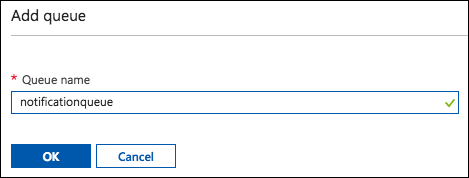

### Task 3: Create Cosmos DB trigger function

In this task, you will create a function that will be triggered whenever a document is inserted into the orders collection in your Azure Cosmos DB. This function sends all new orders to a queue for processing and shipping. This function will use a Cosmos DB trigger and an output binding to an Azure Storage Queue.

1.  When the Function App has deployed, navigate to the new Function App in the Azure portal, by selecting the **notifications icon**, then select **Go to resource** for the Function App notification. 

    

2.  From the left-hand menu on your **Function Apps** blade, select **Functions**, then select **+New function**. 

    

3.  In the trigger search box, enter "cosmos," and select the **Cosmos DB trigger**. 

    

4.  In the **Cosmos DB trigger** dialog, enter the following:

    -   **Language**: Select **JavaScript**.

    -   **Name**: Enter "OrdersCosmosTrigger."

    -   **Azure Cosmos DB account connection**: Select **new**, then select the **best-for-you-db DocumentDB** Account.

    -   **Collection name:** Enter orders (use all lowercase, as case matters).

    -   **Create lease collection if it does not exist:** Leave this checked.

    -   **Database name:** Enter "best-for-you-organics."

    -   **Collection name for leases:** Leave set to leases.

    -   Select **Create**.

        

5.  After the function is created, select **Integrate** under the new function. 

    

6.  Change the Document collection parameter name to "newOrders" for the **Azure Cosmos DB trigger** and select **Save**. 

    

7.  Next, select **+New Output**, select **Azure Queue Storage**, and select **Select**.

    

8.  For the **Azure Queue Storage output**, enter the following:

    -   **Message parameter name**: outputQueue.

    -   **Queue name:** orderqueue (all lowercase, as casing matters).

    -   **Storage account collection:** Select **AzureWebJobsStorage** from the list (this is the bestforyouorders storage account you created when you provisioned your Function App).

    -   Select **Save.** 
    
    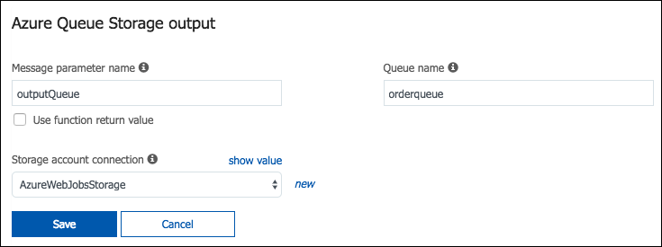

9.  Now, select the **OrdersCosmosTrigger** function in the left-hand menu. 

    

10. To get the code for the OrdersCosmosTrigger function, go into the project is VS Code, expand the AzureFunctions folder, select **OrdersCosmosTrigger.js**, and copy the code, as highlighted in the screen shot below. 

    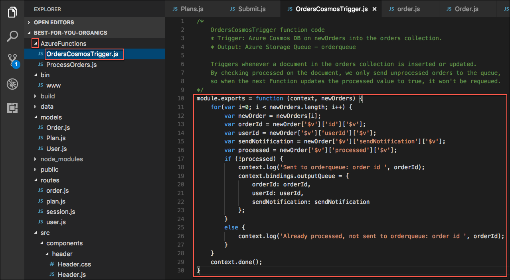

11. Paste the code into the **index.js** block, overwriting all the existing code, and select **Save**. Your index.js file should now look like the following: 

    

12. Next, select **Logs** below the code block, so you can observe the Function being called during the next steps. 

    

13. To trigger the function, return to the starter application in your browser window, and select **Sign In**. 

    

14. On the Login screen, enter the following credentials, and select **Login**.

    -   **Email address:** <demouser@bfyo.com>.

    -   **Password:** Password.1!! 
    
    

15. After logging in, you will be returned to the home page. Select **Select this plan** for any of the plans. 

    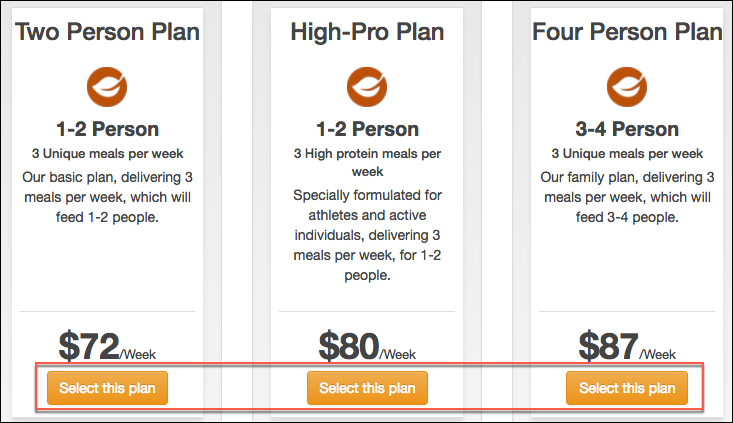

16. On the **Place Order** screen, select **Place Order**. This will create a new order, which will fire the Azure Cosmos DB trigger in your function, and then send the order on to the ordersqueue for processing. 

    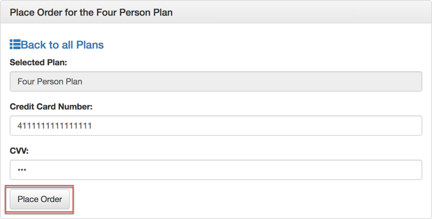

17. Next, you will update an order in the Azure portal, to set the processed value to true. This will be a change that should not be sent into the orderqueue for processing.

18. Navigate to your Cosmos DB account in the Azure portal, select **Data Explorer**, expand the **orders** collection, then select **Documents**.

    

19. Select any order document, and change the processed value to "true," then select **Update**.

    

20. Return to the logs pane of your function and observe that the orders have been processed though the Function, and that the new order was sent to the orderqueue, while the updated order was not. 

    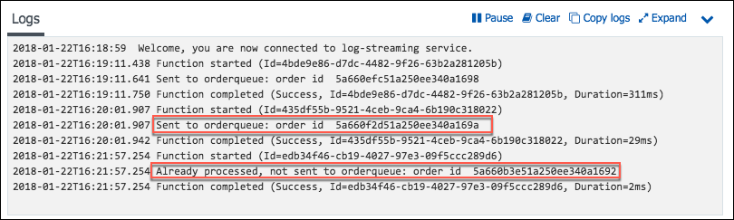

21. Finally, verify items are being written to the order queue, by going to the queue in the Azure Storage account, and observing that items have been added to the queue. 

    

### Task 4: Create Queue function

In this task, you will create a second function which will be triggered the output of the OrdersCosmosTrigger function. This will simulate the order processing and will add items to the notificationqueue if the order processing is complete and sendNotifications is true for the order.

This will use an Azure Storage Queue trigger, and an input dataset from Cosmos DB, pulling in customers. Output dataset will be Azure Cosmos DB orders table, and an update to set processed = true, and the processedDate to today.

1.  Select **Integrate** under the OrdersCosmosTrigger function, then select **Azure Queue Storage (outputQueue)** under **Outputs**. 

    

2.  Under **Actions** for the output, select **Go** next to **Create a new function triggered by this output**. 

    

3.  Select **Queue trigger** from the list. 

    

4.  On the **Queue trigger New Function** dialog, enter the following:

    -   **Language:** Select **JavaScript**.

    -   **Name:** Enter ProcessOrders.

    -   **Queue name:** orderqueue.

    -   **Storage account connection:** Select **AzureWebJobsStorage**.

    -   Select **Create**.

        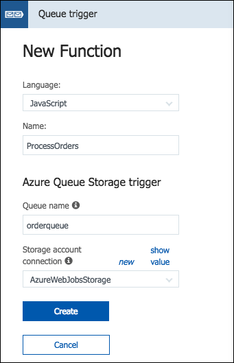

5.  When the function has been created, select **Integrate** under the **ProcessOrders** function, change the Message parameter name to "orderToProcess" for the **Azure Queue storage trigger**, and select **Save**. 

    

6.  Now, select **+New Input**, select **Azure Cosmos DB**, and select **Select**. 

    

7.  On the **Azure Cosmos DB** input screen, enter the following:

    -   **Document parameter name:** Enter "users."

    -   **Database name:** Enter "best-for-you-organics."

    -   **Collection name:** Enter "users" (all lowercase, as case matters).

    -   **Azure Cosmos DB account connection:** Select **best-for-you\_DOCUMENTDB**.

    -   Select **Save**. 
    
    

8.  Next, select **+New Output**, select **Azure Queue Storage**, and select **Select**. 

    

9.  For the **Azure Queue Storage output**, enter the following:

    -   **Message parameter name**: "outputQueue."

    -   **Queue name:** "notificationqueue" (all lowercase, as casing matters).

    -   **Storage account collection:** Select **AzureWebJobsStorage** from the list

    -   Select **Save**.
    
    

10. Now, select the **ProcessOrders** function in the left-hand menu. 

    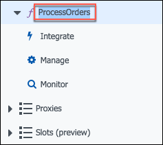

11. To get the code for the **ProcessOrders** function, go into the project is VS Code, expand the **AzureFunctions** folder, select **ProcessOrders.js**, and copy the code, as highlighted in the screen shot below. 

    

12. Paste the code into the **index.js** block, overwriting all the existing code, and select **Save**. Your index.js file should now look like the following: 

    

13. Next, select **Logs** below the code block, so you can observe the Function being called during the next steps. 

    

14. To trigger the function, return to the starter application in your browser window, select **Sign In**, and on the **Sign In** screen, select **Register**. 

    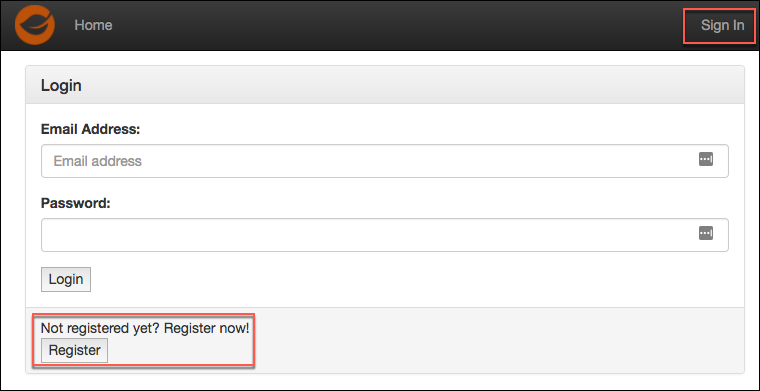

15. Complete the registration form, being sure to include a cell phone number in the Phone field that you can receive text messages on. (If you opt not to enter a phone number, you can still complete the next Exercise, but will not receive the text notifications that your order has been processed.)

    -   You only need to enter data into the **First name**, **Last name**, **email address**, and **phone** fields. All other fields have been pre-populated to save time.

    -   The password has been set to Password.1!!. If you choose to enter a different password, note that when you log into the account.

16. After registering, select **Sign In** from the Home page, enter your email address and password (Password.1!!) on the login screen, and select **Login**.

17. Select the **Select this plan** button for any plan on the home page, and on the Order screen, select **Place Order**. 

    

18. Return to your **ProcessOrders Function** page in the Azure portal and observe the logs. 

    

19. The order you placed has been sent to the notificationqueue and is pending the notification being sent to your cell phone via SMS text message.

## Exercise 7: Create Logic App for sending SMS notifications

Duration: 30 minutes

In this exercise, you will create Logic App which will trigger when an item is added to the notificationqueue Azure Storage Queue. The Logic App will use a Twilio connection to send an SMS message to the phone number included in the notificationqueue message.

### Task 1: Create Free Twilio account

In this task, you will use a free Twilio account to send SMS notifications to customers, informing them that their order has been processed, and is on its way.

1.  If you do not have a Twilio account, sign up for one for free at by going to <https://www.twilio.com/try-twilio>.

2.  On the **Sign up for free** page:

    -   Enter your personal info, email address, and a 14+ character password

    -   Select SMS under **Which product do you plan to use first?**

    -   Select **Order Notifications** under **What are you building?**

    -   Select **JavaScript** under **Choose your language**

    -   Select **Not a Production App** under **Potential monthly interactions**

    -   Check the box next to **I'm not a robot**

    -   Select **Get Started**.
    
    

3.  Enter your **cell phone number** on the We need to verify you're a human screen, check the box if you do not wish to be contacted at the number you enter, and select **Verify** via SMS.

    

4.  Enter the verification code received via text into the box and select **Submit.** 

    

5.  From your account dashboard, select the **All Products & Services icon.** 

    

6.  Select **\#Phone Numbers** under **Super Network**. 

    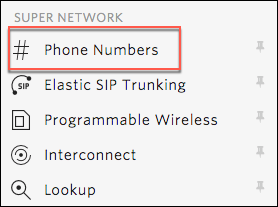

7.  Select **Get Started**. 

    

8.  Select **Get your first Twilio phone number**. 

    

9.  Select **Choose this Number** (or search for a different number if you want something different). 

    

10. Select **Done** on the Congratulations dialog.

11. Select **Home** 

    on your **Account Dashboard**, and leave this page up, as you will be referencing the **Account SID** and **Auth Token** in the next task to configure the Twilio Connector.

### Task 2: Create Logic App

In this task, you will create a new Logic App, which will use the Twilio connector to send SMS notifications to users, informing them that their weekly order has processed and shipped.

1.  In the Azure portal, select **+Create a resource**, select **Web + Mobile**, and select **Logic App**. 

    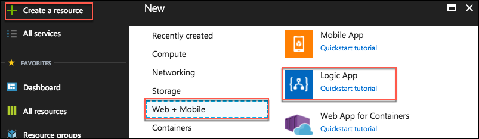

2.  In the **Create logic app** blade, enter the following:

    -   **Name:** Enter "OrderNotifications."

    -   **Subscription:** Select the subscription you are using for this hands-on lab.

    -   **Resource group:** Select **Use existing** and choose the **hands-on-lab-SUFFIX** resource group.

    -   **Location:** Select the location you have been using for resources in this hands-on lab.

    -   Select **Create** to provision the new Logic App.

        

3.  Navigate to your newly created Logic App in the Azure portal.

4.  Select the **Logic App Designer** under **Development Tools** on the left-hand menu. 

    

5.  In the Logic App Designer, select **Blank Logic App** under **Templates**. 

    

6.  Select **Azure Queues** under **Connectors**. 

    

7.  Select **Azure Queues** -- When there are messages in a queue. 

    

8.  On the When there are messages in a queue dialog, enter **bestforyouorders** for the, **Connection Name** select the bestforyouorders **Storage account** from the list and select **Create**. 

    

9.  In the next When there are messages in a queue dialog, select **notificationqueue** from the **Queue Name** list, and set the interval to **1** **minute**, then select **+New step**, and **Add an action**.

    

10. In the **Choose an action box**, enter "Parse," and select **Data Operations** **-- Parse JSON** from the list. 

    

11. Select the **Content** box, select **Add dynamic content +**, then select **Message Text** from the input parameters list that appears. 

    

12. Next, select **Use sample payload to generate schema** below the **Schema** box. 

    

13. In the dialog that appears, paste the following JSON into the sample JSON payload dialog that appears, then select **Done**.
    ```
    {"orderId":"5a6748c5d0d3199cfa076ed3","userId":"demouser@bfyo.com","notificationPhone":"3175551212","firstName":"Demo"}
    ```

    

14. You will now see the Schema for messages coming from the notification queue in the Schema box. Select **+New** **step** and select **Add an action**. 

    

15. In the **Choose an action box**, enter "Twilio," and select **Twilio -- Send Text Message (SMS)** under Actions. 

    

16. In the **Twilio -- Send Text Message (SMS)** dialog, enter the following (You will need the details from Project Info block on the dashboard of your Twilio account for this step):

    -   **Connection Name:** Twilio

    -   **Twilio Account Id:** Enter your Twilio account SID.

    -   **Twilio Access Token:** Enter your Twilio auth token.

    -   Select **Create**.
        
         dialog box")

17. On the next **Send Text Message (SMS)** dialog, enter the following:

    -   **From Phone Number:** Select your Twilio phone number from the drop down.

    -   **To Phone Number:** Select **notificationPhone** from the **Parse JSON** parameters. 
    
     dialog box")

    -   **Text:** Enter a message, such as "Hello \[firstName\], your Best for You Organics weekly order has shipped!" For \[firstName\], select the **firstName** parameter from the **Parse JSON** items. 
    
     dialog box")

18. Select **+New step** and **Add an action**.

    

19. In the **Choose an action** dialog, enter "queue" in to the search box, and select **Azure Queues -- Delete** **message**. 

    

20. Select **notificationqueue** for the Queue Name.

21. For Message ID, select the **Message ID** parameter from the **When there are messages in the queue** parameter list.

    

22. For Pop Receipt, select the **Pop Receipt** parameter from the **When there are messages in a queue** parameter list. 

    

23. Select **Save** on the **Logic Apps Designer** toolbar. 

    

24. The Logic App will begin running immediately, so if you entered your cell phone number when you registered your account in the Best for You Organics starter app, and placed an order, you should receive a text message on your phone within a minute or two of selecting Save.

## After the hands-on lab 

Duration: 10 minutes

In this exercise, you will deprovision all Azure resources that were created in support of this hands-on lab.

### Task 1: Delete Azure resource groups

1.  In the Azure portal, select **Resource groups** from the left-hand menu, and locate and delete the following resource groups.

    -   hands-on-lab-SUFFIX

    -   jenkins-SUFFIX

### Task 2: Delete WebHooks and Service Integrations

1.  In your GitHub account

    -   Delete the Jenkins service integration

    -   Delete the Personal Access Token you created for integration with VS Code.

2.  In your VSTS account

    -   Delete the Personal Access Token you created for integration with Jenkins.

    -   Delete the Jenkins service endpoint you added

    -   Delete the BestForYouOrganics CD release

You should follow all steps provided *after* attending the Hands-on lab.

## Appendix A: Lab VM setup

Appendix A provides steps for manually provisioning and setting up the Lab VM used as a development machine for this lab.

### Task 1: Create VM config script

In this task, you will create a script file that will be used as a custom extension for configuring your Linux virtual machine in Azure. This script contains commands to install all the required software and configure a desktop on the Linux VM. These commands could also be run from an SSH shell manually.

1.  Open a web browser, and navigate to <https://raw.githubusercontent.com/ZoinerTejada/mcw-oss-paas-devops/master/LabVM/labvmconfig.sh>.

2.  Copy the contents displayed in the browser into a text editor, such as Notepad, and save the file as **labvmconfig.sh**. Note the location you saved the file, as you will be referencing it in the next task.

### Task 2: Create a Linux virtual machine

In this task, you will provision a Linux virtual machine (VM) running Ubuntu Server 16.04 LTS.

1.  In the [Azure Portal](https://portal.azure.com/), select **+Create a resource**, then enter "ubuntu" into the search bar, and select **Ubuntu Server 16.04 LTS** from the results. 

    

2.  On the **Ubuntu Server 16.04 LTS** blade, select **Create**.

    

3.  Set the following configuration on the **Basics** tab.

    -   **Name:** Enter LabVM.

    -   **VM disk type:** Select **SSD**.

    -   **User name:** Enter demouser

    -   **Authentication Type:** Select **Password**

    -   **Password:** Enter Password.1!!

    -   **Subscription:** Select the subscription you are using for this hands-on lab

    -   **Resource Group:** Select **Create new**, and enter "hands-on-lab-(SUFFIX)" as the name of the new resource group

    -   **Location:** Select either **East US**, **West US 2**, **West Europe**, or **Southeast Asia**, as these are currently the only regions which offer Dv3 and Ev3 VMs. Remember this location for other resources in this hands-on lab 
        
        

4.  Select **OK** to move to the next step.

5.  On the **Choose a size** blade, select **View all**. This machine will be doing nested virtualization, so it needs to be in either the Dv3 or Ev3 series, so selecting **D2S\_V3 Standard** is a good baseline option. If that size is not available in the region you selected, go back to the **Basics** blade, and try one of the other regions listed above. 

    

6.  Click **Select** to move on to the **Settings** blade.

7.  On the **Settings** blade, select **Network security group (firewall)**, then select **+Add an inbound rule** in the Create network security group blade. 

    

8.  On the **Add inbound security rule** blade, select **RDP** from the **Service** drop down, then select **OK**. 

    

9.  Select **OK** on the Create network security group blade.

10. Next, select **Extensions** on the **Settings** blade, and select **Add extension**. 

    

11. On the **New resource** blade, select **Custom Script for Linux**, then select **Create** on the **Custom Script for Linux** blade. By using a custom script, you can install software and configure the VM as part of the provisioning process.

    

12. On the **Install extension** blade:

    -   **Script files**: Select the **labvmconfig.sh** file you saved in the previous task

    -   **Command**: Enter "bash labvmconfig.sh"

    -   Select **OK** 
    
    

13. Select **OK** on the Extension blade.

14. Select **OK** on the Settings blade.

15. Select **Create** on the **Create** blade to provision the virtual machine. 

    

16. It may take 10+ minutes for the virtual machine to complete provisioning. You can move on to the next task while you wait for this to complete.