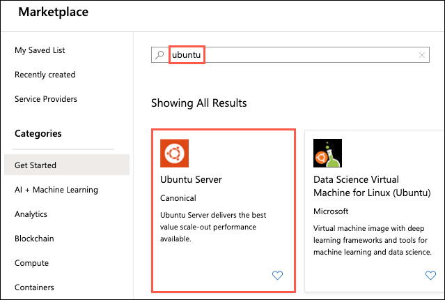
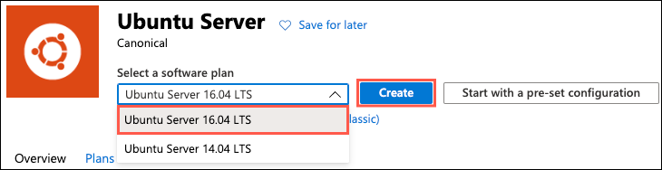
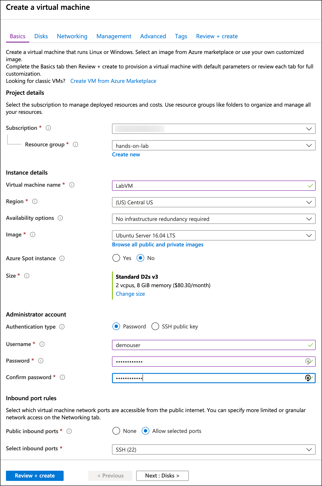
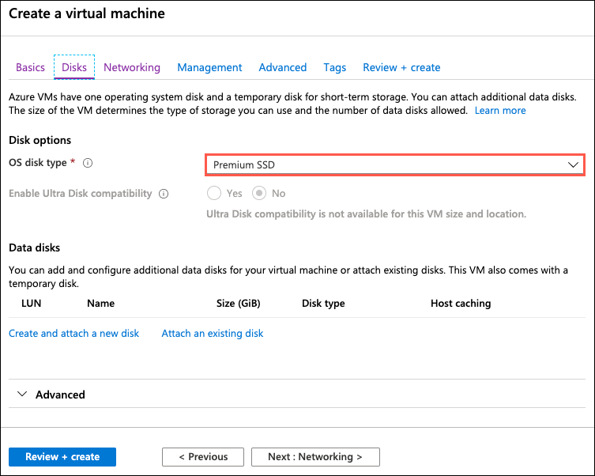
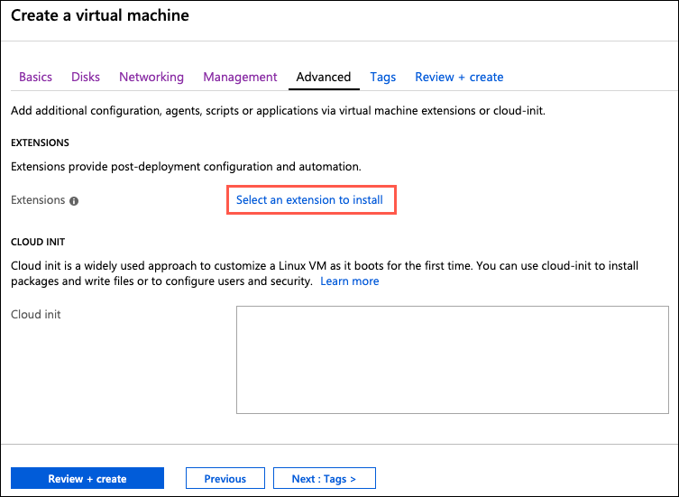
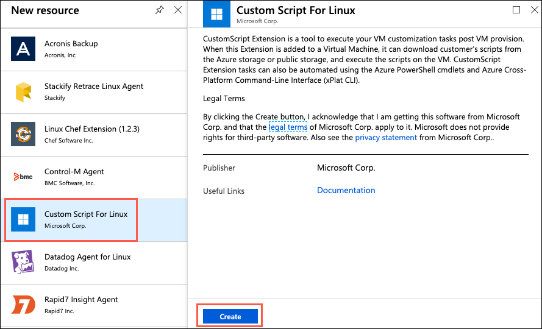
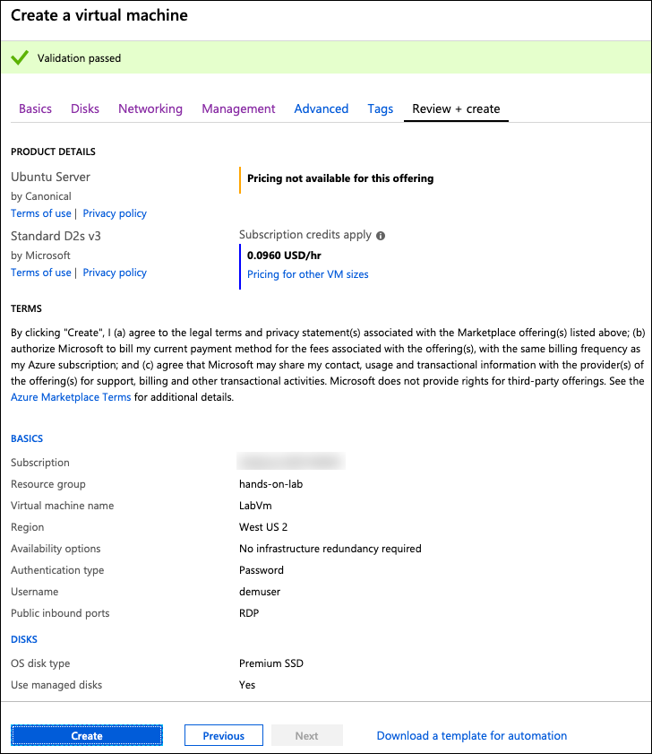

# Appendix A: Lab VM setup

Appendix A provides steps for manually provisioning and setting up the Lab VM used as a development machine for this lab.

## Task 1: Create VM config script

In this task, you will create a script file that will be used as a custom extension for configuring your Linux virtual machine in Azure. This script contains commands to install all the required software and configure a desktop on the Linux VM. These commands could also be run from an SSH shell manually.

1. Open a web browser, and navigate to <https://raw.githubusercontent.com/Microsoft/MCW-OSS-PaaS-and-DevOps/master/Hands-on%20lab/lab-files/LabVM/labvmconfig.sh>.

2. Copy the contents displayed in the browser into a text editor, such as Visual Studio Code or Notepad, and save the file as `labvmconfig.sh`.

    > Note the location where you save the file, as you will be referencing it in the next task.

## Task 2: Create a Linux virtual machine

In this task, you will provision a Linux virtual machine (VM) running Ubuntu Server 16.04 LTS.

1. In the [Azure Portal](https://portal.azure.com/), select **+Create a resource**, then enter "ubuntu" into the search bar, expand **Ubuntu Server** and select **Ubuntu Server 16.04 LTS** from the results.

    

2. On the **Ubuntu Server 16.04 LTS** blade, select **Create**.

    

3. Set the following configuration on the **Basics** tab:

    **PROJECT DETAILS**:

    - **Subscription:** Select the subscription you are using for this hands-on lab.
    - **Resource Group:** Select **Create new**, and enter "hands-on-lab-(SUFFIX)" as the name of the new resource group.

    **INSTANCE DETAILS**:

    - **Virtual machine name:** Enter **LabVM**.
    - **Region:** Select the region you are using for this hands-on lab.
    - **Availability options**: Select **No infrastructure redundancy required**.
    - **Image**: Select **Ubuntu Server 16.04 LTS**.
    - **Size**: Select **Standard D2s v3** or **Standard E2s_v3**.

    **ADMINISTRATOR ACCOUNT**:

    - **Authentication type:** Select **Password**.
    - **Username:** Enter **demouser**
    - **Password:** Enter **Password.1!!**
    - **Login with Azure Active Directory**: Select **Off**.

    **INBOUND PORT RULES**:

     - **Public inbound ports**: Select **Allow selected ports**.
     - **Select inbound ports**: Expand the list and check the box for **RDP (3389)**.

    

4. Select **Next : Disks** to move to the Disks tab.

5. On the **Disks** tab, ensure **Premium SSD** is selected for the **OS disk type**.

    

6. Select **Next : Networking**.

7. On the **Networking** tab, accept all the defaults and select **Next : Management**.

8. On the **Management** tab, accept all the defaults and select **Next : Advanced**.

9. On the **Advanced** tab, click on the **Select an extension to install** link.

    

10. On the **New resource** blade that appears, select **Custom Script for Linux**, and then select **Create** on the Custom Script for Linux blade.

    

11. On the **Install extension** blade:

    - **Script files**: Select the `labvmconfig.sh` file you saved in the previous task.

    - **Command**: Enter `bash labvmconfig.sh`

    - Select **OK**.

    

12. Select **OK** on the Install extension blade.

13. Select **Review + create** on the Advanced tab.

14. Select **Create** on the **Review + create** tab to provision the virtual machine.

    

15. It may take 10+ minutes for the virtual machine to finish provisioning.