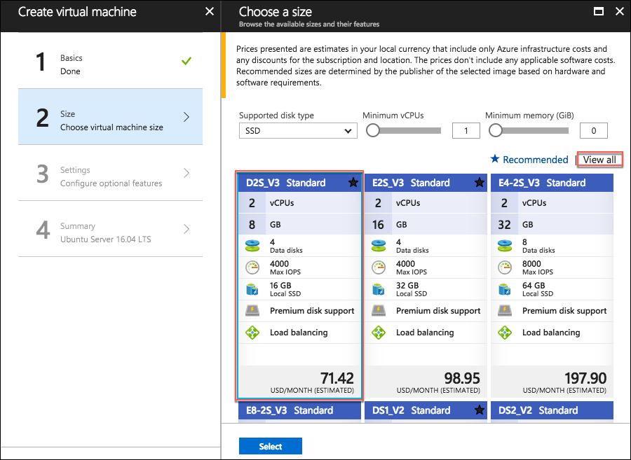
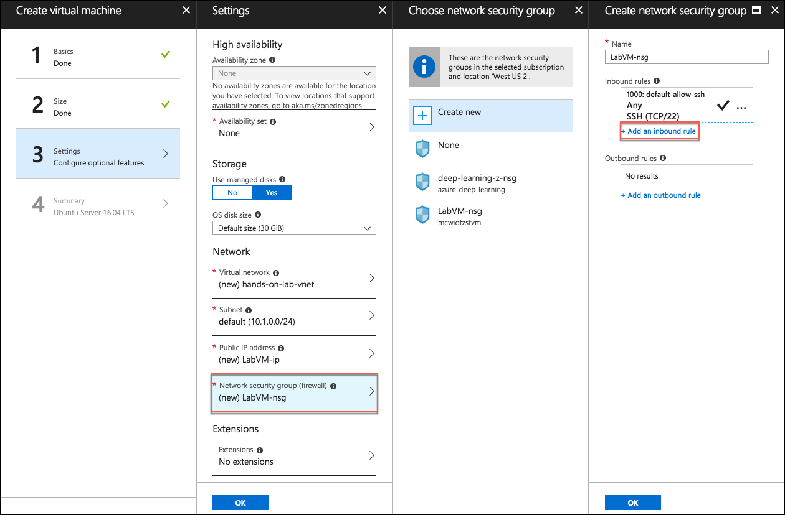
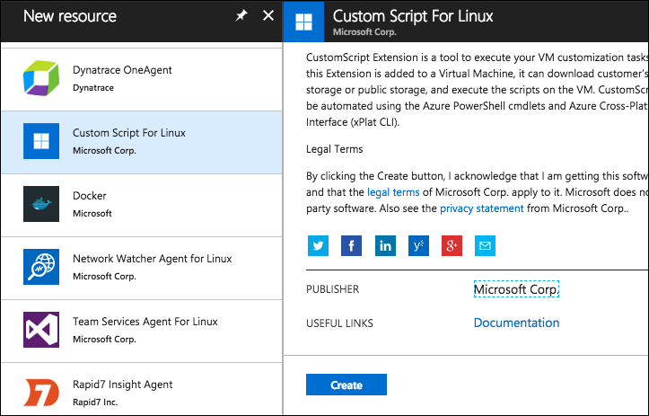

# Appendix A: Lab VM setup

Appendix A provides steps for manually provisioning and setting up the Lab VM used as a development machine for this lab.

## Task 1: Create VM config script

In this task, you will create a script file that will be used as a custom extension for configuring your Linux virtual machine in Azure. This script contains commands to install all the required software and configure a desktop on the Linux VM. These commands could also be run from an SSH shell manually.

1. Open a web browser, and navigate to <https://raw.githubusercontent.com/ZoinerTejada/mcw-oss-paas-devops/master/LabVM/labvmconfig.sh>.

2. Copy the contents displayed in the browser into a text editor, such as Notepad, and save the file as **labvmconfig.sh**. Note the location you saved the file, as you will be referencing it in the next task.

## Task 2: Create a Linux virtual machine

In this task, you will provision a Linux virtual machine (VM) running Ubuntu Server 16.04 LTS.

1. In the [Azure Portal](https://portal.azure.com/), select **+Create a resource**, then enter "ubuntu" into the search bar, and select **Ubuntu Server 16.04 LTS** from the results.

    

2. On the **Ubuntu Server 16.04 LTS** blade, select **Create**.

    

3. Set the following configuration on the **Basics** tab:

    - **Name:** Enter LabVM

    - **VM disk type:** Select **SSD**

    - **User name:** Enter demouser

    - **Authentication Type:** Select **Password**

    - **Password:** Enter Password.1!!

    - **Subscription:** Select the subscription you are using for this hands-on lab.

    - **Resource Group:** Select **Create new**, and enter "hands-on-lab-(SUFFIX)" as the name of the new resource group.

    - **Location:** Select either **East US**, **West US 2**, **West Europe**, or **Southeast Asia**, as these are currently the only regions which offer Dv3 and Ev3 VMs. Remember this location for other resources in this hands-on lab.

        

4. Select **OK** to move to the next step.

5. On the **Choose a size** blade, select **View all**. This machine will be doing nested virtualization, so it needs to be in either the Dv3 or Ev3 series, so selecting **D2S_V3 Standard** is a good baseline option. If that size is not available in the region you selected, go back to the **Basics** blade, and try one of the other regions listed above.

    

6. Click **Select** to move on to the **Settings** blade.

7. On the **Settings** blade, select **Network security group (firewall)**, then select **+Add an inbound rule** in the Create network security group blade.

    

8. On the **Add inbound security rule** blade, select **RDP** from the **Service** drop down, then select **OK**.

    

9. Select **OK** on the Create network security group blade.

10. Next, select **Extensions** on the **Settings** blade, and select **Add extension**.

    

11. On the **New resource** blade, select **Custom Script for Linux**, then select **Create** on the **Custom Script for Linux** blade. By using a custom script, you can install software and configure the VM as part of the provisioning process.

    

12. On the **Install extension** blade:

    - **Script files**: Select the **labvmconfig.sh** file you saved in the previous task.

    - **Command**: Enter "bash labvmconfig.sh"

    - Select **OK**.

    

13. Select **OK** on the Extension blade.

14. Select **OK** on the Settings blade.

15. Select **Create** on the **Create** blade to provision the virtual machine.

    

16. It may take 10+ minutes for the virtual machine to complete provisioning. You can move on to the next task while you wait for this to complete.
