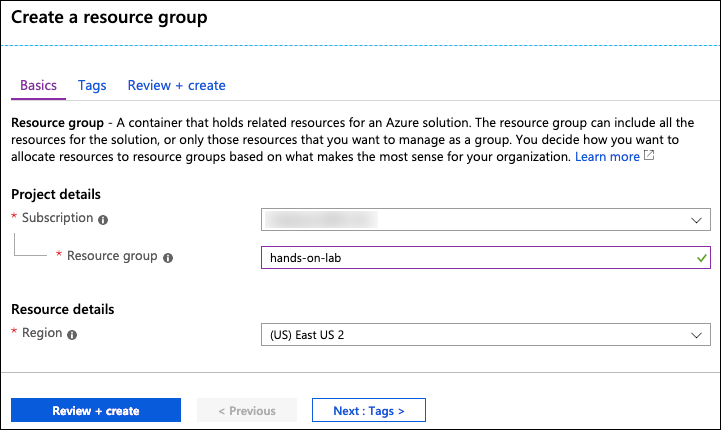
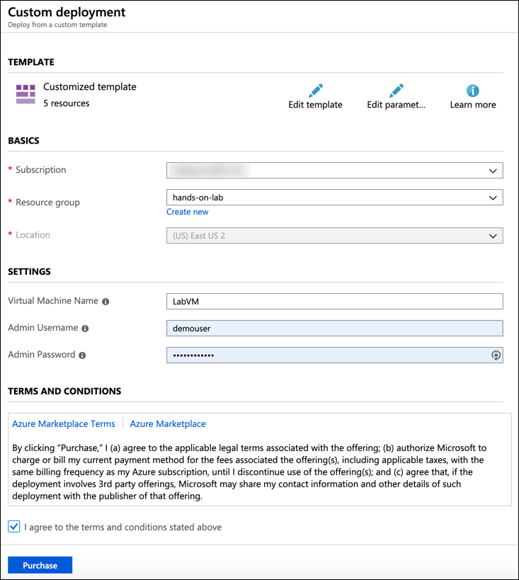
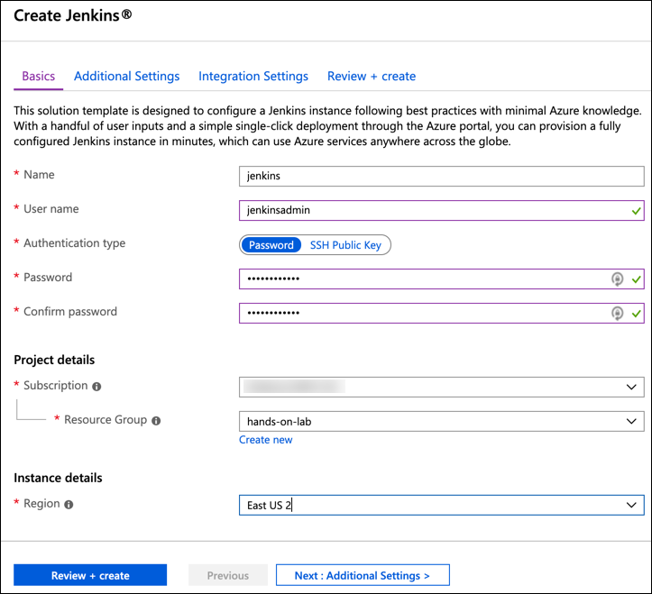
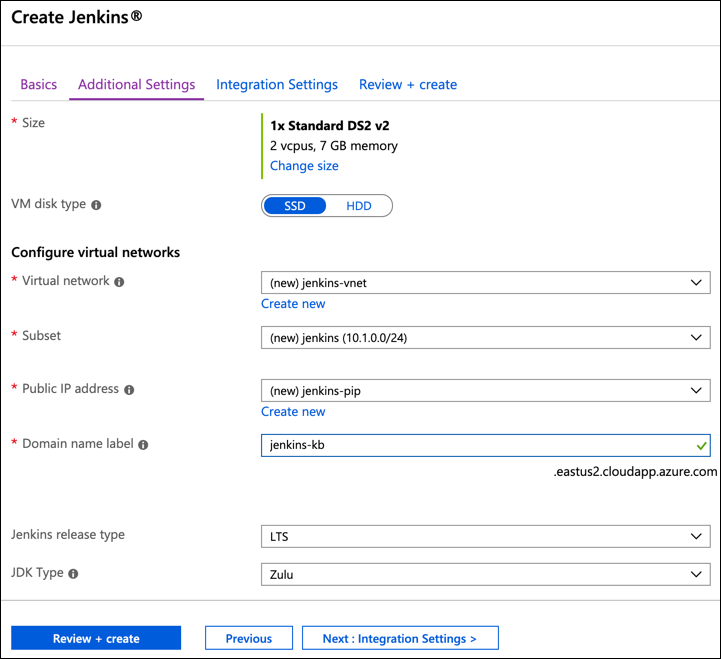
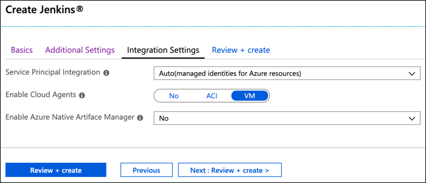
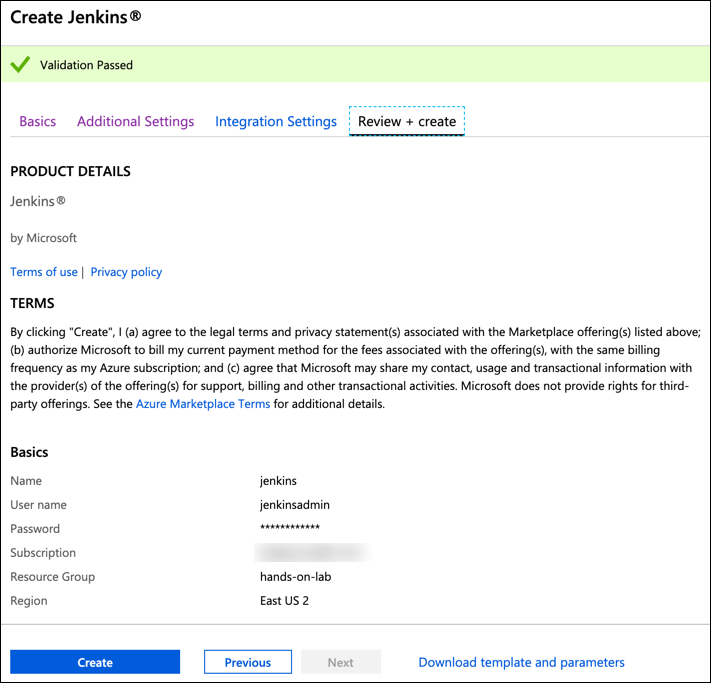
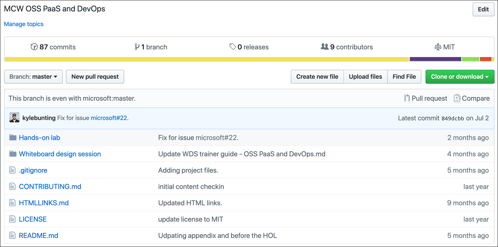

OSS PaaS and DevOps

Before the hands-on lab setup guide

April 2019

Information in this document, including URL and other Internet Web site references, is subject to change without notice. Unless otherwise noted, the example companies, organizations, products, domain names, e-mail addresses, logos, people, places, and events depicted herein are fictitious, and no association with any real company, organization, product, domain name, e-mail address, logo, person, place or event is intended or should be inferred. Complying with all applicable copyright laws is the responsibility of the user. Without limiting the rights under copyright, no part of this document may be reproduced, stored in or introduced into a retrieval system, or transmitted in any form or by any means (electronic, mechanical, photocopying, recording, or otherwise), or for any purpose, without the express written permission of Microsoft Corporation.

Microsoft may have patents, patent applications, trademarks, copyrights, or other intellectual property rights covering subject matter in this document. Except as expressly provided in any written license agreement from Microsoft, the furnishing of this document does not give you any license to these patents, trademarks, copyrights, or other intellectual property.

The names of manufacturers, products, or URLs are provided for informational purposes only and Microsoft makes no representations and warranties, either expressed, implied, or statutory, regarding these manufacturers or the use of the products with any Microsoft technologies. The inclusion of a manufacturer or product does not imply endorsement of Microsoft of the manufacturer or product. Links may be provided to third party sites. Such sites are not under the control of Microsoft and Microsoft is not responsible for the contents of any linked site or any link contained in a linked site, or any changes or updates to such sites. Microsoft is not responsible for webcasting or any other form of transmission received from any linked site. Microsoft is providing these links to you only as a convenience, and the inclusion of any link does not imply endorsement of Microsoft of the site or the products contained therein.

© 2019 Microsoft Corporation. All rights reserved.

Microsoft and the trademarks listed at <https://www.microsoft.com/en-us/legal/intellectualproperty/Trademarks/Usage/General.aspx> are trademarks of the Microsoft group of companies. All other trademarks are property of their respective owners.

**Contents**

<!-- TOC -->

- [OSS PaaS and DevOps before the hands-on lab setup guide](#oss-paas-and-devops-before-the-hands-on-lab-setup-guide)
  - [Requirements](#requirements)
  - [Before the hands-on lab](#before-the-hands-on-lab)
    - [Task 1: Provision a resource group](#task-1-provision-a-resource-group)
    - [Task 2: Create a development virtual machine](#task-2-create-a-development-virtual-machine)
    - [Task 3: Provision a Jenkins server](#task-3-provision-a-jenkins-server)
    - [Task 4: Create GitHub account](#task-4-create-github-account)
    - [Task 5: Fork the starter app](#task-5-fork-the-starter-app)

<!-- /TOC -->

# OSS PaaS and DevOps before the hands-on lab setup guide

## Requirements

1. Microsoft Azure subscription must be pay-as-you-go or MSDN

   - Trial subscriptions will *not* work.

2. Linux virtual machine configured with:

   - Visual Studio Code
   - Azure CLI
   - Docker
   - Node.js and npm
   - MongoDB Community Edition

## Before the hands-on lab

Duration: 30 minutes

In this exercise, you will set up your environment for use in the rest of the hands-on lab. You should follow all steps provided *before* attending the Hands-on lab.

> **IMPORTANT**: Many Azure resources require unique names. Throughout these steps you will see the word "SUFFIX" as part of resource names. You should replace this with your Microsoft alias, initials, or another value to ensure the resource is uniquely named.

### Task 1: Provision a resource group

In this task, you will create an Azure resource group for the resources used throughout this lab.

1. In the [Azure Portal](https://portal.azure.com/), select **Resource groups**, select **+Add**, and then enter the following in the Create an empty resource group blade:

    - **Name**: Enter hands-on-lab-SUFFIX.
    - **Subscription**: Select the subscription you are using for this hands-on lab.
    - **Resource group location**: Select the region you are using for this hands-on lab.

    

2. Select **Create**.

### Task 2: Create a development virtual machine

In this task, you will provision a Linux virtual machine (VM) running Ubuntu Server 16.04 LTS, which will be used as your development machine throughout this lab. The VM will be created using an Azure Resource Manager (ARM) template from a GitHub repository. The ARM template includes a custom extension script which installs Docker, Visual Studio Code (VS Code), MongoDB, and other required software on the VM. The ARM template also adds an inbound port rule that opens port 3389 on the network security group for the VM to allow RDP connections.

> If you would like to review the steps to manually provision the VM and installed software, see [Appendix A](./Appendix-A).

1. To open a custom deployment screen in the Azure portal select the Deploy to Azure button below:

    

2. On the custom deployment screen in the Azure portal, enter the following:

    - **Subscription**: Select the subscription you are using for this hands-on lab.
    - **Resource group**: Select the hands-on-lab-SUFFIX resource group from the dropdown list.
    - **Location**: Select the location you used for the hands-on-lab-SUFFIX resource group.
    - **Virtual Machine Name**: Accept the default value, LabVM.
    - **Admin Username**: Accept the default value, demouser.
    - **Admin Password**: Accept the default value, Password.1!!
    - Check the box to agree to the Azure Marketplace terms and conditions.
    - Select **Purchase**.

    

3. It can take about 20 minutes to deploy the Lab VM. You can move on to the next task while the VM is deploying.

### Task 3: Provision a Jenkins server

In this task, you will provision an Azure Linux VM, which will serve as your Jenkins server for this hands-on lab.

1. In the Azure portal, select **+ Create a resource**, enter "Jenkins" into the **Search the Marketplace** box, select the **Jenkins** compute item from the results, and then select **Create**.

    

2. On the **Create Jenkins Basics** blade, enter the following:

    - **Name:** Enter **Jenkins**
    - **User name:** Enter **jenkinsadmin**
    - **Authentication type:** Select **Password**
    - **Password:** Enter **Password.1!!**
    - **Subscription:** Select the subscription you are using for this hands-on lab.
    - **Resource group:** Select Create new, and enter "jenkins-SUFFIX" (Note: Jenkins will use a different resource group than the other resources in this lab).
    - **Location:** Select the location you are using for resources in this hands-on lab.
    - Select **OK** to proceed to the **Settings** blade.

    

3. On the **Additional Settings** blade:

    - **Subnets**: Select **Configure subnets**, and then select **OK** on the **Subnets** blade to accept the defaults.
    - **Domain name label**: Enter a unique value, such as **jenkins-SUFFIX**.
    - **Jenkins release type**: Select **LTS**.
    - **JDK Type**: Select **Zulu**.

4. Select **OK** to proceed to the Integration Settings screen.

    

5. On the **Integration Settings** blade, select **OK**.

    

6. On the **Summary** blade, ensure the `Validation passed` message is displayed, and then select **OK**.

    

7. Select **Create** on the **Buy** screen to provision the Jenkins server.

    

8. It can take 10+ minutes for the VM to provision. You can move on to the next task while you wait.

### Task 4: Create GitHub account

In this task, you will sign up for a free GitHub account, which will be used for hosting a copy of the sample application used throughout this lab. This account will be integrated into the CI/CD workflow for pushing updates to the application into Azure.

> **NOTE**: If you already have a GitHub account, and wish to use that account, you can skip to the [next task](#task-5-fork-the-starter-app).

1. Navigate to <https://github.com> in a web browser.

2. In the form on the page, enter a **username**, your **email** address, and a **password**, then select **Sign up for GitHub**.

    

3. On the Welcome to GitHub screen, select **Unlimited public repositories free** under **Choose your personal plan**, and select **Continue**.

    

4. On the next screen, you can select options to tailor your experience and select **Submit**, or select **skip this step**, next to **Submit,** to complete your registration.

    

### Task 5: Fork the starter app

In this task, you will fork the [OSS PaaS and DevOps MCW GitHub repository](https://github.com/Microsoft/MCW-OSS-PaaS-and-DevOps) to create a copy of the starter application in your GitHub account.

> As part of this workshop, you will be linking a Jenkins Continuous Integration/Continuous Delivery pipeline to your GitHub repo and committing code changes into that forked repo. To do this, you must create a copy of the starter application in a repo where you have permissions to commit changes.

1. Log into your GitHub account, and then navigate to the [OSS PaaS and DevOps MCW GitHub repository](https://github.com/Microsoft/MCW-OSS-PaaS-and-DevOps).

2. At the top right of the projects GitHub page, select **Fork**.

    

3. If you have more than one GitHub account, select the account you are using for this hands-on lab.

4. This will start the process of making a copy of the repo and starter application into your GitHub account, in a repository named **MCW-OSS-PaaS-and-DevOps**.

5. Once completed the project page will open.

    

You should follow all steps provided *before* attending the Hands-on lab.