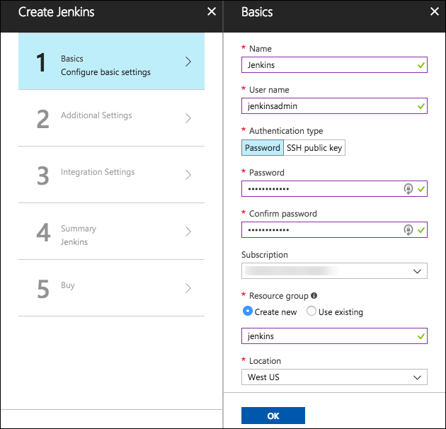

# OSS PaaS and DevOps setup

## Requirements

1.  Microsoft Azure subscription must be pay-as-you-go or MSDN

    -   Trial subscriptions will *not* work

2.  Linux virtual machine configured with:

    -   Visual Studio Code

    -   Azure CLI

    -   Docker

    -   Node.js and npm

    -   MongoDB Community Edition

## Before the hands-on lab

Duration: 30 minutes

In this exercise, you will set up your environment for use in the rest of the hands-on lab. You should follow all steps provided *before* attending the Hands-on lab.

**IMPORTANT**: Most Azure resources require unique names. Throughout these steps you will see the word "SUFFIX" as part of resource names. You should replace this with your Microsoft alias, initials, or another value to ensure the resource is uniquely named.

### Task 1: Provision a resource group

In this task, you will create an Azure resource group for the resources used throughout this lab.

1.  In the [Azure Portal](https://portal.azure.com/), select **Resource groups**, select **+Add**, then enter the following in the Create an empty resource group blade:

    -   **Name**: Enter hands-on-lab-SUFFIX

    -   **Subscription**: Select the subscription you are using for this hands-on lab

    -   **Resource group location**: Select either **East US**, **West US 2**, **West Europe**, or **Southeast Asia**, as these are currently the only regions which offer Dv3 and Ev3 VMs. Remember this location for other resources in this hands-on lab 
    
    

2.  Select **Create**.

### Task 2: Create a development virtual machine

In this task, you will provision a Linux virtual machine (VM) running Ubuntu Server 16.04 LTS, which will be used as your development machine throughout this lab. The VM will be created using an Azure Resource Manager (ARM) template from a GitHub repository. The ARM template includes a custom extension script which installs Docker, Visual Studio Code (VS Code), MongoDB, and other required software on the VM. The ARM template also adds an inbound port rule that opens port 3389 on the network security group for the VM to allow RDP connections. To review the steps to manually provision the VM and installed software, see [Appendix A](#_Appendix_A:_Lab).

1.  To open a custom deployment screen in the Azure portal select the Deploy to Azure button below

    

2.  On the custom deployment screen in the Azure portal, enter the following:

    -   **Subscription**: Select the subscription you are using for this hands-on lab

    -   **Resource group**: Select Use existing, and select the hands-on-lab-SUFFIX resource group

    -   **Location**: Select the location you used for the hands-on-lab-SUFFIX resource group

    -   **Virtual Machine Name**: Accept the default value, LabVM

    -   **Admin Username**: Accept the default value, demouser

    -   **Admin Password**: Accept the default value, Password.1!!

    -   Check the box to agree to the Azure Marketplace terms and conditions.

    -   Select **Purchase**
    
    

3.  It takes about 20 minutes to deploy the Lab VM. Move on to the next task while the VM is deploying.

### Task 3: Provision a Jenkins server 

In this task, you will provision an Azure Linux VM, which will serve as your Jenkins server for this hands-on lab.

1.  In the Azure portal, select **+Create a resource**, enter "Jenkins" into the **Search the Marketplace** box, then select the **Jenkins** compute item from the results. 

    

2.  On the **Jenkins** blade, select **Create** to configure the Jenkins server.

    

3.  On the **Create** **Jenkins Basics** blade, enter the following:

    -   **Name:** Enter "Jenkins"

    -   **User name:** Enter "jenkinsadmin"

    -   **Authentication type:** Select **Password**

    -   **Password:** Enter "Password.1!!"

    -   **Subscription:** Select the subscription you are using for this hands-on lab

    -   **Resource group:** Select **Create new**, and enter "jenkins-SUFFIX" (Note: this will use a different resource group than the other resources in this lab)

    -   **Location:** Select the location you are using for resources in this hands-on lab

    -   Select **OK** to proceed to the **Settings** blade. 
    
    

4.  On the **Additional Settings** blade:

    -   Select **Configure subnets**, and then select **OK** on the **Subnets** blade to accept the defaults.

    -   Enter a unique **Domain name label,** such as "Jenkins-SUFFIX."

    -   Ensure the **Jenkins release type** is set to LTS.

    l.  Select **OK** to proceed to the Integration Settings screen. 
    
    

5.  On the **Integration Settings** blade, select **OK**. 

    

6.  On the **Summary** blade, ensure validation passed, and select **OK**. 

    

7.  Select **Create** on the **Buy** screen to provision the Jenkins server. 

    

8.  It can take 10+ minutes for the VM to provision. You can move on to the next task while you wait.

### Task 4: Create GitHub account

In this task, you will sign up for a free GitHub account, which will be used for hosting a copy of the sample application used throughout this lab. This account will be integrated into the CI/CD workflow for pushing updates to the application into Azure. If you already have a GitHub account, and wish to use that account, you can skip to the [next task](#task-5-fork-the-starter-app).

1.  Open a browser and navigate to <https://github.com>.

2.  In the form on the page, enter a **username**, your **email** address, and a **password**, then select **Sign up for GitHub**. 

    

3.  On the Welcome to GitHub screen, select **Unlimited public repositories free** under **Choose your personal plan**, and select **Continue**. 

    

4.  On the next screen, you can select options to tailor your experience and select **Submit**, or select **skip this step**, next to **Submit,** to complete your registration. 

    

### Task 5: Fork the starter app

In this task, you will fork the starter application to create a copy in your GitHub account.

1.  Log into your GitHub account, then navigate to the GitHub repository for the mcw-oss-paas-devops starter app, [here](https://github.com/ZoinerTejada/mcw-oss-paas-devops).

2.  At the top right of the projects GitHub page, select **Fork**.

    

3.  If you have more than one GitHub account, select the account to which the project should be forked.

4.  This will start the process of making a copy of the starter application into your GitHub account, in a repository named **mcw-oss-paas-devops**.

5.  Once completed the project page will open. 

    

You should follow all steps provided *before* attending the Hands-on lab.