<div class="MCWHeader1">
OSS PaaS and DevOps
</div>

<div class="MCWHeader2">
Hands-on lab step-by-step
</div>

<div class="MCWHeader3">
April 2019
</div>

Information in this document, including URL and other Internet Web site references, is subject to change without notice. Unless otherwise noted, the example companies, organizations, products, domain names, e-mail addresses, logos, people, places, and events depicted herein are fictitious, and no association with any real company, organization, product, domain name, e-mail address, logo, person, place or event is intended or should be inferred. Complying with all applicable copyright laws is the responsibility of the user. Without limiting the rights under copyright, no part of this document may be reproduced, stored in or introduced into a retrieval system, or transmitted in any form or by any means (electronic, mechanical, photocopying, recording, or otherwise), or for any purpose, without the express written permission of Microsoft Corporation.

Microsoft may have patents, patent applications, trademarks, copyrights, or other intellectual property rights covering subject matter in this document. Except as expressly provided in any written license agreement from Microsoft, the furnishing of this document does not give you any license to these patents, trademarks, copyrights, or other intellectual property.

The names of manufacturers, products, or URLs are provided for informational purposes only and Microsoft makes no representations and warranties, either expressed, implied, or statutory, regarding these manufacturers or the use of the products with any Microsoft technologies. The inclusion of a manufacturer or product does not imply endorsement of Microsoft of the manufacturer or product. Links may be provided to third party sites. Such sites are not under the control of Microsoft and Microsoft is not responsible for the contents of any linked site or any link contained in a linked site, or any changes or updates to such sites. Microsoft is not responsible for webcasting or any other form of transmission received from any linked site. Microsoft is providing these links to you only as a convenience, and the inclusion of any link does not imply endorsement of Microsoft of the site or the products contained therein.

© 2019 Microsoft Corporation. All rights reserved.

Microsoft and the trademarks listed at <https://www.microsoft.com/en-us/legal/intellectualproperty/Trademarks/Usage/General.aspx> are trademarks of the Microsoft group of companies. All other trademarks are property of their respective owners.

**Contents**

- [OSS PaaS and DevOps hands-on lab step-by-step](#oss-paas-and-devops-hands-on-lab-step-by-step)
  - [Abstract and learning objectives](#abstract-and-learning-objectives)
  - [Overview](#overview)
  - [Solution architecture](#solution-architecture)
  - [Requirements](#requirements)
  - [Exercise 1: Run starter application](#exercise-1-run-starter-application)
    - [Task 1: Connect to your Lab VM](#task-1-connect-to-your-lab-vm)
    - [Task 2: Grant permissions to Docker](#task-2-grant-permissions-to-docker)
    - [Task 3: Integrate GitHub into VS Code](#task-3-integrate-github-into-vs-code)
    - [Task 4: Clone the starter application](#task-4-clone-the-starter-application)
    - [Task 5: Launch the starter application](#task-5-launch-the-starter-application)
  - [Exercise 2: Migrate the database to Cosmos DB](#exercise-2-migrate-the-database-to-cosmos-db)
    - [Task 1: Provision Cosmos DB using the MongoDB API](#task-1-provision-cosmos-db-using-the-mongodb-api)
    - [Task 2: Create and scale collections](#task-2-create-and-scale-collections)
    - [Task 3: Update database connection string](#task-3-update-database-connection-string)
    - [Task 4: Import data to the API for MongoDB using mongoimport](#task-4-import-data-to-the-api-for-mongodb-using-mongoimport)
    - [Task 5: Install Azure Cosmos DB extension for VS Code](#task-5-install-azure-cosmos-db-extension-for-vs-code)
    - [Task 6: Decrease collection throughput](#task-6-decrease-collection-throughput)
  - [Exercise 3: Containerize the app](#exercise-3-containerize-the-app)
    - [Task 1: Create an Azure Container Registry](#task-1-create-an-azure-container-registry)
    - [Task 2: Install Docker extension in VS Code](#task-2-install-docker-extension-in-vs-code)
    - [Task 3: Create Docker image and run the app](#task-3-create-docker-image-and-run-the-app)
    - [Task 4: Run the containerized app](#task-4-run-the-containerized-app)
    - [Task 5: Push image to Azure Container Registry](#task-5-push-image-to-azure-container-registry)
  - [Exercise 4: Set up Web App for Containers](#exercise-4-set-up-web-app-for-containers)
    - [Task 1: Provision Web App for Containers](#task-1-provision-web-app-for-containers)
    - [Task 2: Navigate to the deployed app](#task-2-navigate-to-the-deployed-app)
  - [Exercise 5: Configure CI/CD pipeline](#exercise-5-configure-cicd-pipeline)
    - [Task 1: Prepare GitHub account for service integrations](#task-1-prepare-github-account-for-service-integrations)
    - [Task 2: Open connection to Jenkins](#task-2-open-connection-to-jenkins)
    - [Task 3: Configure Continuous Integration with Jenkins](#task-3-configure-continuous-integration-with-jenkins)
    - [Task 4: Trigger CI build](#task-4-trigger-ci-build)
    - [Task 5: Install Docker on the Jenkins VM](#task-5-install-docker-on-the-jenkins-vm)
    - [Task 6: Add an Azure service principal for Jenkins](#task-6-add-an-azure-service-principal-for-jenkins)
    - [Task 7: Add continuous delivery to Jenkins build job](#task-7-add-continuous-delivery-to-jenkins-build-job)
    - [Task 8: Trigger CI-CD pipeline](#task-8-trigger-ci-cd-pipeline)
  - [Exercise 6: Create Azure Function for order processing](#exercise-6-create-azure-function-for-order-processing)
    - [Task 1: Provision a Function App](#task-1-provision-a-function-app)
    - [Task 2: Configure storage queues](#task-2-configure-storage-queues)
    - [Task 3: Create Cosmos DB trigger function](#task-3-create-cosmos-db-trigger-function)
    - [Task 4: Create Queue function](#task-4-create-queue-function)
  - [Exercise 7: Create Logic App for sending email notifications](#exercise-7-create-logic-app-for-sending-email-notifications)
    - [Task 1: Create SendGrid account](#task-1-create-sendgrid-account)
    - [Task 2: Create Logic App](#task-2-create-logic-app)
  - [After the hands-on lab](#after-the-hands-on-lab)
    - [Task 1: Delete Azure resource groups](#task-1-delete-azure-resource-groups)
    - [Task 2: Delete WebHooks and Service Integrations](#task-2-delete-webhooks-and-service-integrations)

# OSS PaaS and DevOps hands-on lab step-by-step

## Abstract and learning objectives

In this hands-on lab, you will implement a solution for integrating and deploying complex open-source software (OSS) workloads into Azure PaaS. You will migrate an existing MERN (MongoDB, Express.js, React.js, Node.js) stack application from a hosted environment into Azure Web App for Containers, migrate a MongoDB instance into Cosmos DB, enhance application functionality using serverless technologies, and fully embrace modern DevOps tools.

At the end of this hands-on lab, you will be better able to migrate and deploy OSS applications into Azure PaaS using modern DevOps methodologies and Docker containers.

## Overview

Best For You Organics Company is one of the leading health food suppliers in North America, serving customers in Canada, Mexico, and the United States. They have a MERN stack web application which they host on-premises and are looking to migrate their OSS application into Azure. They will be creating a custom Docker image for their application and using a Jenkins continuous integration/continuous delivery (CI/CD) pipeline to deploy the application into a Web App for Containers instance. In addition, they will be swapping out the use of MongoDB with Azure Cosmos DB, using the MongoDB APIs.

In this hands-on lab, you will assist them with completing the OSS application and database migrations into Azure. You will create a custom Docker image, provision an Azure Container Registry, push the image to the registry, and configure the CI/CD pipeline to deploy the application to a Web App for Containers instance. You will also help them implement functionality enhancements using serverless architecture services in Azure.

## Solution architecture

Below is a diagram of the solution architecture you will build in this lab. Please study this carefully, so you understand the whole of the solution as you are working on the various components.

![This diagram consists of icons that are connected by arrows. On the left, the Developer icon (VS Code) points in a linear fashion to the GitHub Repo and Jenkins icons. The previous two icons are enclosed in a box labeled CI/CD Pipeline. Jenkins points to Web App for Containers on the right. Various arrows point from Web App for Container to: Azure Container Registry (a double-sided arrow); Logic Apps (a linear arrow that also points from Logic Apps to Customers); Customers (a linear arrow); and Azure Cosmos DB (a double-sided arrow that also points from Azure Cosmos DB to Azure Functions with another double-sided arrow).](media/solution-architecture-diagram.png "Solution architecture diagram")

The solution begins with developers using Visual Studio Code (VS Code) as their code editor, so they can leverage its rich integration with GitHub, Docker, and Azure. From a high level, developers will package the entire OSS application inside a custom Docker container using the Docker extension in VS Code. The image will be pushed to an Azure Container Registry as part of a continuous integration/continuous delivery (CI/CD) pipeline using GitHub and Jenkins. This Docker image will then be deployed to a Web App for Containers instance, as part of their continuous delivery process using The Azure App Service Jenkins plugin.

The MongoDB database will be imported into Azure Cosmos DB, using mongoimport.exe, and access the database from the application will continue to use the MongoDB APIs. The database connection string in the application will be updated to point to the new Cosmos DB.

Serverless architecture will be applied to order processing and customer notifications. Azure Functions will be used to automate the processing of orders. Logic Apps will be applied to send SMS notifications, via a Twilio connector, to customers informing them that their order has been processed and shipped.

## Requirements

1. Microsoft Azure subscription must be pay-as-you-go or MSDN
    - Trial subscriptions will *not* work.
2. Linux virtual machine configured with:
    - Visual Studio Code
    - Azure CLI
    - Docker
    - Node.js and npm
    - MongoDB Community Edition

## Exercise 1: Run starter application

Duration: 30 minutes

In this exercise, you will create a local copy of the starter application on your Lab VM, add some sample data to the local MongoDB database, and run the application.

### Task 1: Connect to your Lab VM

In this task, you will create an RDP connection to your Lab VM. If you are already connected, skip to [Task 2](#task-2-grant-permissions-to-docker).

1. Navigate to the Azure portal and select **Resource groups** from the left-hand menu, then select the **hands-on-lab-SUFFIX** resource group from the list. If there are too many, enter "hands-on-lab" into the filter box to reduce the resource groups displayed the list.

    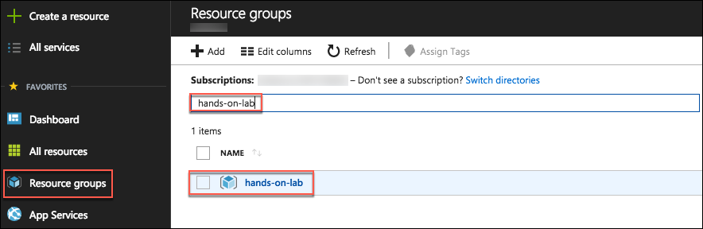

2. Next, select **LabVM** from the list of available resources.

    

3. On the **LabVM** blade, copy the Public IP address from the Essentials area on the Overview screen.

    

4. Open a Remote Desktop Client (RDP) application and enter or paste the Public IP address of your Lab VM into the computer name field.

5. Select **Connect** on the Remote Desktop Connection dialog.

6. Select **Yes** to connect, if prompted that the identity of the remote computer cannot be verified.

    

7. Enter the following credentials (or the non-default credentials if you changed them):

    - **User name:** demouser
    - **Password:** Password.1!!

    

8. Select **OK** to log into the Lab VM.

### Task 2: Grant permissions to Docker

In this task, you will grant permissions to the demouser account to access the Unix socket needed to communicate with the Docker engine.

1. On your Lab VM, open a **Bash** shell by selecting the Start menu, and then expanding Debian, Applications, and Shells.

    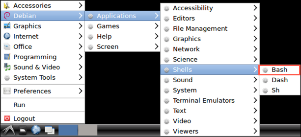

2. At the command prompt, enter the following command:

    ```bash
    sudo usermod -a -G docker $USER
    ```

3. After running the command, you will need **completely log out of the Lab VM** and log back in (if in doubt, reboot).

4. After logging back in, run the following command to test that the demouser account has proper permissions:

    ```bash
    docker run hello-world
    ```

    

### Task 3: Integrate GitHub into VS Code

In this task, you will install the GitHub extension in VS Code, and configure a service integration with your GitHub account. This integration will allow you to push your code changes to GitHub directly from VS Code.

1. On your Lab VM, open **VS Code** under Programming on the Start menu.

    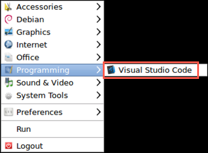

2. In VS Code, select the **Extensions** icon from the left-hand menu, enter "github" into the **Extensions** search box, and select the **GitHub** extension.

    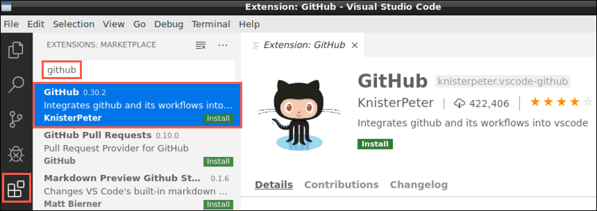

3. Select **Install** in the Extension: GitHub window.

    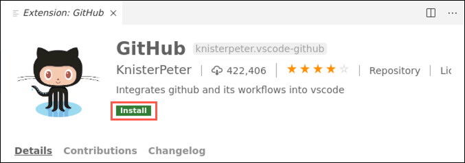

4. Close VS Code.

    > **Note**: VS Code must be restarted to enable the extension.

5. To connect VS Code with your GitHub account, you need to generate a Personal access token.

6. Open a browser window and navigate to your GitHub account (<https://github.com>).

7. Within your GitHub account, select **your user profile icon** in the top right, then select **Settings** from the menu.

    

8. On the Settings screen, select **Developer settings** at the bottom of the Personal settings menu on the left-hand side of the screen.

    

9. On the Developer settings page, select **Personal access tokens** from the left-hand menu.

    

10. Select **Generate new token**.

    

11. Enter a token description, such as "VS Code Integration", and then check the box next to **repo** under **Select scopes**, which will select all the boxes under it.

    

12. Select **Generate token** near the bottom of the screen.

    

13. Select the **copy** button next to the token that is generated.

    

    >**Important**: Make sure you copy the new personal access token before you navigate away from the screen, or you will need to regenerate the token. Save the copied token by pasting it into a text editor for future reference. This will also be used as your password when pushing changes to GitHub.

14. Open **VS Code** on your Lab VM.

15. Select the **View** menu, then select **Command Palette** from the menu.

    

16. In the box that appears at the top center of the VS Code window, enter "Set Personal Access Token," then select **GitHub: Set Personal Access Token**, when it appears.

    

17. Paste the Personal access token you copied from GitHub into the box, and press **Enter**.

    

18. VS Code is now connected to your GitHub account.

19. Close VS Code.

### Task 4: Clone the starter application

In this task, you will clone the starter application, creating a local copy on your Lab VM.

1. On your Lab VM, open a browser, and navigate to your GitHub account (<https://github.com>).

2. Within your GitHub account, navigate to the forked copy of the `MCW-OSS-PaaS-and-Devops` application page, select **Clone or download**, then select the **copy** link next to the web URL.

    

3. Open a new bash shell, and enter the following command:

    ```bash
    cd ~
    ```

4. Next, enter the following command, replacing `[EMAIL]` with the email address you used when creating your GitHub account. This will associate your git email address with the commits made from the Lab VM.

    ```bash
    git config --global user.email "[EMAIL]"
    ```

    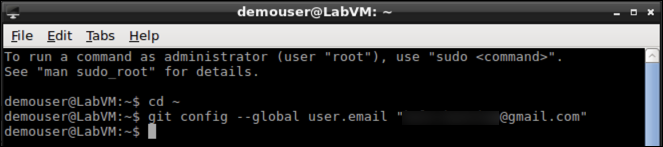

5. At the prompt, enter the following command, replacing `[CLONE-URL]` with URL you copied from GitHub in step 2 above:

    ```bash
    git clone [CLONE-URL]
    ```

    

6. Now, change the directory to the cloned project by entering the following at the prompt:

    ```bash
    cd MCW-OSS-PaaS-and-DevOps
    ```

    

7. Finally, issue a command to open the starter project in VS Code by typing:

    ```bash
    code .
    ```

8. A new VS Code window will open, with the `MCW-OSS-PaaS-and-DevOps` folder opened.

    

9. You are now ready to begin working with the project in VS Code.

### Task 5: Launch the starter application

In this task, you will seed the MongoDB with sample data, then run the application locally, connected to your MongoDB instance. This task is to verify the connection to MongoDB and that it contains the seeded plan data, before we migrate the application and data to Azure Cosmos DB.

1. Return to VS Code, select **Terminal** from the menu, and select **New Terminal**.

    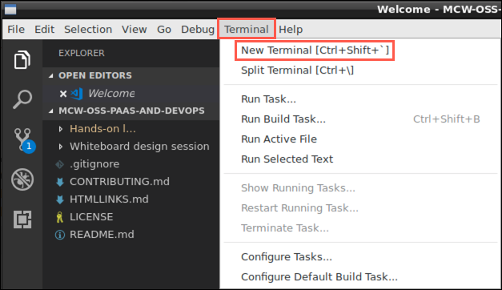

2. This will open a new bash terminal window at the bottom of the VS Code dialog.

3. Change directories to the `Hands-on lab/lab-files` folder by running the following command. **Important**: Be sure to include the quotes around the path, since it contains a space.

    ```bash
    cd "Hands-on lab/lab-files"
    ```

4. At the bash prompt, use the `npm install` command to ensure the required components are installed on your Lab VM.

    ```bash
    sudo npm install
    ```

    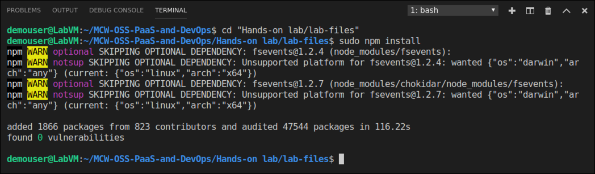

5. Next, enter the following to seed the local MongoDB database with plans, user accounts, and orders.

    ```bash
    node data/Seed.js
    ```

    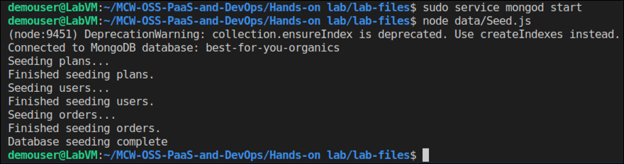

    >**Note**: If you receive an error that the service is not running, start the MongoDB service by executing the `sudo service mongod start` command at the shell prompt.

6. Next, build the application using the following:

    ```bash
    sudo npm run build
    ```

7. Finally, enter the following to start the web server for the application. You will see a `connection successful` message in the terminal window.

    ```bash
    npm start
    ```

8. Open a browser and navigate to <http://localhost:3000> to view the landing page of the starter application. You will see three plans listed on the application home page, which are pulled from the local MongoDB database.

    

9. Return to the VS Code integrated terminal window, and press **CTRL+C** to stop the application.

## Exercise 2: Migrate the database to Cosmos DB

Duration: 30 minutes

In this exercise, you will provision an Azure Cosmos DB account, and then update the starter application's database connection string to point to your new Azure Cosmos DB account. You will then, use `mongoimport.exe` to migrate the data in your MongoDB database into Cosmos DB collections, and verify with the application that you are connected to your Cosmos DB database.

### Task 1: Provision Cosmos DB using the MongoDB API

In this task, you will provision a new Azure Cosmos DB account using the MongoDB API.

1. In the Azure portal, select **+Create a resource**, **Databases**, the select **Azure Cosmos DB**.

    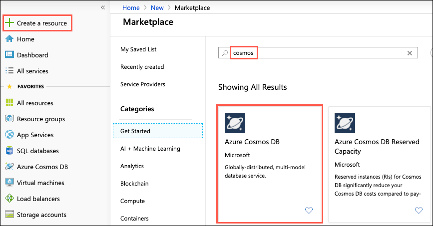

2. On the **Azure Cosmos** **DB** blade, enter the following:

    **PROJECT DETAILS**:

    - **Subscription:** Select the subscription you are using for this hands-on lab.
    - **Resource Group:** Select the **hands-on-lab-SUFFIX** resource group you created previously.

    **INSTANCE DETAILS**:

    - **Account Name**: Enter `best-for-you-db-SUFFIX`, where SUFFIX is your Microsoft alias, initials, or another value to ensure the name is unique (indicated by a green check mark).
    - **API:** Select **Azure Cosmos DB for MongoDB API**.
    - **Location:** Select a location near you from the list (Note: not all locations are available for Cosmos DB).
    - **Enable geo-redundancy:** Select Disable.
    - **Multi-region Writes**: Select Disable.

    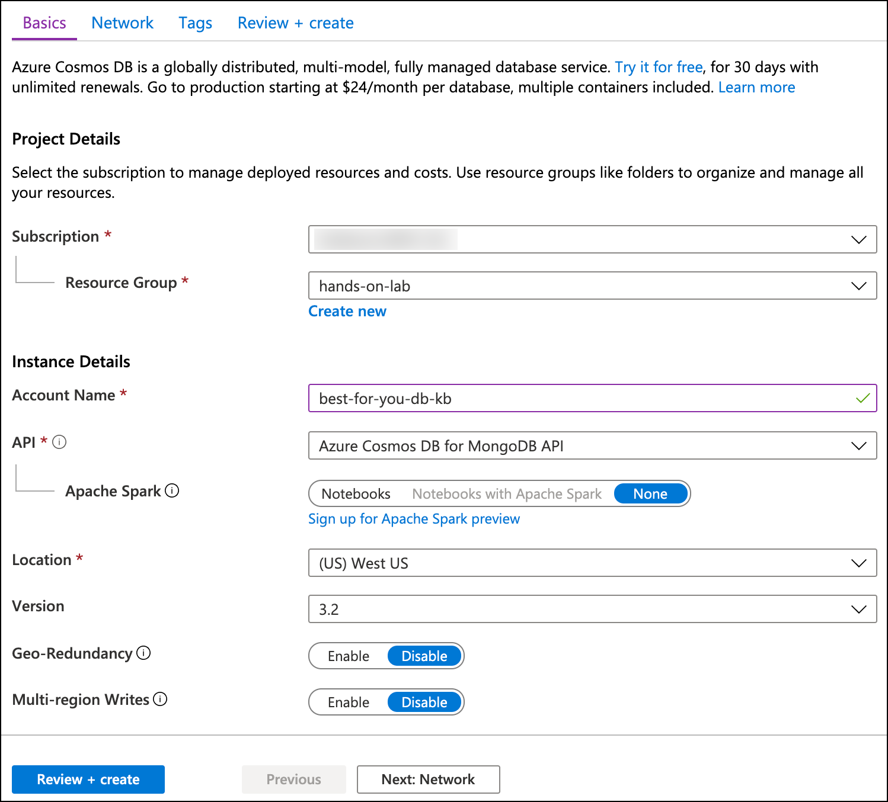

3. Select **Review + create** to move to the validation step.

4. Ensure the **Validation Success** message is displayed, and then select **Create** to provision the new Azure Cosmos DB.

### Task 2: Create and scale collections

In this task, you will create the collections needed for your database migration and increase each collection's throughput from the default 1,000 RUs to 2,500 RUs. This is done to avoid throttling during the migration, and reduce the time required to import data.

> To learn more about RUs and throughput provisioning in Cosmos DB, read [Request Units in Azure Cosmos DB](https://docs.microsoft.com/en-us/azure/cosmos-db/request-units).

1. When your Cosmos DB account is provisioned, navigate to it in the Azure portal, select **Browse** from the left-hand menu, under **Collections**, and then select **+Add Collection**.

    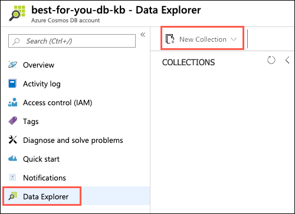

2. In the **Add Collection** dialog, enter the following:

    - **Database id:** Select **Create new**, and enter **best-for-you-organics**.
    - **Collection Id:** Enter **orders**.
    - **Storage capacity:** Select **Fixed (10 GB)**.
    - **Throughput:** Enter **2500**.
    - Select **OK** to create the collection.

    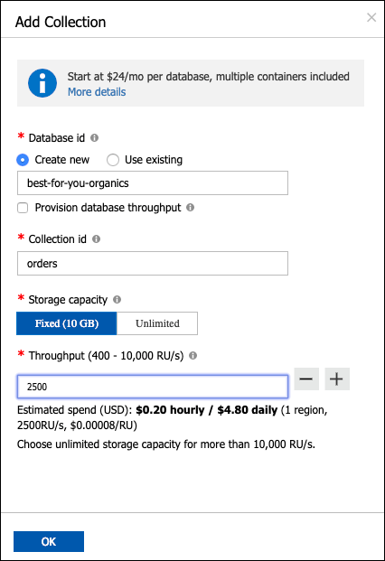

3. On the Collections blade, select **New Collection** to create another collection.

    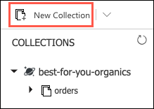

4. On the Add Collection dialog, enter the following:

    - **Database id**: Select **Use existing** and select the **best-for-you-organics** database from the list.
    - **Collection id**: Enter **users**.
    - **Storage capacity**: Select **Fixed (10 GB)**.
    - **Throughput**: Enter **2500**.
    - Select **OK** to create the collection.

    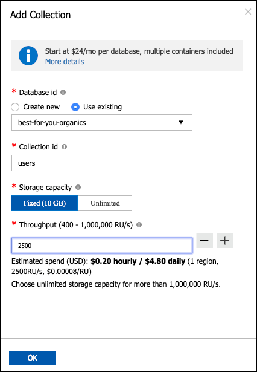

5. Repeat steps 3 and 4, this time entering **plans** as the collection name.

6. The best-for-you-organics database will have three collections listed under it when you are complete.

    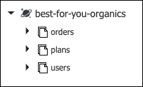

### Task 3: Update database connection string

In this task, you will retrieve the connection string for your Azure Cosmos DB database and update the starter application's database connection string.

1. On the **Azure Cosmos DB account** blade, select **Connection String** under **Settings** in the left-hand menu, and copy the **PRIMARY connection string**.

    

2. Return to VS Code.

3. Open `app.js` from the `Hands-on lab/lab-files` directory of the application and locate the line that starts with **var databaseUrl** (line 16).

    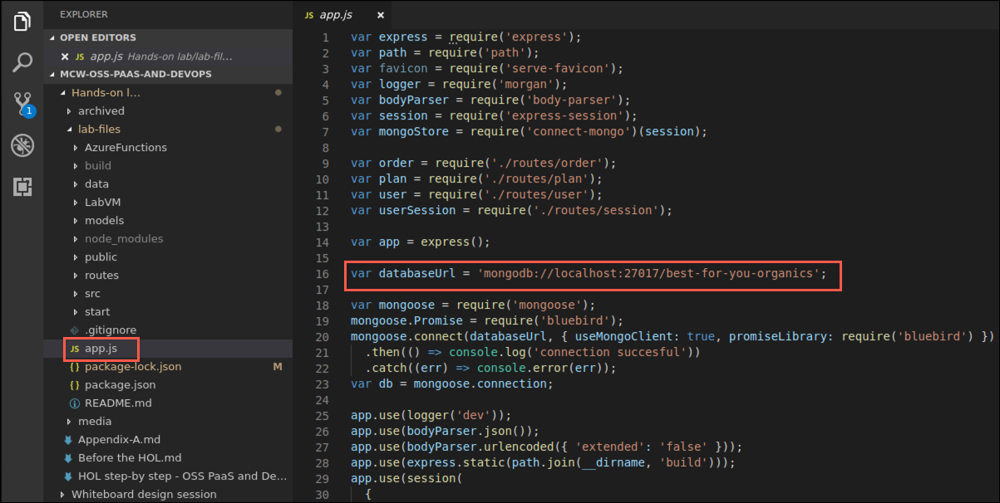

4. Replace the value of the **databaseUrl** variable with the Cosmos DB connection string you copied from the Azure portal.

    

5. The connection string copied from the portal does not specify the name of the database, so you now need to add that to the connection string. Scroll to the end of the value you just pasted in and locate **10255/?ssl=** in the string.

    

6. Between the "/" and the "?" insert **best-for-you-organics** to specify the database name.

    

7. Save `app.js`.

8. In the VS Code integrated terminal, enter the following command to rebuild the application:

    ```bash
    sudo npm run build
    ```

9. When the build completes, start the application by typing the following:

    ```bash
    npm start
    ```

10. Return to your browser and refresh the application page. Note: You may need to press **CTRL+F5** in your browser window to clear the browser cache while refreshing the page.

    

    > Notice the three plans that were displayed on the page previously are no longer there. This is because the application is now pointed to your Azure Cosmos DB, and the plans collection does not contain any data yet.

11. Let's move on to copying the data from the local MongoDB instance into Cosmos DB.

### Task 4: Import data to the API for MongoDB using mongoimport

In this task, you will use `mongoimport.exe` to import data to your Cosmos DB account. There is a shell script located in the `MCW-OSS-PaaS-and-DevOps` project which handles exporting the data out of your MongoDB into JSON files on the local file system. These files will be used for the import into Cosmos DB.

1. On your Lab VM, open a new integrated bash prompt in VS Code by selecting the **+** next to the shell dropdown in the integrated terminal pane.

    

2. At the prompt, enter the following command to grant execute permissions on the export script:

    ```bash
    chmod +x "Hands-on lab/lab-files/data/mongo-export.sh"
    ```

3. Next, run the script by entering the following command:

    ```bash
    "Hands-on lab/lab-files/data/mongo-export.sh"
    ```

    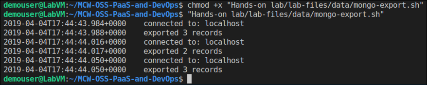

4. The script creates the folder ~/MongoExport, and exports each of the collections in your MongoDB to JSON files. Navigate to the MongoExport directory for your user account by running the following command:

    ```bash
    cd ~/MongoExport
    ```

5. You are now ready to import the data into Azure Cosmos DB using `mongoimport.exe`.

6. You will use the following command template for executing the data import:

    ```bash
    mongoimport --host <your_hostname>:10255 -u <your_username> -p <your_password> --db <your_database> --collection <your_collection> --ssl --sslAllowInvalidCertificates --type json --file <your_collection>.json
    ```

7. To get the values needed for the template command above, return to the **Connection string** blade for your Azure Cosmos DB account in the Azure portal. Leave this window up, as you will need the **HOST**, **USERNAME**, and **PRIMARY PASSWORD** values from this page to import data to your Cosmos DB account.

    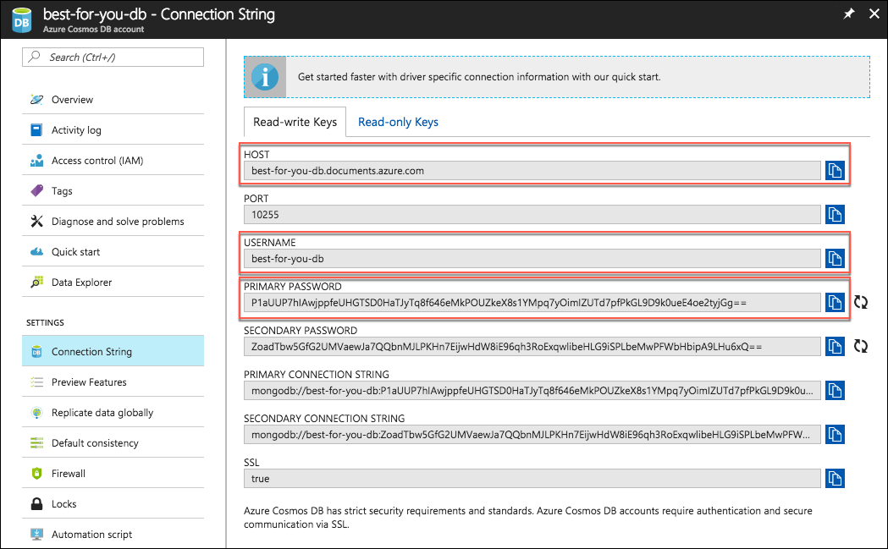

8. Replace the values as follows in the template command above:

    - `<your_hostname>`: Copy and paste the **Host** value from your **Cosmos DB Connection String** blade.
    - `<your_username>`: Copy and paste the **Username** value from your **Cosmos DB Connection String** blade.
    - `<your_password>`: Copy and paste the **Primary Password** value from your **Cosmos DB Connection** **String** blade.
    - `<your_database>`: Enter "best-for-you-organics".
    - `<your_collection>`: Enter "plans" (Note there are two instances of `<your-collection>` in the template command).

9. Your final command should look something like:

    ```bash
    mongoimport --host best-for-you-db.documents.azure.com:10255 -u best-for-you-db -p miZiDmNrn8TnSAufBvTQsghbYPiQOY69hIHgFhSn7Gf10cvbRLXvqxaherSKY6vQTDrvHHqYyICP4OcLncqWew== --db best-for-you-organics --collection plans --ssl --sslAllowInvalidCertificates --type json --file plans.json
    ```

10. Copy and paste the final command at the command prompt to import the plans collection into Azure Cosmos DB.

    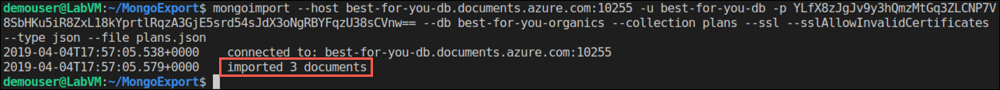

    > You will see a message indicating the number of documents imported, which should be 3 for plans.

11. Verify the import by selecting **Data Explorer** in your Cosmos DB account in the Azure portal, expanding plans, and selecting **Documents**. You will see the three documents imported listed.

    

12. Repeat step 8 for the users and orders collections, replacing the `<your_collection>` values with:

    - users

        ```bash
        mongoimport --host best-for-you-db.documents.azure.com:10255 -u best-for-you-db -p miZiDmNrn8TnSAufBvTQsghbYPiQOY69hIHgFhSn7Gf10cvbRLXvqxaherSKY6vQTDrvHHqYyICP4OcLncqWew== --db best-for-you-organics --collection users --ssl --sslAllowInvalidCertificates --type json --file users.json
        ```

    - orders

        ```bash
        mongoimport --host best-for-you-db.documents.azure.com:10255 -u best-for-you-db -p miZiDmNrn8TnSAufBvTQsghbYPiQOY69hIHgFhSn7Gf10cvbRLXvqxaherSKY6vQTDrvHHqYyICP4OcLncqWew== --db best-for-you-organics --collection orders --ssl --sslAllowInvalidCertificates --type json --file orders.json
        ```

13. To verify the starter application is now pulling properly from Azure Cosmos DB, return to your browser running the starter application (<http://localhost:3000>), and refresh the page. You should now see the three plans appear again on the home page. These were pulled from your Azure Cosmos DB database.

    

14. You have successfully migrated the application and data to use Azure Cosmos DB with MongoDB APIs.

15. Return to the Integrated terminal window of VS Code which is running the application, and press **CTRL+C** to stop the application.

### Task 5: Install Azure Cosmos DB extension for VS Code

In this task, you will install the Azure Cosmos DB extension for VS Code to take advantage of the integration with Azure Cosmos DB. This extension allows you to view and interact with your Cosmos DB databases, collections, and documents directly from VS Code.

1. Select the **Extensions** icon, enter "azure cosmos db" into the search box, select the **Azure Cosmos DB** extension, and then select **Install** in the Extension: Azure Cosmos DB window.

    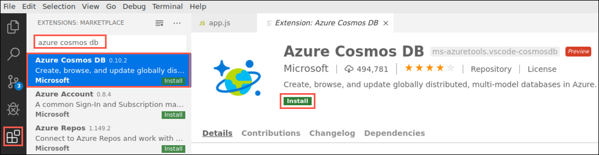

2. In the left-hand menu of VS Code you should now see an Azure icon. Select that, and then select **Sign in to Azure**.

    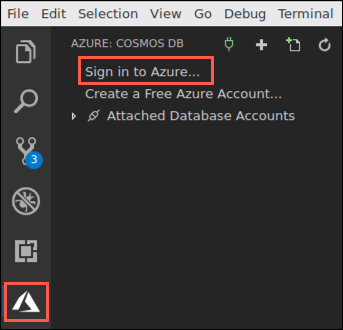

    > If you don't see the Azure icon, restart VS Code, and reopen the `MCW-OSS-PaaS-and-DevOps` project folder.

3. Enter your Azure account credentials in the browser window that appears.

4. If presented with a prompt to enter a password for a new keyring, enter "**Password.1!!**" as the password, and select **Continue**.

    

5. Once you have signed in, you will receive a message that you can close the browser window.

6. Back in VS Code, you should now see your Azure account listed under Azure Cosmos DB, along with your Azure account email listed in the status bar of VS Code.

    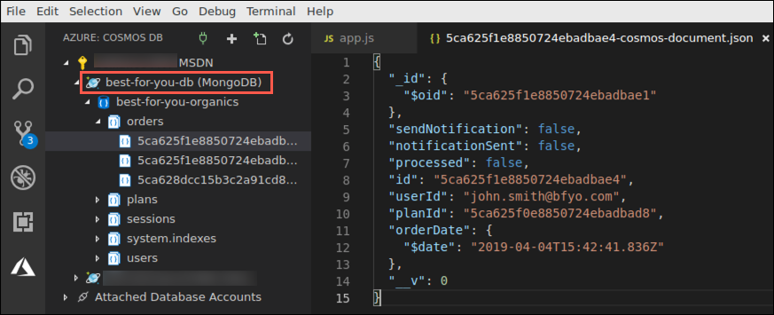

7. From here, you can view your databases, collections, and documents, as well as edit documents directly in VS Code, and push the updated documents back into your database.

### Task 6: Decrease collection throughput

In this task, you will decrease the throughput on your collections. Azure Cosmos DB uses an hourly billing rate, so reducing the throughput after the data migration will help save costs.

1. From the Azure Cosmos DB menu pane in Visual Studio Code, right-click on the **best-for-you-db** database and then select **Open in Portal**.

    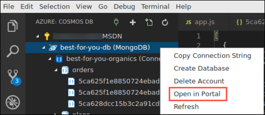

2. In the Azure portal, select **Scale** from the left-hand menu, under **Collections** on the Azure Cosmos DB account blade.

3. Expand the **orders** collection and select **Scale & Settings**.

4. Change the **Throughput** value to **400** and select **Save**.

    

5. Repeat steps 3 & 4 for the **plans** and **users** collections.

## Exercise 3: Containerize the app

Duration: 30 minutes

This exercise walks you through containerizing the existing Best For You Organics Company MERN application using Docker, pushing the image to an **Azure Container Registry**, then deploying the image to **Web App for Containers** directly from VS Code.

### Task 1: Create an Azure Container Registry

In this task, you will be creating a private Docker registry in the Azure portal, so you have a place to store the custom Docker image you will create in later steps.

1. In the Azure portal, select **+Create a resource**, **Containers**, and select **Container Registry**.

    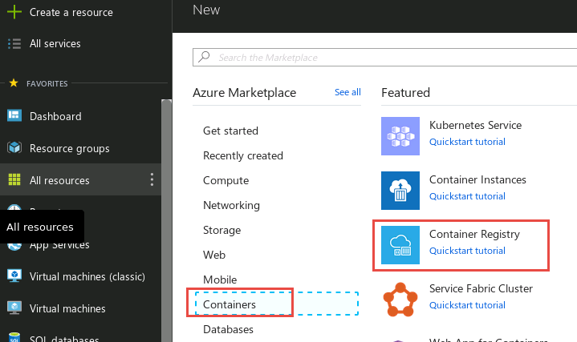

2. On the **Create container registry** blade, enter the following:

    - **Registry name:** Enter "bestforyouregistrySUFFIX," where SUFFIX is your Microsoft alias, initials, or another value to ensure the name is unique (indicated by a green check mark).
    - **Subscription:** Select the subscription you are using for this hands-on lab.
    - **Resource group:** Select the **hands-on-lab-SUFFIX** resource group created previously.
    - **Location:** Select the location you are using for resources in this hands-on lab.
    - **Admin user:** Select **Enable**.
    - **SKU:** Select **Basic**.

    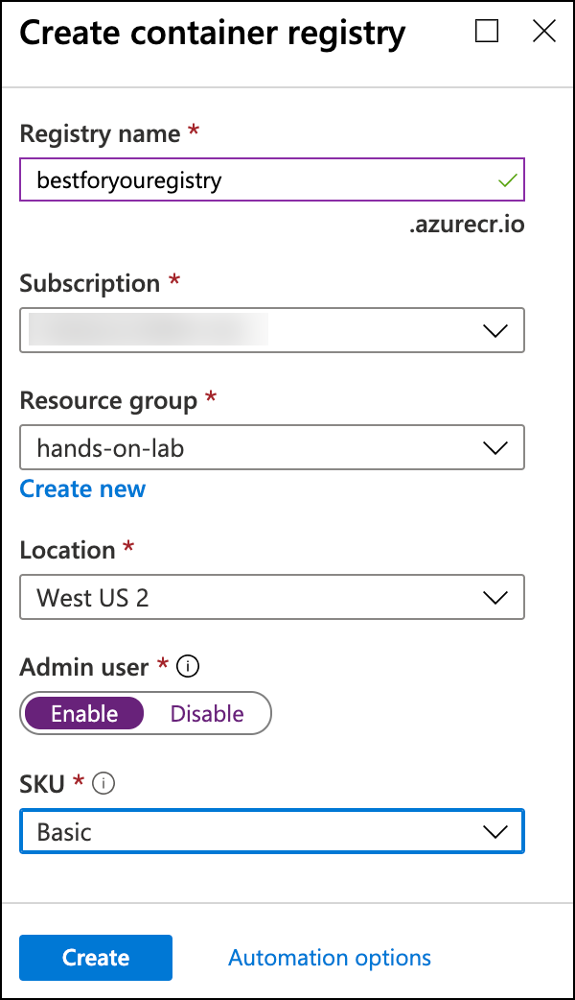

3. Select **Create** to provision the new Azure Container Registry.

### Task 2: Install Docker extension in VS Code

The Docker extension for VS Code is used to simplify the management of local Docker images and commands, as well as the deployment of a built app image to Azure.

1. On your Lab VM, return to VS Code, and the open `MCW-OSS-PaaS-and-DevOps` starter project.

2. Select the **Extensions icon** from the left-hand menu, enter "docker" into the search box, select the **Docker** extension, and in the **Extension: Docker** window, and then select **Install**.

    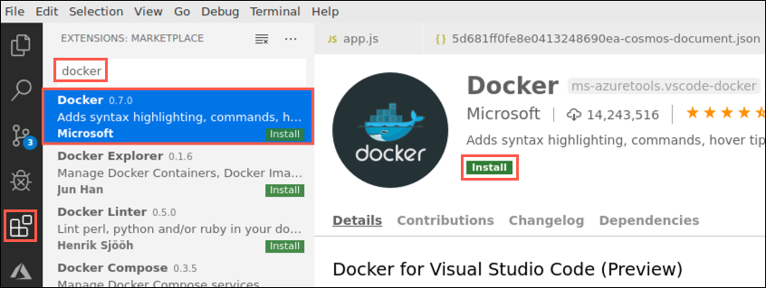

3. You should now see a Docker icon appear in the left-hand menu of Visual Studio Code. Select the **Docker** icon. Expand **Registries** and then expand **Azure**. You should see the **bestforyouregistry** you created above listed.

    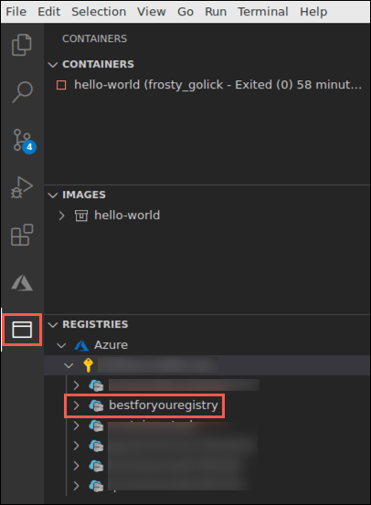

    > If you don't see the Docker icon in the left-hand menu, close and reopen VS Code, and the `MCW-OSS-PaaS-and-DevOps` project.

### Task 3: Create Docker image and run the app

In this task, you will use VS Code, and the Docker extension, to add the necessary files to the project to create a custom Docker image for the `MCW-OSS-PaaS-and-DevOps` app.

1. On your Lab VM, return to VS Code, and the `MCW-OSS-PaaS-and-DevOps` project.

2. Open the VS Code Command Palette, by selecting **View** from the menu, then **Command Palette**.

3. Enter "add docker" into the Command Palette and select **Docker: Add docker files to workspace**.

    

4. At the **Select Application Platform** prompt, select **Node.js**.

    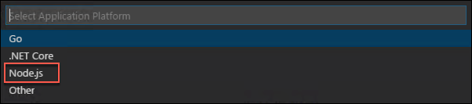

5. Ensure port "3000" is entered on the next screen, and press **Enter**.

    

6. This will add Dockerfile, along with several configuration files for Docker compose to the project.

    

7. Select **Dockerfile** from the file navigator and observe the contents. This file provides the commands required to assemble a Docker image for the `MCW-OSS-PaaS-and-DevOps` application.

    

8. Currently, the Docker extension for Visual Studio Code places the generated Docker files in the root directory of the project. Because the project files are all located in the `lab-files` directory, we need to move the generated files into that folder. Select the `.dockerignore`, `docker-compose.debug.yml`, `docker-compose.yml`, and `Dockerfile` files, and then drag and drop them into the `Hands-on lab/lab-files` folder. Respond Yes if prompted about moving the files.

    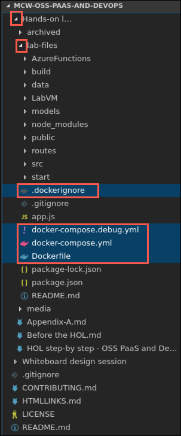

9. Next, you will tell Docker to build and image for your app. Select the **Terminal** menu in Visual Studio Code, and then select **New Terminal**.

    

10. In the new terminal window, change the directory to the `Hands-on lab/lab-files` folder by executing the following command:

    ```bash
    cd "Hands-on lab/lab-files"
    ```

11. With the next command you will provide a **registry**, **image name**, and **tag**, using the following format. This format will allow the image to be pushed to your container registry.

    > `[registry]/[image name]:[tag]`

12. For this, you will need the Login server value from your Azure Container registry's **Access keys** blade.

    

13. At the terminal prompt, enter the following, where `[Login server]` is the Login server value from Azure:

    ```bash
    docker build --rm -f "Dockerfile" -t [Login server]/best-for-you-organics:latest .
    ```

    > Be sure to include the "." at the end of the line.

14. For example:

    ```bash
    docker build --rm -f "Dockerfile" -t bestforyouregistry.azurecr.io/best-for-you-organics:latest .
    ```

15. Press **Enter**, which will trigger the build of the image. You will see the following output in the terminal window:

    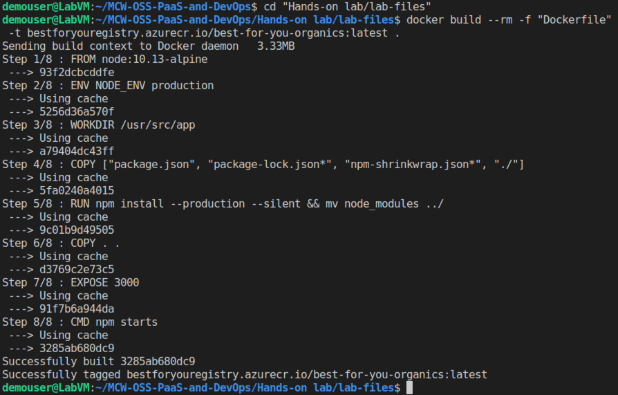

16. Once the build completes, select the **Docker** icon in the left-hand menu of Visual Studio Code and then expand **Images**. You will see the `best-for-you-organics` image.

    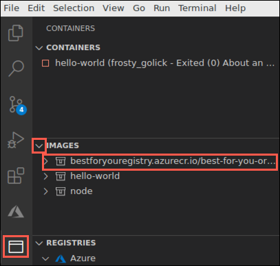

17. You can also use the `docker images` command in the Integrated terminal to list the images.

    

### Task 4: Run the containerized app

In this task, you will run the app from the container you built in the previous task.

1. In the **Images** area of the Docker extension in VS Code, expand the `best-for-you-organics` image, and then right-click on the `latest` image, and select **Run Interactive**.

    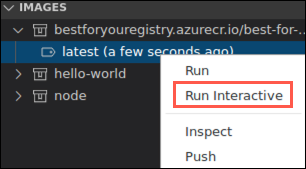

2. Notice in the Interactive terminal that a docker run command is issued. Using the VS Code Docker extension, you can issue some docker commands, without needing to work from the command line.

    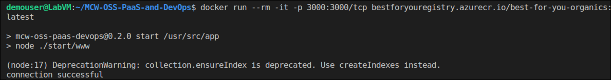

3. Verify the web app and container are functioning by opening a browser window and navigating to <http://localhost:3000>.

    

4. In the Integrated terminal of VS Code, for the interactive session, press **CTRL+C** to stop the container.

### Task 5: Push image to Azure Container Registry

In this task, you are going to push the image to your Azure Container Registry.

1. In the Azure portal, navigate to the hands-on-lab-SUFFIX resource group, and select the **bestforyouregistrySUFFIX** Container registry from the list of resources.

    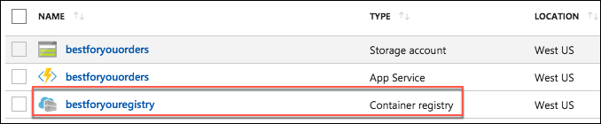

2. On the **bestforyouregistrySUFFIX** blade, select **Access keys** under settings in the left-hand menu, and leave this page up as you will be referencing the **Login server**, **Username**, and **password** in the next task.

    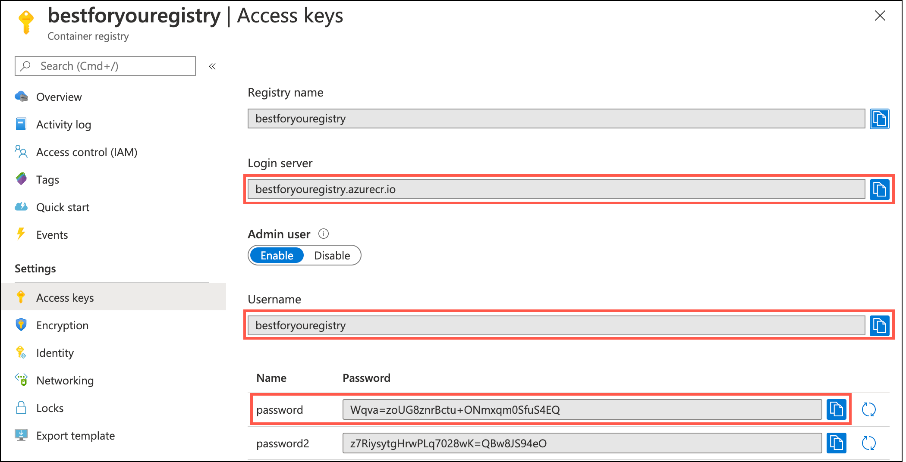

3. Return to the Integrated terminal window in VS Code and enter the following command to log in to your Azure Container registry, replacing the bracketed values with those from the container registry access keys page.

    ```bash
    docker login [Login Server] -u [Username]
    ```

4. For example:

    ```bash
    docker login bestforyouregistry.azurecr.io -u bestforyouregistry
    ```

5. Copy and paste the Container registry password when prompted to complete the login process.

    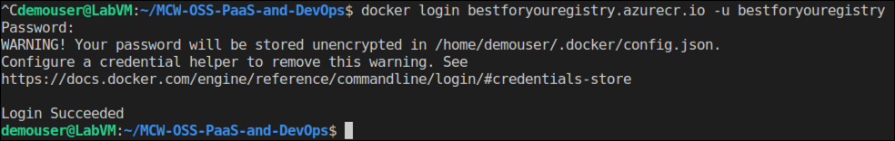

6. Once you are successfully logged in, find your image in the Docker extension section of the VS Code, right-click your image, and select **Push**.

    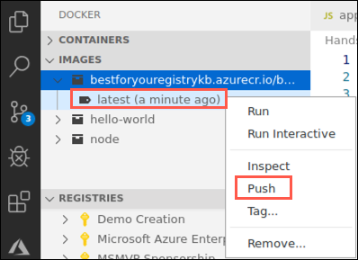

7. If prompted to set the default registry path, select **Yes**.

    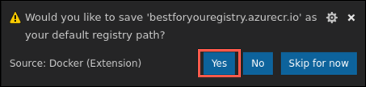

8. Note the "docker push" command issued in the terminal window.

    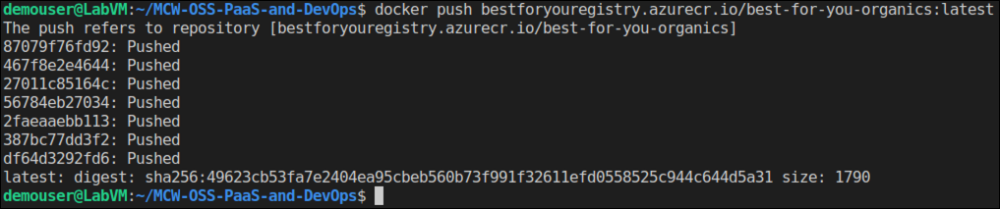

9. To verify the push, return to the **bestforyouregistry** Registry container blade in the Azure portal, and select **Repositories** under **Services** on the left-hand side, and note the **best-for-you-organics** repository.

    

## Exercise 4: Set up Web App for Containers

Duration: 10 minutes

In this exercise, you will deploy the containerized app to a Web App for Containers instance from the image stored in your Azure Container Registry.

### Task 1: Provision Web App for Containers

1. In the Azure portal, select **+Create a resource**, **Web**, and select **Web App for Containers**.

    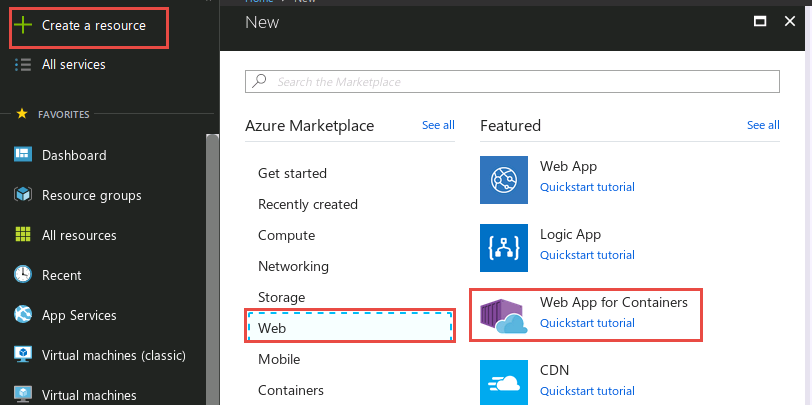

2. On the **Create** blade, enter the following:

    - **App name**: Enter **best-for-you-app-SUFFIX** (the name must be unique).
    - **Subscription**: Select the subscription you are using for this lab.
    - **Resource group**: Select **Use existing** and choose the hands-on-lab-SUFFIX resource group.
    - **OS**: Select **Linux**.
    - **App Service plan/Location**: Accept the default assigned value, which will create a new App Service plan.
    - Select **Configure container**, and enter the following:
        - **Image source:** Select **Azure Container Registry**.
        - **Registry**: Select **bestforyouregistrySUFFIX**.
        - **Image**: Select **best-for-you-organics**.
        - **Tag**: Select **latest**.
        - **Startup File**: Leave blank.
        - Select **Apply**.

3. Select **Create**.

    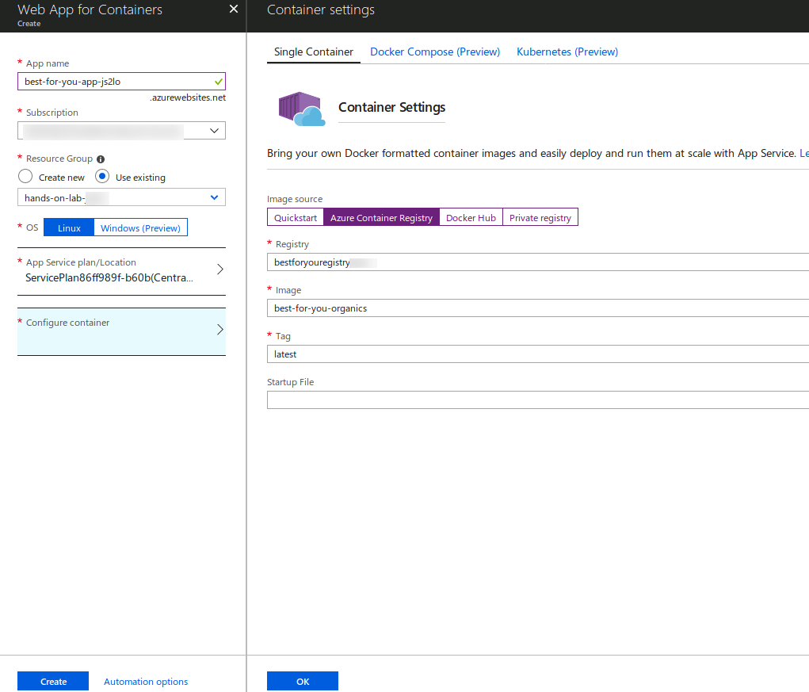

### Task 2: Navigate to the deployed app

In this task, you will navigate to the deployed app, and log in to verify it is functioning correctly.

1. When you receive the notification that the Web App for Containers deployment has completed, navigate to the Web App by selecting the **notifications icon**, and selecting **Go to resource**.

    

2. On the **Overview** blade of **App Service**, select the **URL** for the App Service.

    

3. A new browser window or tab will open, and you should see the `MCW-OSS-PaaS-and-DevOps` application's home page displayed.

4. Select **Sign In** on the top right of the page and login with the following credentials to verify everything is working as expected:

    - **Email address**: <demouser@bfyo.com>
    - **Password**: Password.1!!

    

## Exercise 5: Configure CI/CD pipeline

Duration: 60 minutes

In this exercise, you are going to use Jenkins to implement a continuous integration (CI) and continuous delivery (CD) pipeline to deploy the containerized MERN app to Web App for Containers in Azure.

### Task 1: Prepare GitHub account for service integrations

In this task, you will be adding a Jenkins service integration into your GitHub account. This integration will enable a Jenkins CI build job to be triggered when code is checked in to your GitHub repository.

1. On your Lab VM, navigate to your Jenkins VM in the [Azure portal](https://portal.azure.com/) by selecting **Resource groups** from the left-hand menu, entering "jenkins" into the search box, and selecting your **jenkins-SUFFIX** resource group from the list.

    

2. On the Jenkins-SUFFIX Resource group blade, select your **Jenkins** virtual machine.

    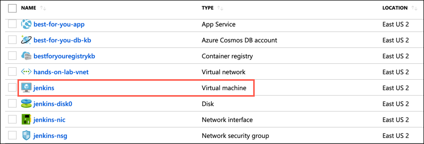

3. On the **Overview** blade of your Jenkins virtual machine, locate the **DNS name**, and copy the value.

    

4. Return to your forked `MCW-OSS-PaaS-and-DevOps` application page in GitHub, select **Settings**, then select **Webhooks** from the left-hand menu, and then select **Add Webhook**.
  
   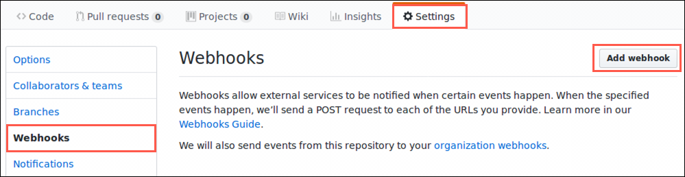

5. When prompted, enter your GitHub account password to continue.

    

6. On the Add webhook page, enter the following:

    - **Payload URL**: Enter <http://YOUR-JENKINS-URL/github-webhook/>, replacing `YOUR-JENKINS-URL` with the Jenkins DNS name you copied from the Azure portal. **Important**: Make sure to include the trailing backslash ("/").
    - **Content type**: Select **application/json**.
    - **Secret**: Leave blank.
    - Under **Which events would you like to trigger this webhook?**, select **Just the _push_ event.**
    - **Active**: Check this box.

    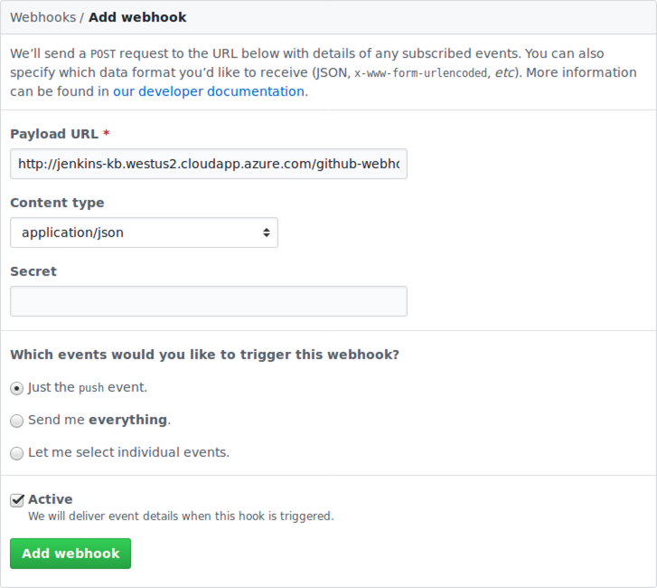

7. Select **Add webhook**

8. A warning will be displayed. This is a permissions error that will be resolved in a later step.

    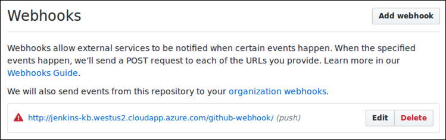

9. Next, you need to grant the Jenkins user access to your GitHub repository by adding a deploy key in the GitHub settings. Return to your Jenkins virtual machine page in the Azure portal, select **Connect**.

    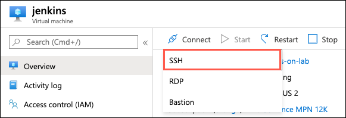

10. On the Connect to virtual machine dialog, select the **SSH** tab and copy the **Login using VM local account** value.

    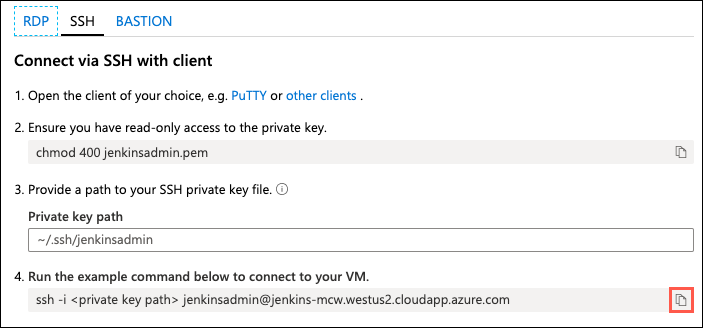

11. Open a new bash shell and paste the SSH command you copied above at the prompt. Enter "yes" if prompted about continuing to connect, and enter the jenkinsadmin password, `Password.1!!`, when prompted.

    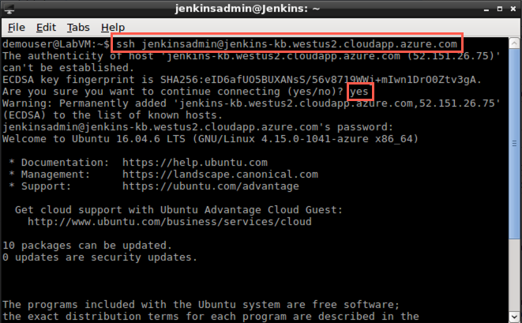

12. At the `jenkinsadmin@Jenkins` prompt, enter:

    ```bash
    ssh-keygen
    ```

13. Press **Enter** to accept the default file in which to save the key.

14. Press **Enter** to use an empty passphrase, and re-enter it to confirm.

    > **Note**: The use of an empty password is done only for simplicity in this hands-on lab. This not recommend for actual environments.

15. Copy the location into which your public key has been saved.

    

16. Show the public key using the following command, replacing `[KEY-PATH]` with the location of your public key.

    ```bash
    cat [KEY-PATH]
    ```

17. Copy the key displayed, so it can be added to GitHub.

    

18. Return to the Settings page of your GitHub account in the browser, select the **Deploy keys** option from the left-hand menu, and then select **Add deploy key**.

    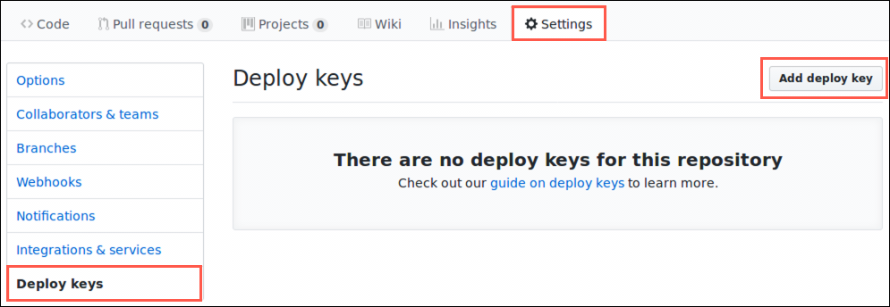

19. Enter "Jenkins" for the title, paste the SSH key you copied above into the Key field, removing any trailing spaces, and select **Add key**.

    

20. To ensure that everything is working, return to the Jenkin's bash shell, and enter the below command which will check the connection to GitHub.

    ```bash
    ssh git@github.com
    ```

21. Enter "yes" when prompted about continuing.

22. You should see a message like the following, indicating a successful authentication and closed connection.

    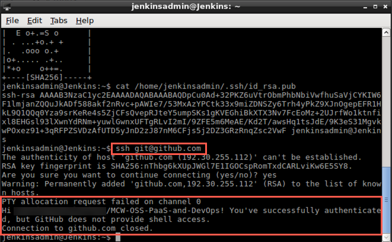

23. The GitHub side of the integration with Jenkins is complete. Next, you will configure Jenkins as part of your CI/CD pipeline.

### Task 2: Open connection to Jenkins

In this task, you will create an SSH tunnel to the Jenkins server, and configure the Jenkins server for use with the MERN application.

1. Return to your **Jenkins** VM blade in the Azure portal.

2. On the **Overview** blade of your Jenkins VM, locate the **DNS name**, and copy the value.

    

3. Open a new browser window or tab and paste the copied DNS name into the browser's address bar to navigate to your Jenkins server.

4. On the Jenkins on Azure screen, you will see a message that this Jenkins instance does not support https, so logging in through a public IP address has been disabled. You will need to create an SSH tunnel to securely connect to the Jenkins instance.

5. To set up an SSH tunnel to Jenkins, copy the ssh command provided in the Jenkins on Azure window, as highlighted in the screen shot below.

    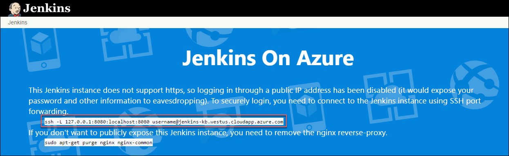

6. Open a new bash shell, and at the command prompt paste the copied ssh command, replacing "username" with **jenkinsadmin**. The command will resemble the following:

    ```bash
    ssh -L 127.0.0.1:8080:localhost:8080 jenkinsadmin@jenkins-kb.westus.cloudapp.azure.com
    ```

7. If prompted that authenticity of the Jenkins host cannot be established, enter "yes" to continue.

8. Enter the **jenkinsadmin** password, "Password.1!!"

    

9. After you have started the SSH tunnel, open a new browser tab or window, and navigate to <http://localhost:8080/>.

    

10. To get the initial password, return to the SSH tunnel bash window, and run the following command:

    ```bash
    sudo cat /var/lib/jenkins/secrets/initialAdminPassword
    ```

11. Copy the password returned.

    

12. Return to the Getting Started screen in your browser, paste the password into the **Administrator password** box, and select **Continue**.

    

13. On the Customize Jenkins screen, select **Install suggested plugins**.

    

14. On the Create First Admin User screen, enter the following:

    - **Username**: Enter **jenkins**.
    - **Password**: Password.1!!
    - **Confirm Password**: Password.1!!
    - **Full name**: Enter **jenkins**.
    - **E-mail address**: Enter your email address.
    - Select **Save and Continue**.

    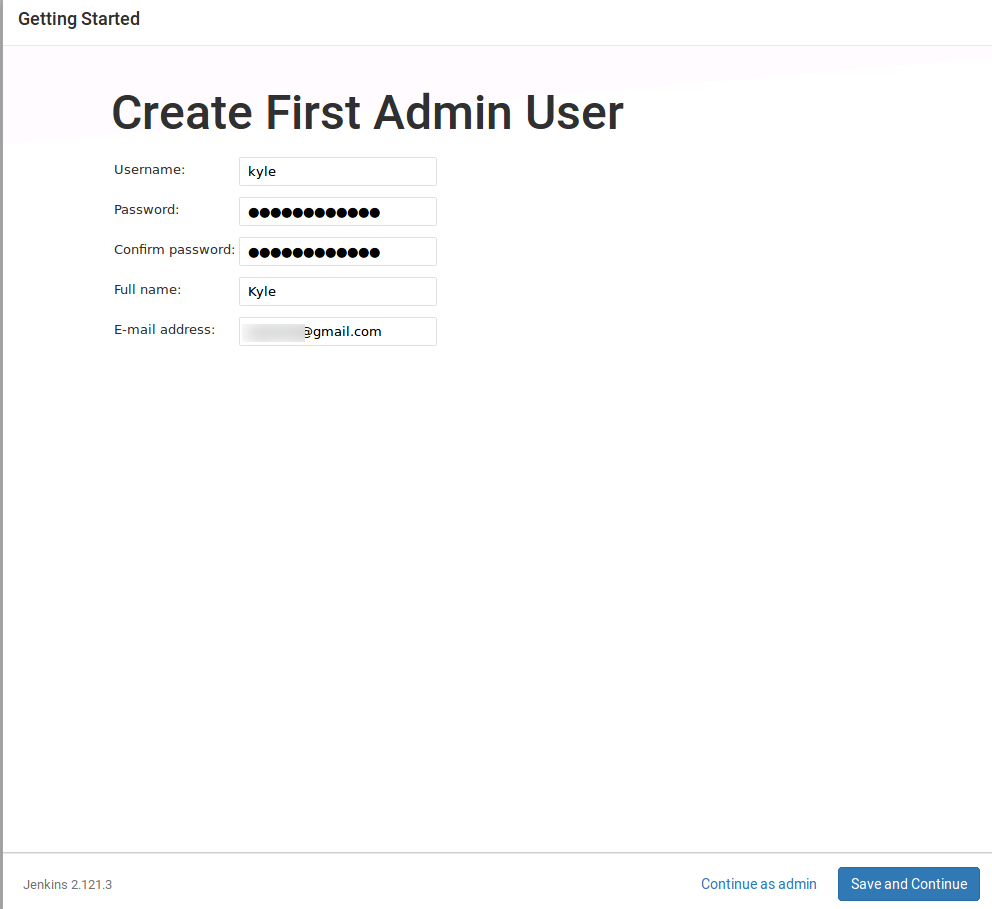

15. You may be required to restart Jenkins and log in again. Otherwise, select **Start using Jenkins** on the Jenkins is ready screen.

    

16. You will be redirected to the Jenkins dashboard.

    

17. From the Jenkins dashboard, select **Manage Jenkins** from the left-hand menu and then select **Manage Plugins**.

    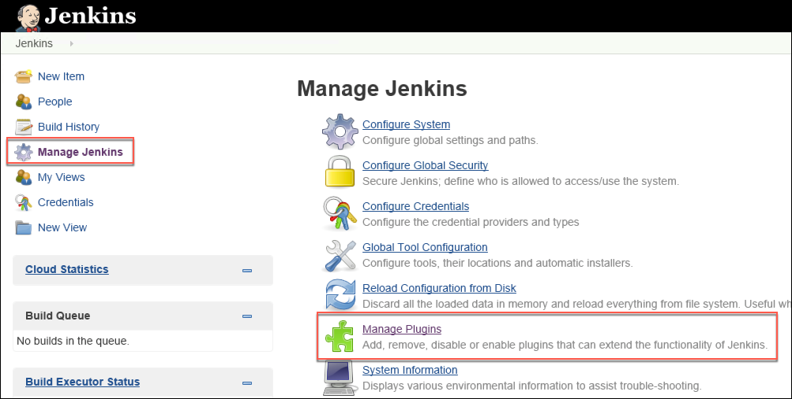

18. With the **Available** tab selected, install the **NodeJS** plug-in by entering **nodejs** into the Filter box, and selecting the **NodeJS** plug-in in the results, and then selecting **Install without restart**.

    

19. Scroll up to the top the screen, and select **Manage Jenkins** from the left-hand menu.

    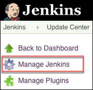

20. Select **Global Tool Configuration**.

    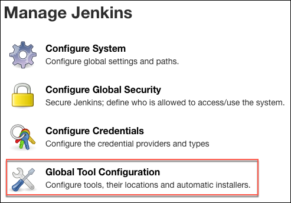

21. Find **NodeJS** and select **Add NodeJS** next to NodeJS installations.

22. Enter **bestforyounode** as the Name, ensure **Install automatically** is checked, and accept the default (latest) version of nodejs.

    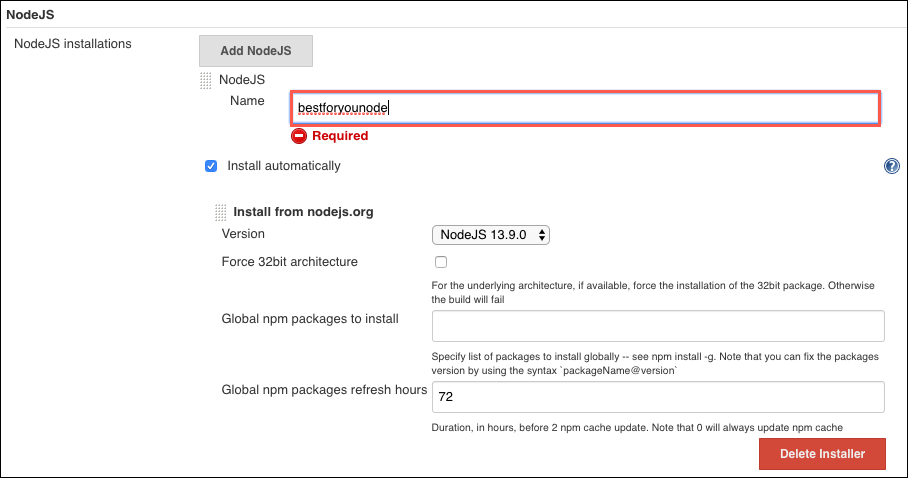

23. Select **Save**.

    

### Task 3: Configure Continuous Integration with Jenkins

In this task, you will set up a simple Jenkins continuous integration (CI) pipeline, which will build the `MCW-OSS-PaaS-and-DevOps` application with every code commit into GitHub.

1. Return to the **Jenkins** dashboard, and select **New Item** from the left-hand menu.

2. Enter "best-for-you-build" as the name, select **Freestyle project**, and select **OK**.

    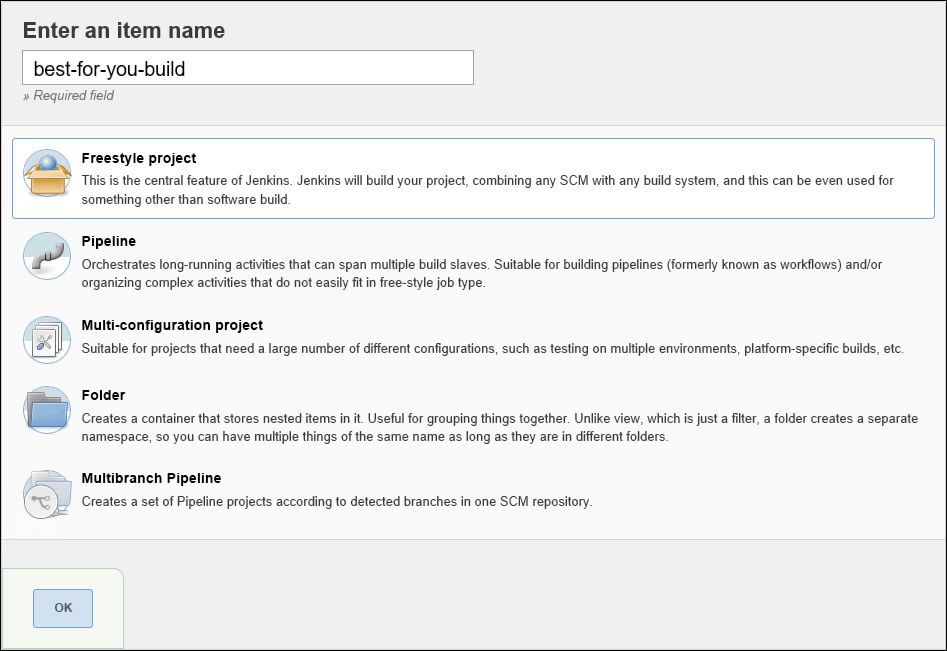

3. On the **General** tab of the project page:

    - Select **GitHub project**, and enter the URL for your forked copy of the `MCW-OSS-PaaS-and-DevOps` project page in your GitHub account.
    - Uncheck **Restrict where this project can be run**, if it is checked.

    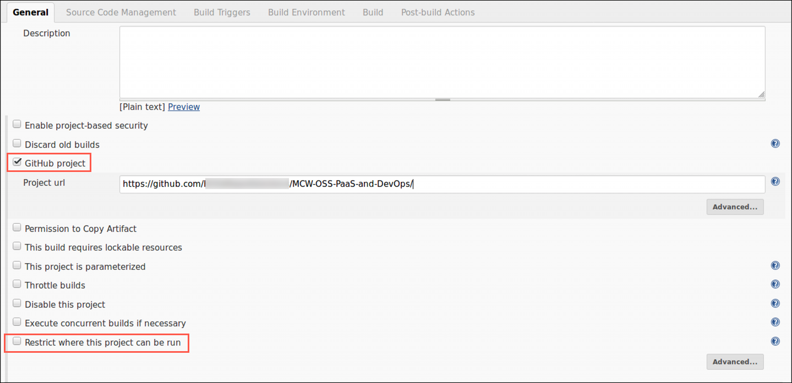

4. Next, scroll down to the **Source Code Management** section, select **Git**, and enter the URL to your project, including the ".git" extension.

    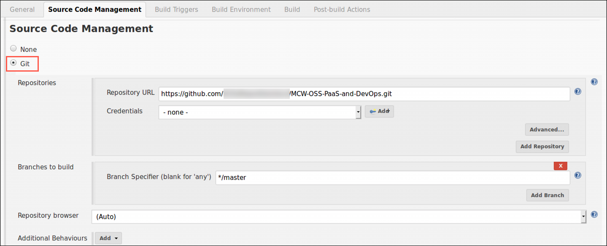

5. Scroll down to the **Build Triggers** section and select **GitHub hook trigger for GITScm polling**.

    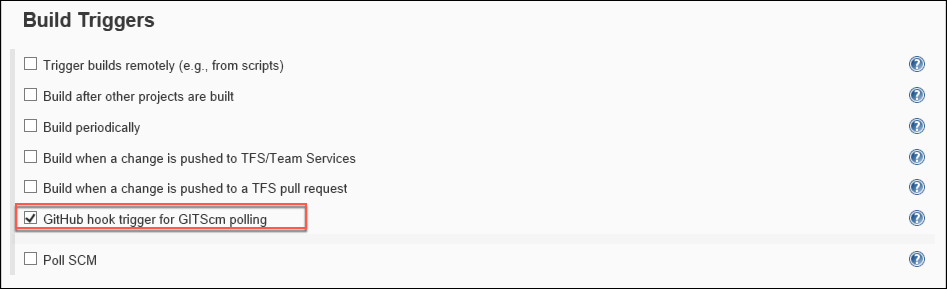

6. Scroll down to the **Build Environment** section and select **Provide Node & npm bin/ folder to PATH**, select your NodeJS Installation from the list, and leave the default value for npmrc file.

    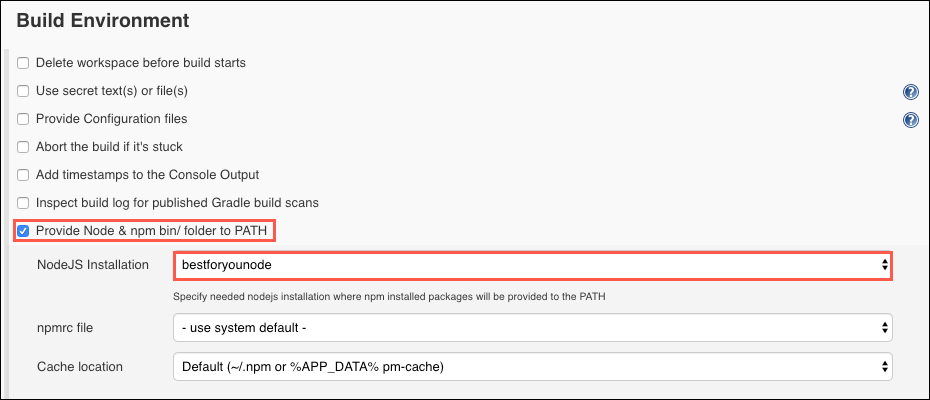

7. In the **Build** section, select **Add build step**, and select **Execute shell** from the options.

    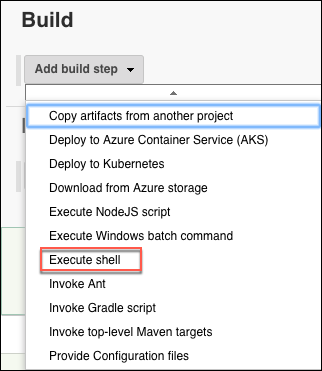

8. In the **Execute shell** Command block, enter:

    ```bash
    cd "Hands-on lab/lab-files"
    npm install
    npm run build
    ```

    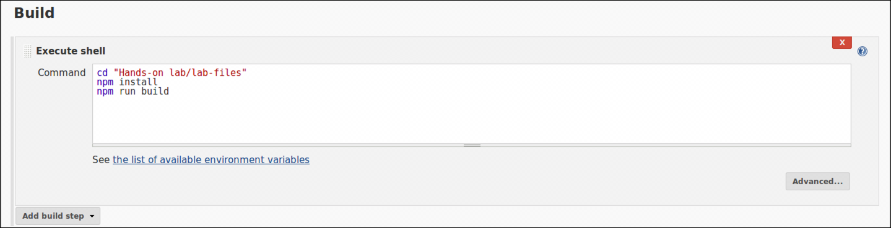

9. Finally, select **Save**.

    

10. Your Jenkins CI build job should now be triggered whenever a push is made to your repository.

### Task 4: Trigger CI build

In this task you will commit your pending changes in VS Code to you GitHub repo, and trigger the Jenkins CI build job.

1. Return to VS Code on your Lab VM, and the open `MCW-OSS-PaaS-and-DevOps` project.

2. Observe that the **source control icon** on the left-hand navigation bar has a badge indicating you have uncommitted changes. Select the **icon**.

    

3. In the **SOURCE CONTROL: GIT** pane, enter a commit message, such as "Added Docker configuration," and select **+** next to **CHANGES** to stage all the pending changes.

    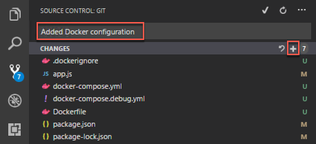

4. Select the **checkmark** to commit the changes.

    

5. Next, select the **ellipsis** to the right of the check mark, and select **Push** from the dropdown.

    

6. If prompted, enter your GitHub account credentials to log into your GitHub account.

    > **Note**: You will need to user your GitHub username (not your email address) here, and the password will be the Personal Access Token you created and saved previously.

7. Return to your best-for-you-build job in Jenkins, and locate the **Build History** block on the left-hand side. Select **#1** to view the details of the build job, caused by your GitHub commit.

    

8. On the build page, you can see the changes you committed.

    

9. You have successfully set up your CI pipeline.

### Task 5: Install Docker on the Jenkins VM

In this task, you will install Docker CE on your Jenkins VM, so it can be used to build images from the build artifacts produced by your CI build.

1. The first step is to ensure no older versions of Docker are installed on your Jenkins VM. Using the SSH tunnel bash terminal you opened previously, navigate to the command prompt, and enter:

    ```bash
    sudo apt-get remove docker docker-engine docker.io
    ```

2. Next, you need to set up a Docker repository on the host machine. The begin, update the `apt` package index:

    ```bash
    sudo apt-get update
    ```

3. Install the necessary packages to allow `apt` to use a repository over HTTPS, entering `y` when prompted to continue.

    ```bash
    sudo apt-get install \
    apt-transport-https \
    ca-certificates \
    curl \
    software-properties-common
    ```

4. Add Docker's official GPG key.

    ```bash
    curl -fsSL https://download.docker.com/linux/ubuntu/gpg | sudo apt-key add -
    ```

5. Verify that you now have the key with fingerprint `9DC8 5822 9FC7 DD38 854A E2D8 8D81 803C 0EBF CD88`, by searching for the last 8 characters of the fingerprint:

    ```bash
    sudo apt-key fingerprint 0EBFCD88
    ```

6. You should see output similar to:

    ```bash
    pub   4096R/0EBFCD88 2017-02-22
        Key fingerprint = 9DC8 5822 9FC7 DD38 854A  E2D8 8D81 803C 0EBF CD88
    uid                  Docker Release (CE deb) <docker@docker.com>
    sub   4096R/F273FCD8 2017-02-22
    ```

7. Next, enter the following commands to set up the **stable** repository.

    ```bash
    sudo add-apt-repository \
    "deb [arch=amd64] https://download.docker.com/linux/ubuntu \
    $(lsb_release -cs) \
    stable"
    ```

8. You are now ready to install Docker CE. Start by updating the `apt` package index.

    ```bash
    sudo apt-get update
    ```

9. Install the latest version of Docker CE, entering `y` when prompted to continue.

    ```bash
    sudo apt-get install docker-ce
    ```

10. Verify that Docker CE is installed correctly by running the `hello-world` image.

    ```bash
    sudo docker run hello-world
    ```

    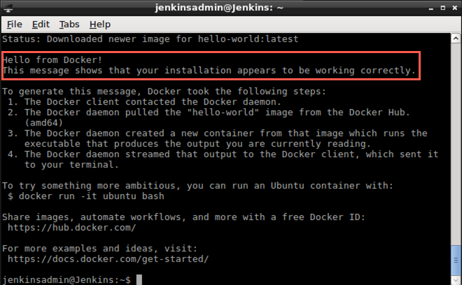

11. The final step is to add permission to the `jenkins` user to Docker.

    ```bash
    sudo usermod -a -G docker jenkins
    sudo chmod 664 /run/docker.sock
    ```

12. Now, restart the Jenkins service, entering the jenkinsadmin password, `Password.1!!`, when prompted.

    ```bash
    service jenkins restart
    ```

### Task 6: Add an Azure service principal for Jenkins

In this task, you will use the Azure CLI to create an Azure Active Directory (Azure AD) application and service principal (SP) that will provide the Jenkins CD pipeline access to Azure resources. You will grant the SP permissions to the hands-on-lab-SUFFIX resource group.

1. In the [Azure portal](https://portal.azure.com), select the **Cloud Shell** icon in the top toolbar.

    

2. Select **PowerShell** in the Cloud Shell pane.

    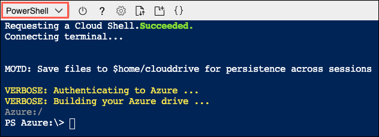

3. Next, you will issue a command to create a service principal named **best-for-you-app** and assign it contributor permissions to your **hands-on-lab-SUFFIX** resource group. The command will be in the following format:

    ```bash
    az ad sp create-for-rbac -n "best-for-you-app" --role contributor --scopes subscriptions/{SubID}/resourceGroups/{ResourceGroupName}
    ```

    > You will need to replace the `{SubID}` and `{ResourceGroupName}` values.

4. To retrieve the values you need to replace above, navigate to **Resource groups** in the Azure navigation menu, enter "hands-on-lab-SUFFIX" into the filter box, and select the hands-on-lab-SUFFIX resource group from the list.

5. On your hands-on-lab-SUFFIX blade, you will copy two values to paste into the command above:

    - **Resource group name**: Copy the resource group name (hands-on-lab-SUFFIX) and paste it into the command in place of `{ResourceGroupName}`.
    - **Subscription ID**: In the Essentials area of the Overview blade, locate the Subscription ID, then copy and paste the value into the command in place of the `{SubID}` value.

    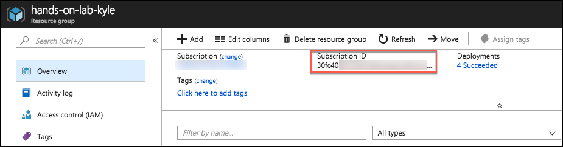

6. Copy and paste the updated `az ad sp create-for-rbac` command at the Cloud Shell prompt and press `Enter`. The command should be similar to the following, with your subscription ID and resource group name:

    ```bash
    az ad sp create-for-rbac -n "best-for-you-app" --role contributor --scopes /subscriptions/30fc406c-c745-XXXX-XXXX-XXXXXXXXXXXX/resourceGroups/hands-on-lab
    ```

    

7. Copy the output from the command into a text editor, as you will need it in the next task. The output should be similar to:

    ```json
    {
        "appId": "24c91e7d-4568-4f48-bca5-af3fc75e5481",
        "displayName": "best-for-you-app",
        "name": "http://best-for-you-app",
        "password": "389bbb6f-731a-449a-a438-65a0f485ec8b",
        "tenant": "9c37bff0-cd20-XXXX-XXXX-XXXXXXXXXXXX"
    }
    ```

8. To verify the role assignment, select **Access control (IAM)** from the left-hand menu of the **hands-on-lab-SUFFIX** resource group blade, and then select the **Role assignments** tab and locate **best-for-you-app** under the CONTRIBUTOR role.

    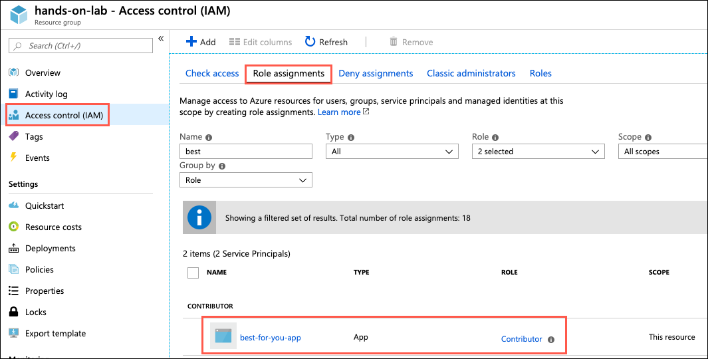

### Task 7: Add continuous delivery to Jenkins build job

In this task, you will use the [Azure App Service Jenkins plugin](https://plugins.jenkins.io/azure-app-service) to add continuous deployment (CD) to the Jenkins build pipeline. This will use a post-build action to create a new Docker image from the build, push that image to your Azure Container Registry, and deploy the image to your Web App for Containers instance. This post-build action will run under the credentials of the SP you created in the previous task.

1. Return to your **Jenkins** dashboard, and select the **best-for-you-build** project.

    

2. Select **Configure** from the left-hand menu.

    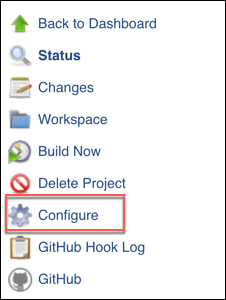

3. On the configure screen, scroll down to Post-build Actions, select **Add post-build action** and then select **Publish an Azure Web App**.

    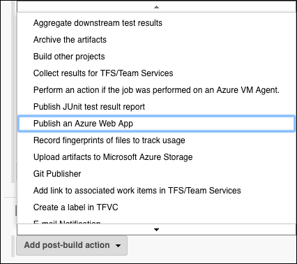

4. In the Publish an Azure Web App section that appears, select **Add** and then **Jenkins** next to **Azure Credentials**.

    

5. On the Jenkins Credentials Provider screen, enter the following:

    - **Domain**: Leave set to Global credentials (unrestricted).
    - **Kind**: Select **Microsoft Azure Service Principal**.
    - **Scope**: Leave set to Global (Jenkins, nodes, items, all child items, etc).
    - **Subscription ID**: Enter your Azure subscription ID which you copied above from the hands-on-lab-SUFFIX Resource group blade.
    - **Client ID**: Enter the **appId** value from the Cloud shell output you copied into the text editor.
    - **Client Secret**: Enter the **password** value from the Cloud shell output you copied into the text editor.
    - **Tenant ID**: Enter the **tenant** value from the Cloud shell output you copied into the text editor.
    - **Azure Environment**: Leave set to Azure.
    - **ID**: Enter jenkinsSp.
    - **Description** Leave blank, or enter a description if you like.
    - Select **Verify Service Principal** and ensure you see the _Successfully verified the Microsoft Azure Service Principal_ message.

    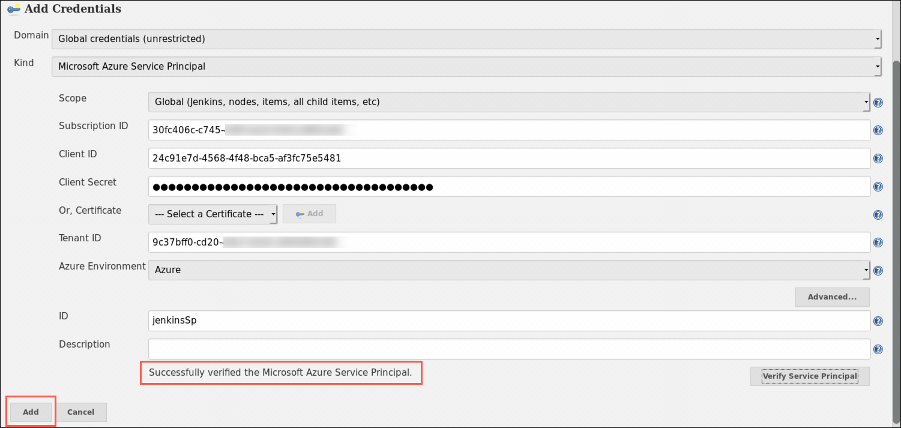

6. Select **Add**.

7. Back in the Publish an Azure Web App of the post-build actions tab, select the newly created jenkinsSp credentials in the Azure Credentials list.

    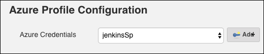

8. In the App configuration section:

    - **Resource Group Name**: Select the hands-on-lab-SUFFIX resource group.
    - **App Name**: Select best-for-you-app.
    - Select **Publish via Docker**.
    - **Dockerfile path**: Leave set to **/Dockerfile.
    - **Docker registry URL**: Enter your Azure Container Registry's Login server value, which you can retrieve from the Access keys blade in the Azure portal.
    - **Registry credentials**: Select **Add** and then **Jenkins**, and in the Add Credentials dialog enter the following:
        - **Domain**: Leave set to Global credentials (unrestricted).
        - **Kind**: Set to Username with password.
        - **Scope**: Leave set to Global (Jenkins, nodes, items, all child items, etc).
        - **Username**: Enter the Username value for your Azure Container Registry, which you can retrieve from the Access keys blade of your ACR in the Azure portal.
        - **Password**: Enter the password value for your Azure Container Registry, which you can retrieve from the Access keys blade of your ACR in the Azure portal.

        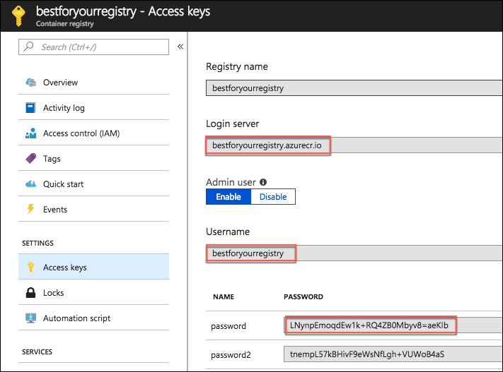

        - **ID**: Enter acrCreds.
        - **Description**: Leave blank, or enter a description if you like.
        - Select **Add**.

        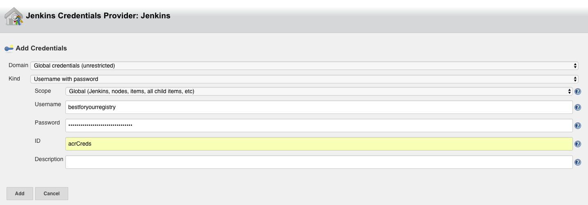

    - Select the newly added acrCreds credentials from the Registry credentials list (will be listed as `[the name of your registry]/******`).
    - Select the **Advanced** button.
    - **Docker Image**: Leave blank.
    - **Docker Image Tag**: Leave blank.
    - Select **Verify Docker Configuration** and ensure the _Docker registry configuration verified_ message is displayed.

        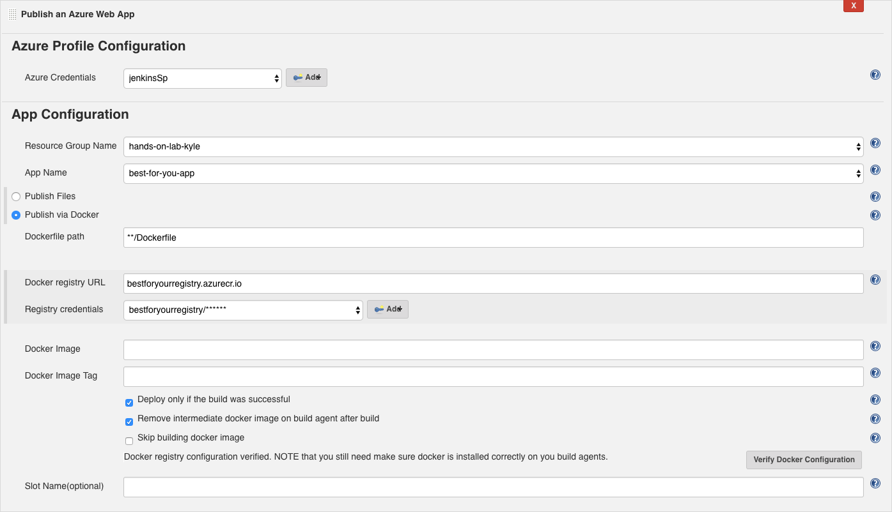

9. Select **Save**.

### Task 8: Trigger CI-CD pipeline

In this task, you will commit changes to the `MCW-OSS-PaaS-and-DevOps` starter application and trigger the full CI/CD pipeline through Jenkins, resulting in the updated application being added to a new Docker image, pushed to ACR, and deployed to Web App for Containers.

1. Return to VS Code on your Lab VM, open the `.dockerignore` file, and delete the line containing __DockerFile*__ from the file. This will allow Jenkins to use the file to build the container in the Jenkins CI/CD pipeline.

2. Next, open the `src/components/plan/Plans.js` file, and insert the following markup between `<div class="container">` and `<Grid>`:

    ```html
    <h3>Welcome to Best For You Organics Company</h3>
    ```

    

3. Save the updated files.

4. As you did in [Task 4](#task-4-trigger-ci-build), above, select the **Source Control icon** from the left-hand menu, enter a commit comment, select **+** to stage the change, and select the **checkmark** to commit the change, and push to GitHub. Enter your credentials if prompted. This will trigger the Jenkins CI/CD pipeline.

    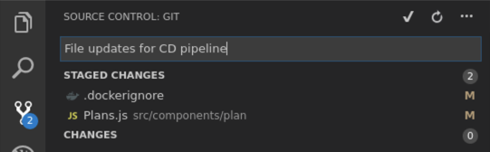

5. Return to your Jenkins dashboard, and select the **best-for-you-build** project, and select the latest build number under Build History.

    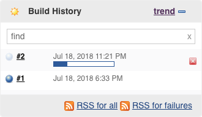

6. On the Build page, select **Console Output** from the left-hand menu.

    

7. On the Console Output page, you can monitor the build progress. When it completes after a few minutes, you will see a SUCCESS message similar to the following:

    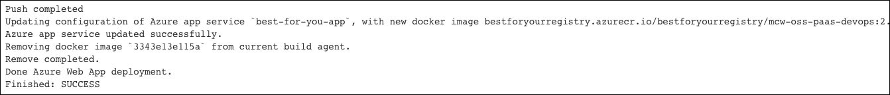

8. When the deployment is complete, you can verify the changes deployed successfully by navigating to your App Service instance in the Azure portal, and selecting the URL on the overview blade. The deployment of the container can take several minutes to complete so refreshes may take a few minutes to show the new header.

    >**Tip**: It may help to open the app in an Incognito or InPrivate browser window, so you don't have the old page cached.

9. You should see the home page, with a new header above the three plans on the page.

    

## Exercise 6: Create Azure Function for order processing

Duration: 45 minutes

In this task, you will create an Azure Function that will be triggered by orders being added to the Orders collection in Azure Cosmos DB. This Function will trigger whenever a document in the orders collection is inserted or updated. The function checks the processed field on the order document, ensuring only unprocessed orders are sent to the processing queue.

### Task 1: Provision a Function App

In this task, you will create a Function App in Azure, which will host your Functions.

1. In the Azure portal, select **+Create a resource**, enter "function app" in to the **Search the marketplace** box, and select **Function App** from the results.

    

2. On the **Function App** blade, select **Create**.

3. On the **Create Function App** blade, enter the following:

    - **App name:** Enter a unique name, such as "bestforyouordersSUFFIX".
    - **Subscription:** Select the subscription you are using for this hands-on lab.
    - **Resource group:** Select **Use existing** and choose the **hands-on-lab-SUFFIX** resource group.
    - **OS:** Select Windows.
    - **Hosting Plan:** Choose Consumption Plan.
    - **Location:** Select the location you have been using for resources in this hands-on lab.
    - **Runtime Stack** Select JavaScript.
    - **Storage:** Select **Create new** and enter "bestforyouordersSUFFIX" for the name.
    - **Application Insights** Select Disabled.
    - Select **Create** to provision the new Function App.

    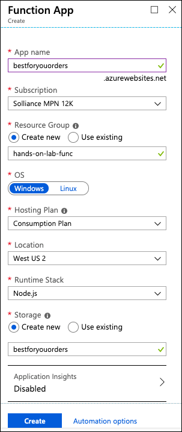

### Task 2: Configure storage queues

In this task, you will add two storage queues to the storage account provisioned when you created your Function App. These queues will be used to store orders and notifications needing to be processed.

1. In the Azure portal, navigate to the new **bestforyouordersSUFFIX** storage account that was created when you provisioned your Function App, by selecting **Resource groups** from the left-hand menu, selecting your **hands-on-lab-SUFFIX** resource group from the list, and then selecting the **bestforyouordersSUFFIX** storage account.

    

2. Select **Queues** from the **Services** area of the **Overview** blade.

    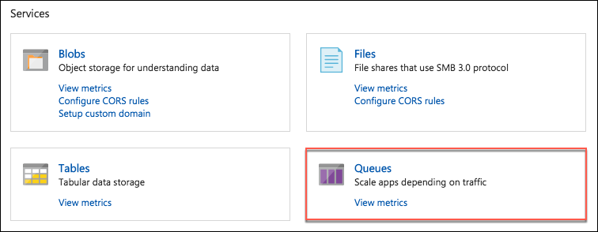

3. On the **Queue service** blade, select **+Queue** to add a new queue.

    

4. In the **Add** queue dialog, enter **orderqueue** for the **Queue name**, and select **OK**.

    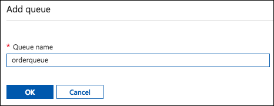

5. Select **+Queue** again, and this time enter "notificationqueue" for the **Queue name**.

    

### Task 3: Create Cosmos DB trigger function

In this task, you will create a function that will be triggered whenever a document is inserted into the orders collection in your Azure Cosmos DB. This function sends all new orders to a queue for processing and shipping. This function will use a Cosmos DB trigger and an output binding to an Azure Storage Queue.

1. When the Function App has deployed, navigate to the new Function App in the Azure portal, by selecting the **notifications icon**, then select **Go to resource** for the Function App notification.

    

2. From the left-hand menu on your **Function Apps** blade, select **Functions**, then select **+New function**.

    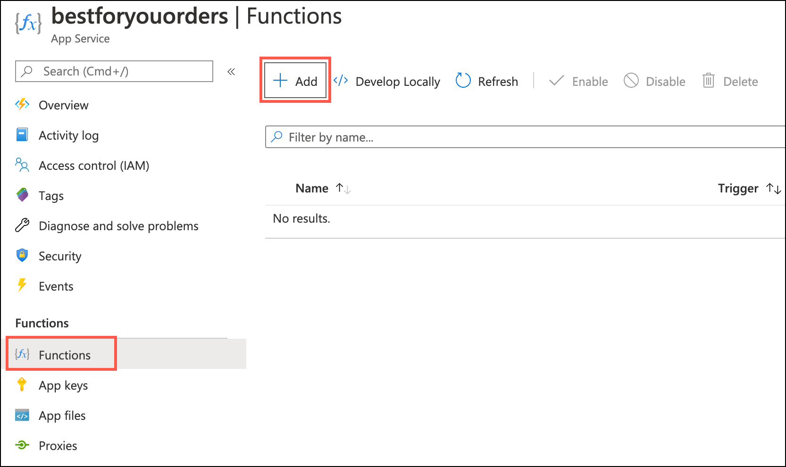

3. In the trigger search box, enter "cosmos," and select the **Azure Cosmos DB trigger**.

    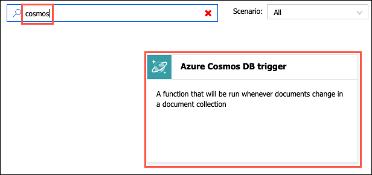

4. Install any extensions required when prompted.

    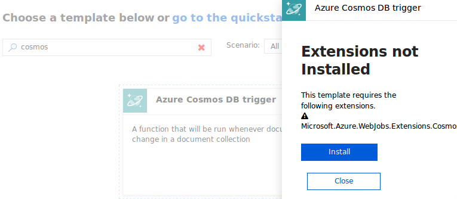

5. In the **Azure Cosmos DB trigger** dialog, enter the following:

    - **Name**: Enter "OrdersCosmosTrigger".
    - **Azure Cosmos DB account connection**: Select **new**, then select the **best-for-you-db** Cosmos DB Account.
    - **Collection name:** Enter orders (use all lowercase, as case matters).
    - **Create lease collection if it does not exist:** Leave this checked.
    - **Database name:** Enter "best-for-you-organics".
    - **Collection name for leases:** Leave set to leases.
    - Select **Create**.

    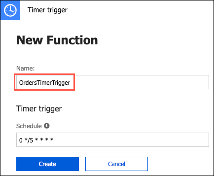

6. After the function is created, select **Integrate** under the new function.

    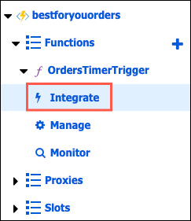

7. Change the Document collection parameter name to "newOrders" for the **Azure Cosmos DB trigger** and select **Save**.

    

8. Next, select **+New Output**, select **Azure Queue Storage**, and select **Select**.

    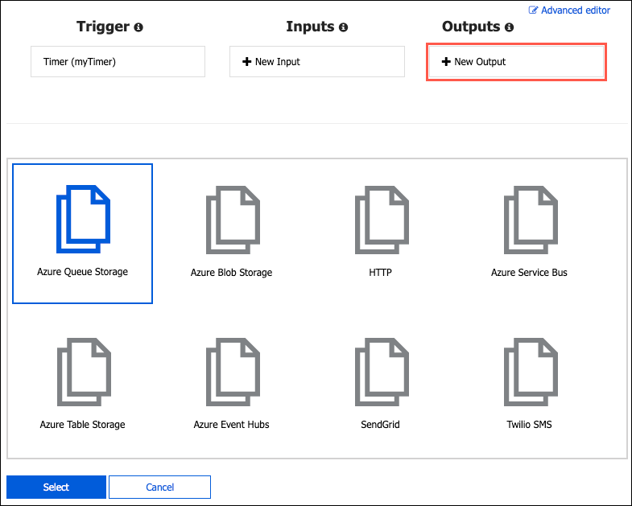

9. Install extensions if prompted to do so.

    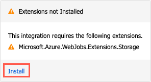

10. For the **Azure Queue Storage output**, enter the following:

    - **Message parameter name**: outputQueue
    - **Queue name:** orderqueue (all lowercase, as casing matters)
    - **Storage account collection:** Select **AzureWebJobsStorage** from the list (this is the bestforyouorders storage account you created when you provisioned your Function App).
    - Select **Save**.

    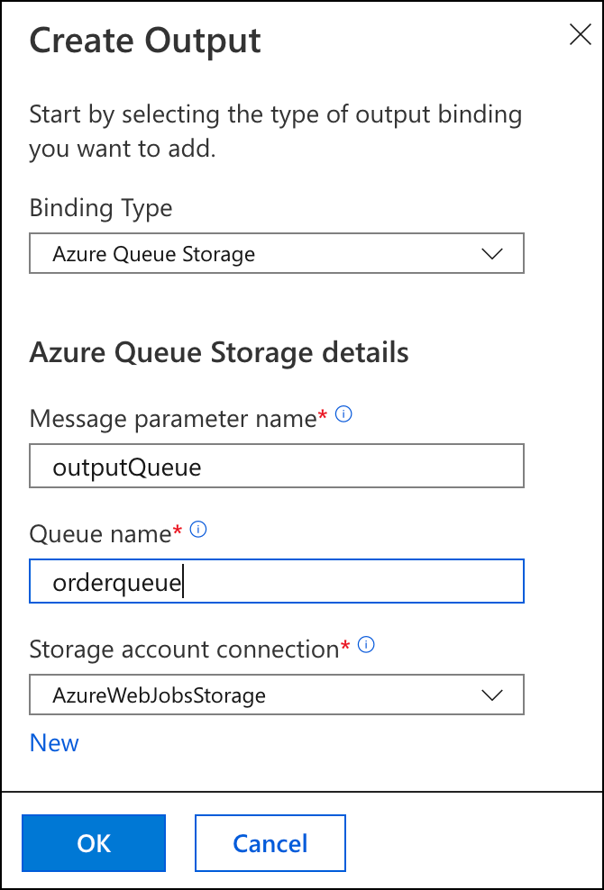

11. Now, select the **OrdersCosmosTrigger** function in the left-hand menu.

    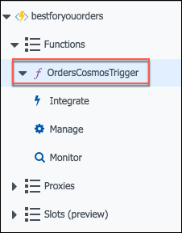

12. To get the code for the OrdersCosmosTrigger function, go into the project is VS Code, expand the AzureFunctions folder, select `OrdersCosmosTrigger.js`, and copy the code, as highlighted in the screen shot below.

    

13. Paste the code into the `index.js` block, overwriting all the existing code, and select **Save**. Your `index.js` file should now look like the following:

    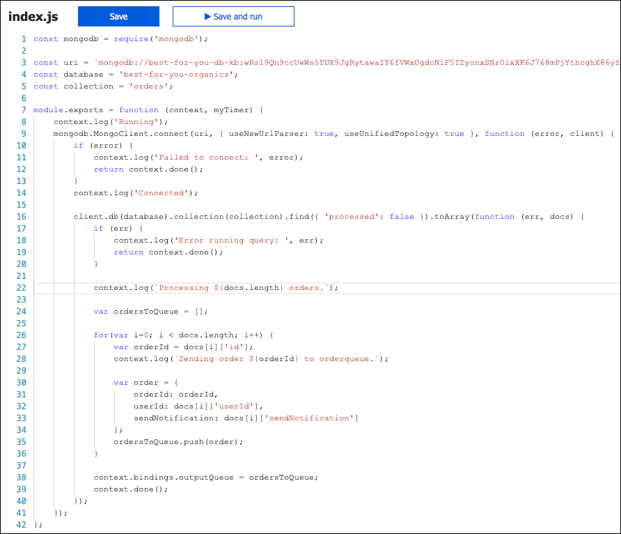

14. Next, select **Logs** below the code block, so you can observe the Function being called during the next steps.

    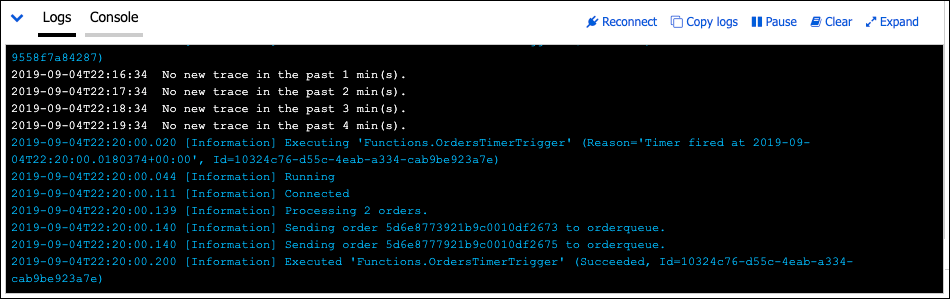

15. To trigger the function, return to the starter application in your browser window, and select **Sign In**.

    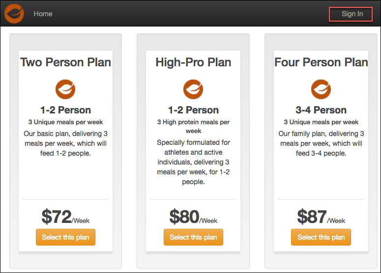

16. On the Login screen, enter the following credentials, and select **Login**:

    - **Email address:** <demouser@bfyo.com>
    - **Password:** Password.1!!

    

17. After logging in, you will be returned to the home page. Select **Select this plan** for any of the plans.

    

18. On the **Place Order** screen, select **Place Order**. This will create a new order, which will fire the Azure Cosmos DB trigger in your function, and then send the order on to the ordersqueue for processing.

    

19. Next, you will update an order in the Azure portal, to set the processed value to true. This will be a change that should not be sent into the orderqueue for processing.

20. Navigate to your Cosmos DB account in the Azure portal, select **Data Explorer**, expand the **orders** collection, then select **Documents**.

    

21. Select any order document, and change the processed value to "true," then select **Update**.

    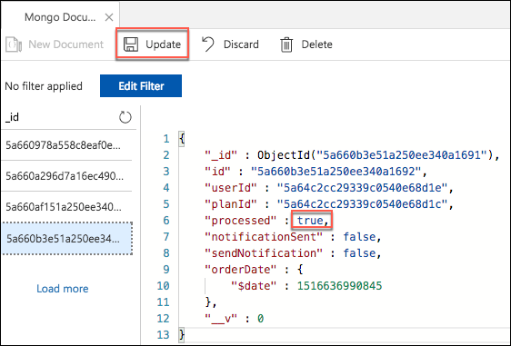

22. Return to the logs pane of your function and observe that the orders have been processed though the Function, and that the new order was sent to the orderqueue, while the updated order was not.

    

23. Finally, verify items are being written to the order queue, by going to the queue in the Azure Storage account, and observing that items have been added to the queue.

    

### Task 4: Create Queue function

In this task, you will create a second function which will be triggered by the output of the OrdersCosmosTrigger function. This will simulate the order processing and will add items to the notificationqueue if the order processing is complete and the `sendNotifications` property is true for the order.

This will use an Azure Storage Queue trigger, and an input dataset from Cosmos DB, pulling in customers. Output dataset will be Azure Cosmos DB orders table, and an update to set `processed = true`, and the `processedDate` to today.

1. Select **Integrate** under the OrdersCosmosTrigger function, then select **Azure Queue Storage (outputQueue)** under **Outputs**.

    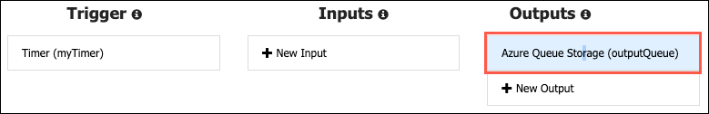

2. Under **Actions** for the output, select **Go** next to **Create a new function triggered by this output**.

    

3. Select **Azure Queue Storage trigger** from the list.

    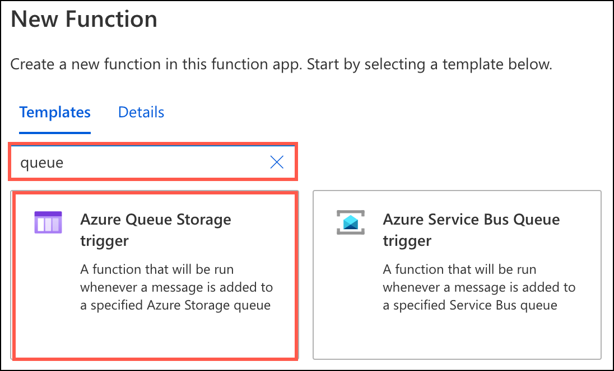

4. On the **Queue trigger New Function** dialog, enter the following:

    - **Name:** Enter ProcessOrders.
    - **Queue name:** orderqueue
    - **Storage account connection:** Select **AzureWebJobsStorage**.
    - Select **Create**.

    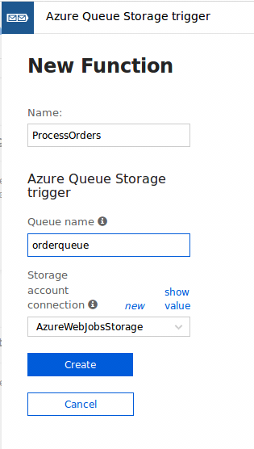

5. When the function has been created, select **Integrate** under the **ProcessOrders** function, change the Message parameter name to "orderToProcess" for the **Azure Queue storage trigger**, and select **Save**.

    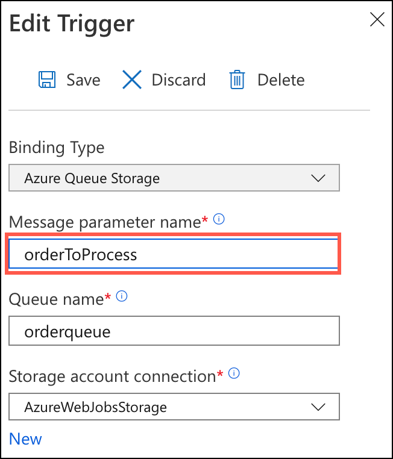

6. Now, select **+New Input**, select **Azure Cosmos DB**, and select **Select**.

    

7. On the **Azure Cosmos DB** input screen, enter the following:

    - **Document parameter name:** Enter "users".
    - **Database name:** Enter "best-for-you-organics".
    - **Collection name:** Enter "users" (all lowercase, as case matters).
    - **Azure Cosmos DB account connection:** Select **best-for-you_DOCUMENTDB**.
    - Select **Save**.

    

8. Next, select **+New Output**, select **Azure Queue Storage**, and select **Select**.

    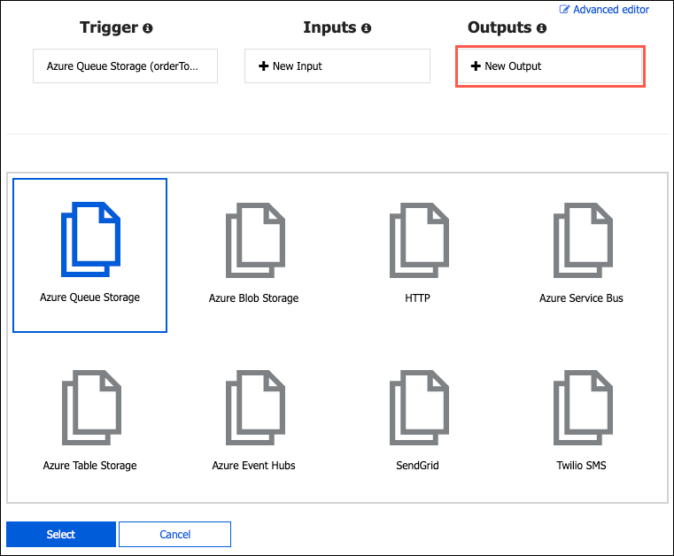

9. For the **Azure Queue Storage output**, enter the following:

    - **Message parameter name**: "outputQueue"
    - **Queue name:** "notificationqueue" (all lowercase, as casing matters)
    - **Storage account collection:** Select **AzureWebJobsStorage** from the list.
    - Select **Save**.

    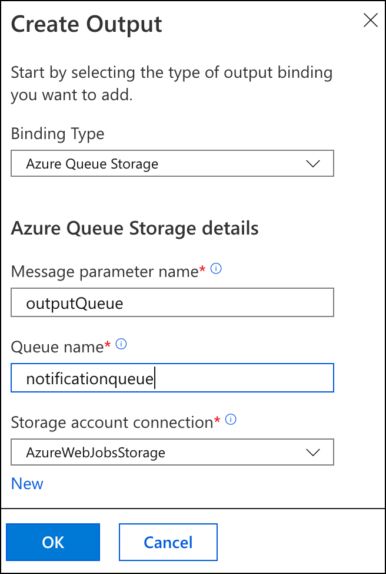

10. Now, select the **ProcessOrders** function in the left-hand menu.

    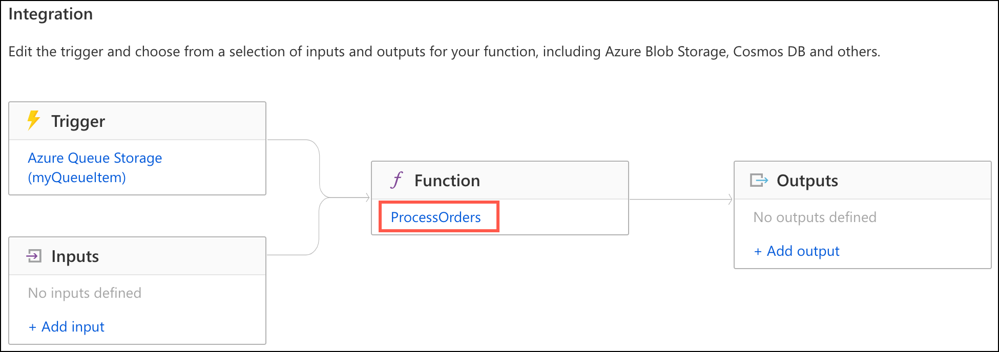

11. To get the code for the **ProcessOrders** function, go into the project is VS Code, expand the **AzureFunctions** folder, select **ProcessOrders.js**, and copy the code, as highlighted in the screen shot below.

    

12. Paste the code into the **index.js** block, overwriting all the existing code, and select **Save**. Your index.js file should now look like the following:

    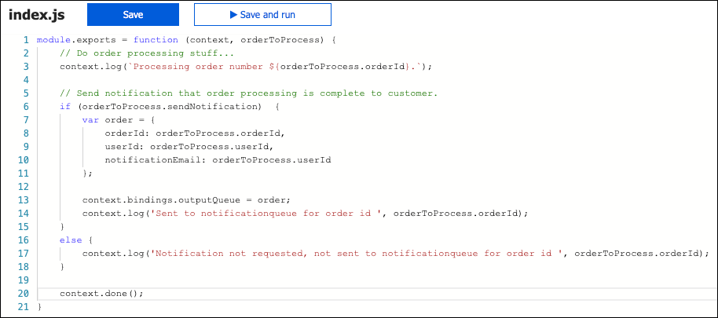

13. Next, select **Logs** below the code block, so you can observe the Function being called during the next steps.

    

14. To trigger the function, return to the starter application in your browser window, select **Sign In**, and on the **Sign In** screen, select **Register**.

    

    > **NOTE**: You may need to select **Logout** if you are still logged in with the demouser account.

15. Complete the registration form. Be sure to include a valid email address so you can receive notifications of order processing in the next exercise. (If you opt not to enter a valid email address, you can still complete the next Exercise, but will not receive the email notifications that your order has been processed.)

    - You only need to enter data into the **First name**, **Last name**, and **email address** fields. All other fields have been pre-populated to save time.
    - The password has been set to `Password.1!!`. If you choose to enter a different password, note that when you log into the account.

16. After registering, you should be automatically logged into the site. If not, select **Sign In** from the Home page, enter the email address you provided during registration and the password (`Password.1!!`) on the login screen, and then select **Login**.

17. Select the **Select this plan** button for any plan on the home page, and on the Order screen, select **Place Order**.

    

18. Return to your **ProcessOrders** function page in the Azure portal and observe the logs.

    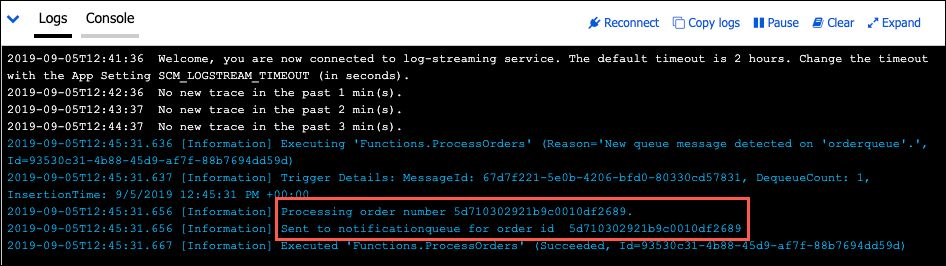

19. The order you placed has been sent to the notificationqueue and is pending the notification being sent to your email address.

## Exercise 7: Create Logic App for sending email notifications

Duration: 30 minutes

In this exercise, you will create Logic App which will trigger when an item is added to the `notificationqueue` Azure Storage Queue. The Logic App will send an email message to the email address included in the `notificationqueue` message.

### Task 1: Create SendGrid account

In this task, you will create a SendGrid account through the Azure portal to send email notifications to customers, informing them that their order has been processed, and is on its way.

1. In the [Azure portal](https://portal.azure.com), select **+ Create a resource** and enter "SendGrid" into the Search the Marketplace box.

    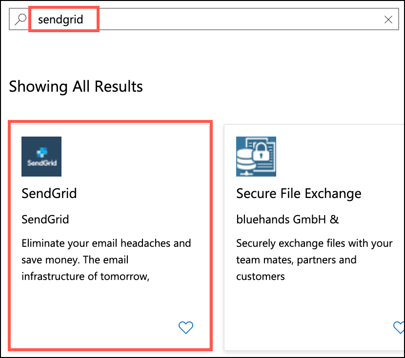

2. On the SendGrid blade, select **Create**.

    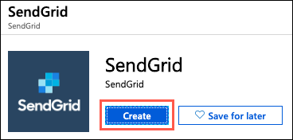

3. On the Create a new SendGrid Account blade, enter the following:

    - **Name**: Enter **bfyoemail**.
    - **Password**: Enter **Password.1!!**
    - **Subscription** Select the subscription you are using for this hands-on lab.
    - **Resource group**: Choose **Use existing** and select the **hands-on-lab-SUFFIX** resource group.
    - **Pricing tier**: Select **F1 Free** and select **Select**.
    - **Contact information**: Enter your name, company, and email address and select **OK**.
    - **Legal terms**: Review the legal terms and enter a phone number and then select **OK**.

    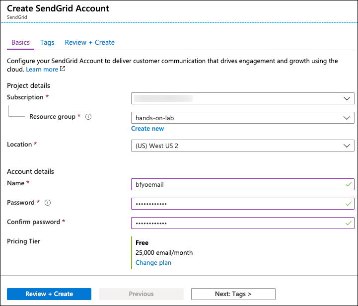

4. Select **Create** to provision the SendGrid account.

5. When the SendGrid account finishes provisioning, select **Go to resource** from the notifications pane in the Azure portal.

    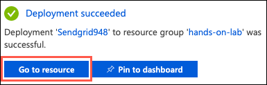

6. On the SendGrid account blade, select **Manage** from the toolbar.

    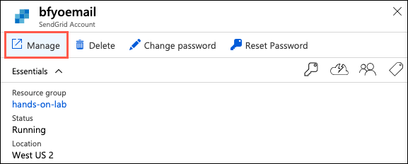

7. On the SendGrid page that opens, select **API Keys** under Settings in the left-hand menu, and then select **Create API Key**.

    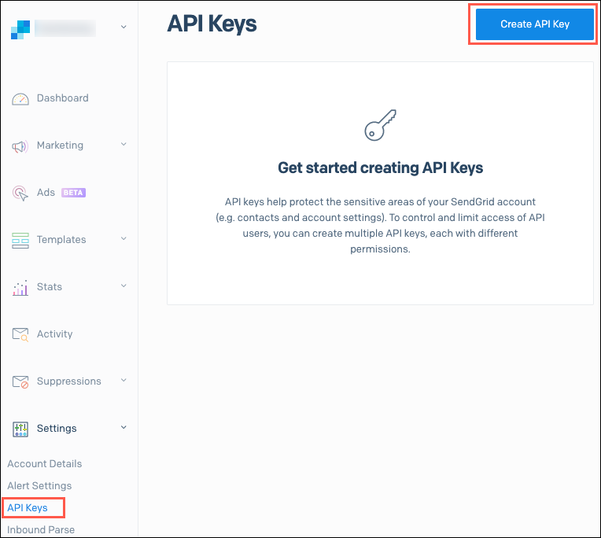

8. On the Create API Key page, enter the following:

    - **API Key Name**: Enter **bfyo-api-key**.
    - **API Key Permissions**: Select **Full Access**.
    - Select **Create & View**.

    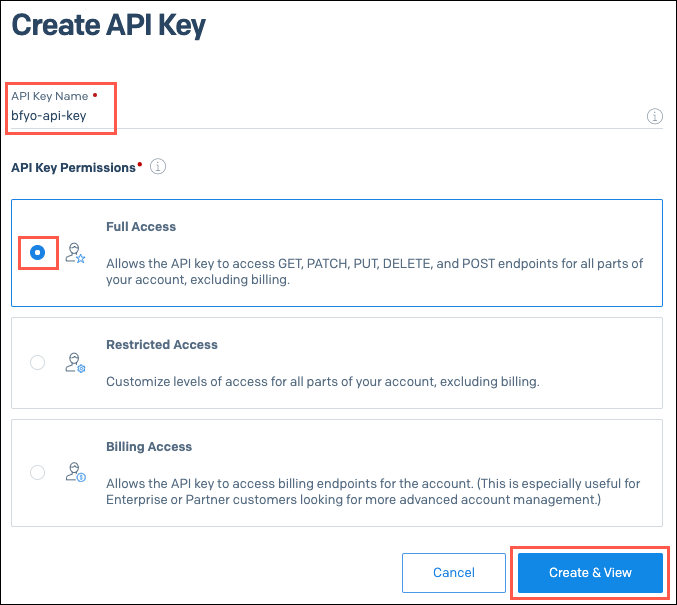

9. Leave the API Key Created screen that appears open. You will be copying the key and pasting it into your Logic App in the next task.

    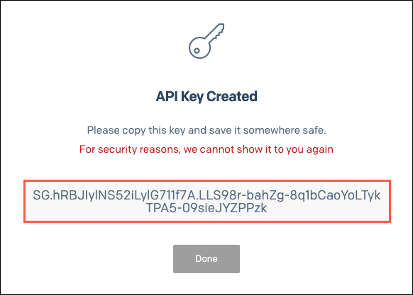

### Task 2: Create Logic App

In this task, you will create a new Logic App, which will use the SendGrid connector to send email notifications to users, informing them that their order has processed and shipped.

1. In the Azure portal, select **+Create a resource**, select **Web**, and select **Logic App**.

    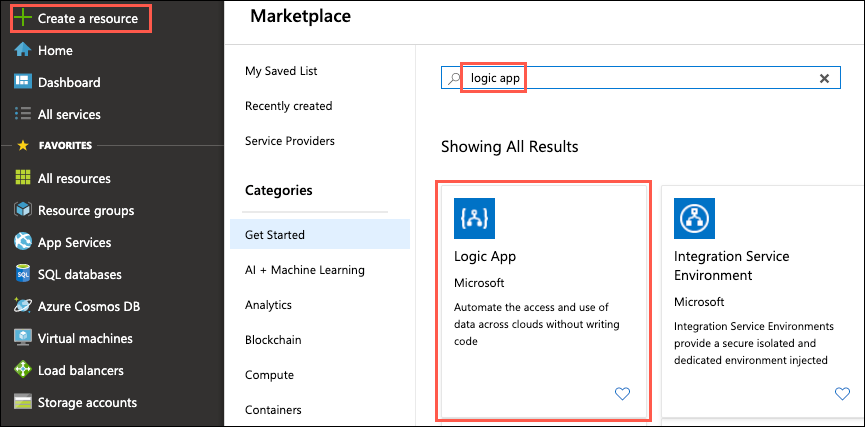

2. In the **Create logic app** blade, enter the following:

    - **Name:** Enter "OrderNotifications".
    - **Subscription:** Select the subscription you are using for this hands-on lab.
    - **Resource group:** Select **Use existing** and choose the **hands-on-lab-SUFFIX** resource group.
    - **Location:** Select the location you have been using for resources in this hands-on lab.
    - Select **Create** to provision the new Logic App.

    

3. Navigate to your newly created Logic App in the Azure portal.

4. In the Logic App Designer, select **Blank Logic App** under **Templates**.

    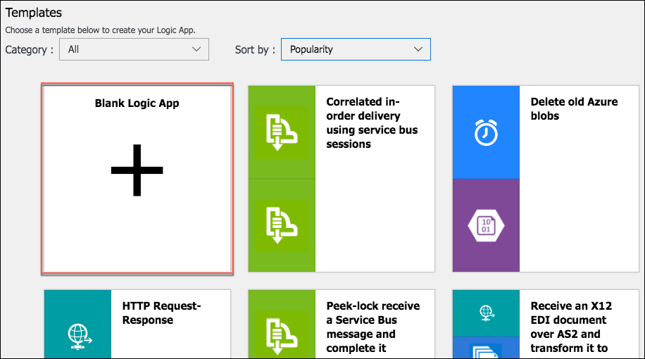

5. In the blank logic app template, select **All** and then select **Azure Queues** under **Connectors**.

    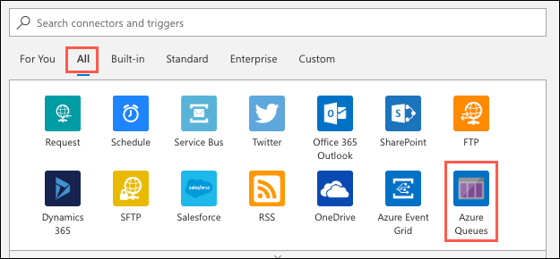

6. Select **When there are messages in a queue** under Triggers.

    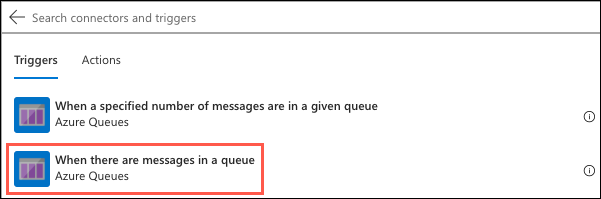

7. On the When there are messages in a queue dialog, enter **bestforyouorders** for the, **Connection Name** select the bestforyouorders **Storage account** from the list and select **Create**.

    

8. In the next **When there are messages in a queue** dialog, select **notificationqueue** from the **Queue Name** list, and set the interval to **1 minute**.

    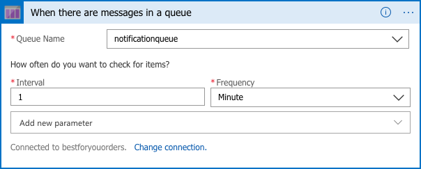

9. Select **+ New step**.

    

10. In the **Choose an action box**, enter "parse," and select **Data Operations**.

    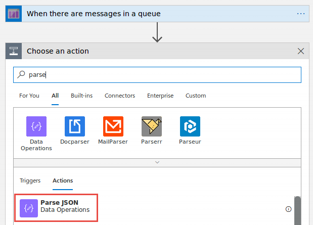

11. Under Data Operations, select **Parse JSON**.

    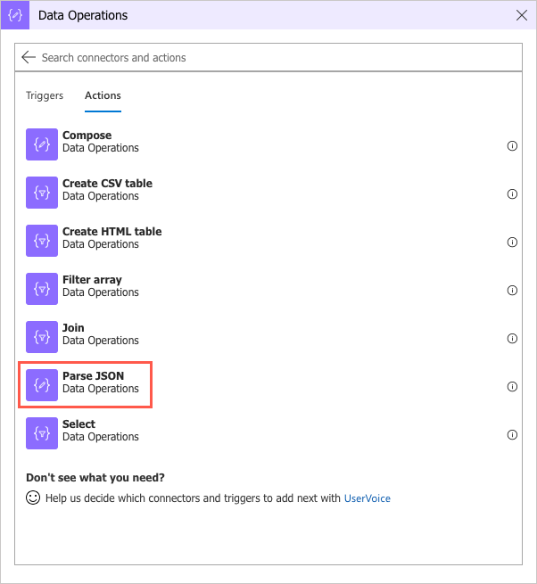

12. In the Parse JSON box, select the **Content** box, select **Add dynamic content +**, then select **Message Text** from the input parameters list that appears.

    

13. Next, select **Use sample payload to generate schema** below the **Schema** box.

    

14. In the dialog that appears, paste the following JSON into the sample JSON payload box, then select **Done**.

    ```json
    {"orderId":"5a6748c5d0d3199cfa076ed3","userId":"demouser@bfyo.com","notificationEmail":"demouser@bfyo.com","firstName":"Demo"}
    ```

    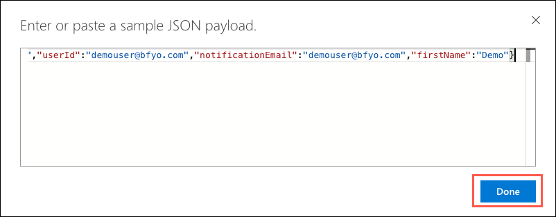

15. You will now see the Schema for messages coming from the notification queue in the Schema box.

    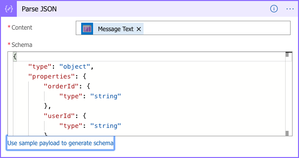

16. Select **+ New** **step**.

    

17. In the **Choose an action box**, enter "sendgrid," and select **SendGrid** under Connectors.

    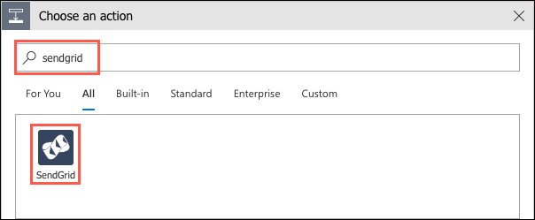

18. In the **SendGrid** connector dialog, select **Send email (V2)**.

    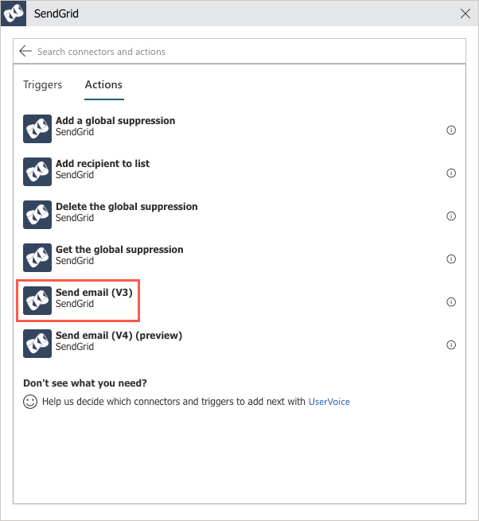

19. In the **SendGrid** box, enter the following:

    - **Connection Name**: Enter **bfyo-sendgrid**.
    - **SendGrid Api Key**: Return to the **API Key Created** screen in your SendGrid account, and then copy and paste the API key you generated.
    - Select **Create**.

    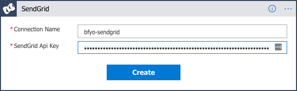

20. In the **Send email (V2)** box, enter the following:

    - **From**: Enter your email address.
    - **To**: Click in the box, select **Add dynamic content**, and then select the **notificationEmail** property. **NOTE**: If under the Parse JSON Dynamic Content section, you see a message that there were not any outputs to match the input format, select **See more** in the message.

    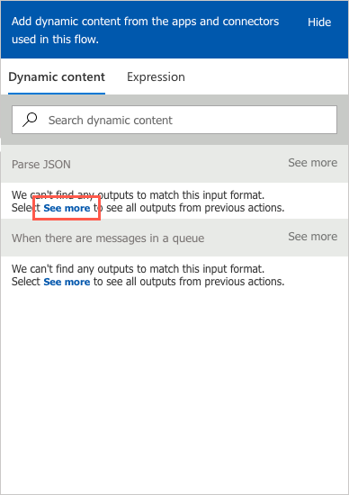

    - **Subject**: Enter "Order #: " and then select **orderId** from the dynamic content dialog.
    - **Email body**: Select **firstName** from the dynamic content dialog, and then enter ", Your Best For You Organics Company order has shipped."

    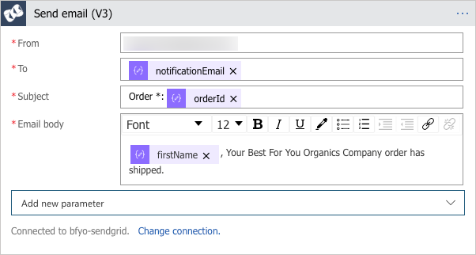)

21. Select **+ New step**.

    

22. In the **Choose an action** dialog, enter "queues" in to the search box, and select **Delete message** under Actions.

    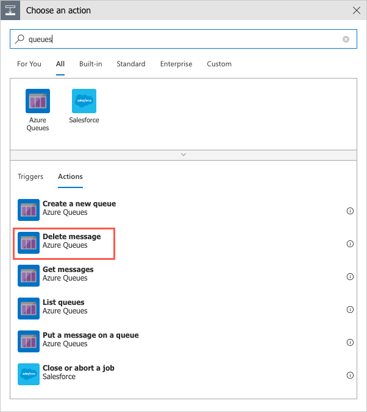

23. Select **notificationqueue** for the Queue Name.

24. For Message ID, select the **Message ID** parameter from the dynamic content parameter list.

25. For Pop Receipt, select the **Pop Receipt** parameter from the dynamic content parameter list.

    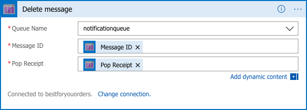

26. Select **Save** on the **Logic Apps Designer** toolbar.

    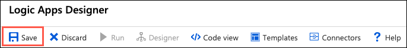

27. The Logic App will begin running immediately, so if you entered your valid email address when you registered your account in the Best for You Organics starter app, and placed an order, you should receive an email message within a minute or two of selecting Save.

    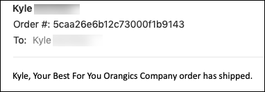

## After the hands-on lab

Duration: 10 minutes

In this exercise, you will de-provision all Azure resources that were created in support of this hands-on lab.

### Task 1: Delete Azure resource groups

1. In the Azure portal, select **Resource groups** from the left-hand menu, and locate and delete the following resource groups.

    - hands-on-lab-SUFFIX
    - jenkins-SUFFIX

### Task 2: Delete WebHooks and Service Integrations

1. In your GitHub account:

    - Delete the Jenkins service integration.
    - Delete the Personal Access Token you created for integration with VS Code.

You should follow all steps provided *after* attending the Hands-on lab.