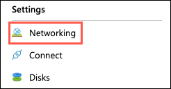
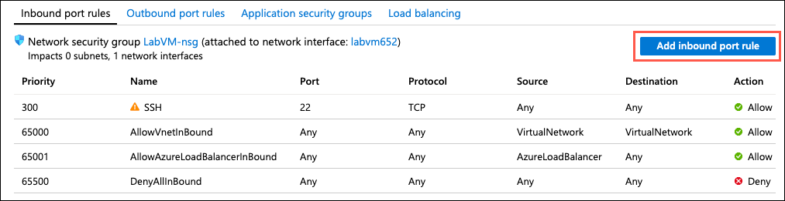
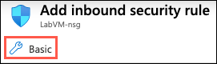
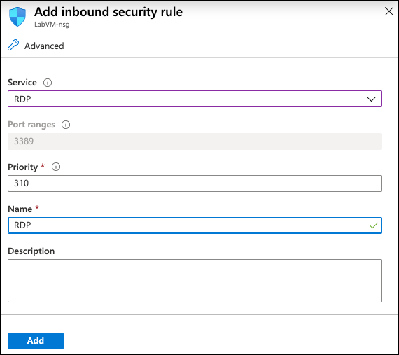
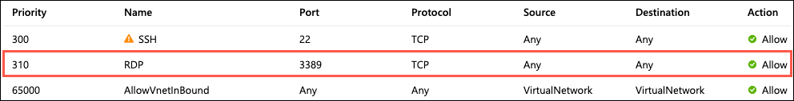

# Lab VM manual setup guide

This guide provides step-by-step instructions for manually provisioning and setting up the Lab VM used as a development machine for this lab.

June 2020

## Task 1: Create a VM config script

In this task, you create a script file that serves as a custom extension for configuring your Linux virtual machine in Azure. This script contains commands to install all the required software and configure a desktop on the Linux VM. These commands could also be run from an SSH shell manually.

1. Open a web browser and navigate to <https://raw.githubusercontent.com/Microsoft/MCW-OSS-PaaS-and-DevOps/master/Hands-on%20lab/lab-files/LabVM/labvmconfig.sh>.

2. Copy the contents displayed in the browser into a text editor, such as Visual Studio Code or Notepad, and save the file as `labvmconfig.sh`.

    > Note the location where you save the file, as you will be referencing it in the next task.

## Task 2: Create a Linux virtual machine

In this task, you will provision a Linux virtual machine (VM) running Ubuntu Server 16.04 LTS.

1. In the [Azure portal](https://portal.azure.com/), select the **Show portal menu** icon and then select **+Create a resource** from the menu.

    

2. Enter "ubuntu" into the search bar, expand **Ubuntu Server**, and select **Ubuntu Server 16.04 LTS** from the results.

    

3. On the **Ubuntu Server** blade, select **Ubuntu Server 16.04 LTS** from the Select a software plan drop-down list and then select **Create**.

    

4. Set the following configuration on the **Basics** tab:

    **Project Details**:

    - **Subscription:** Select the subscription you are using for this hands-on lab.
    - **Resource Group:** Select **Create new**, and enter "hands-on-lab-(SUFFIX)" as the name of the new resource group.

    **Instance Details**:

    - **Virtual machine name:** Enter **LabVM**
    - **Region:** Select the region you are using for this hands-on lab.
    - **Availability options**: Select **No infrastructure redundancy required**.
    - **Image**: Select **Ubuntu Server 16.04 LTS**.
    - **Size**: Select **Standard D2s v3** or **Standard E2s_v3**.

    **Administrator Account**:

    - **Authentication type:** Select **Password**.
    - **Username:** Enter **demouser**
    - **Password:** Enter **Password.1!!**
    - **Login with Azure Active Directory**: Select **Off**.

    **Inbound Port Rules**:

     - **Public inbound ports**: Select **Allow selected ports**.
     - **Select inbound ports**: Expand the list and check the box for **SSH ()**.

    

5. Select **Next: Disks** to move to the Disks tab.

6. On the **Disks** tab, ensure **Premium SSD** is selected for the **OS disk type**.

    

7. Select **Next: Networking**.

8. On the **Networking** tab, accept all the defaults and select **Next: Management**.

9. On the **Management** tab, accept all the defaults and select **Next: Advanced**.

10. On the **Advanced** tab, click on the **Select an extension to install** link.

    

11. On the **New resource** blade that appears, select **Custom Script for Linux**, and then select **Create** on the Custom Script for Linux blade.

    

12. On the **Install extension** blade:

    - **Script files**: Select the `labvmconfig.sh` file you saved in the previous task.

    - **Command**: Enter `bash labvmconfig.sh`

    - Select **OK**.

    

13. Select **OK** on the Install extension blade.

14. Select **Review + create** on the Advanced tab.

15. Select **Create** on the **Review + create** tab to provision the virtual machine.

    

16. It may take 10+ minutes for the virtual machine to finish provisioning.

### Task 2: Enable RDP connections to the LabVM

In this task, you create a firewall rule for the LabVM to open port 3389 and allow RDP connections to the virtual machine.

1. When the LabVM finishes provisioning, navigate to the [Azure portal](https://portal.azure.com) and select **Resource groups** from the Azure services list.

    

2. Select the hands-on-lab-SUFFIX resource group from the list.

    

3. Select **LabVM** from the list of available resources.

    

4. On the **LabVM** blade, select **Networking** under Settings in the left-hand menu.

    

5. On the **Networking** blade, select **Add inbound port rule.**

    

6. On the Add inbound security rule dialog, select **Basic**.

    

7. Next, enter the following into the Basic form:

    - **Service**: Select RDP.
    - **Port ranges**: 3389 will be entered by the Service selection.
    - **Priority**: Accept the default priority value (310).
    - **Name**: Enter RDP

    

8. Select **Add**. The new rule will be added to the list.

    
