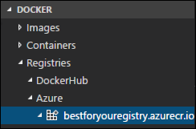

<div class="MCWHeader1">
OSS PaaS and DevOps
</div>

<div class="MCWHeader2">
Hands-on lab unguided
</div>

<div class="MCWHeader3">
August 2018
</div>

Information in this document, including URL and other Internet Web site references, is subject to change without notice. Unless otherwise noted, the example companies, organizations, products, domain names, e-mail addresses, logos, people, places, and events depicted herein are fictitious, and no association with any real company, organization, product, domain name, e-mail address, logo, person, place or event is intended or should be inferred. Complying with all applicable copyright laws is the responsibility of the user. Without limiting the rights under copyright, no part of this document may be reproduced, stored in or introduced into a retrieval system, or transmitted in any form or by any means (electronic, mechanical, photocopying, recording, or otherwise), or for any purpose, without the express written permission of Microsoft Corporation.

Microsoft may have patents, patent applications, trademarks, copyrights, or other intellectual property rights covering subject matter in this document. Except as expressly provided in any written license agreement from Microsoft, the furnishing of this document does not give you any license to these patents, trademarks, copyrights, or other intellectual property.

The names of manufacturers, products, or URLs are provided for informational purposes only and Microsoft makes no representations and warranties, either expressed, implied, or statutory, regarding these manufacturers or the use of the products with any Microsoft technologies. The inclusion of a manufacturer or product does not imply endorsement of Microsoft of the manufacturer or product. Links may be provided to third party sites. Such sites are not under the control of Microsoft and Microsoft is not responsible for the contents of any linked site or any link contained in a linked site, or any changes or updates to such sites. Microsoft is not responsible for webcasting or any other form of transmission received from any linked site. Microsoft is providing these links to you only as a convenience, and the inclusion of any link does not imply endorsement of Microsoft of the site or the products contained therein.

© 2018 Microsoft Corporation. All rights reserved.

Microsoft and the trademarks listed at <https://www.microsoft.com/en-us/legal/intellectualproperty/Trademarks/Usage/General.aspx> are trademarks of the Microsoft group of companies. All other trademarks are property of their respective owners.

**Contents**

- [OSS PaaS and DevOps hands-on lab unguided](#oss-paas-and-devops-hands-on-lab-unguided)
  - [Abstract and learning objectives](#abstract-and-learning-objectives)
  - [Overview](#overview)
  - [Solution architecture](#solution-architecture)
  - [Requirements](#requirements)
  - [Exercise 1: Run starter application](#exercise-1-run-starter-application)
    - [Task 1: Connect to your Lab VM](#task-1-connect-to-your-lab-vm)
    - [Task 2: Grant permissions to Docker](#task-2-grant-permissions-to-docker)
    - [Task 3: Integrate GitHub into VS Code](#task-3-integrate-github-into-vs-code)
    - [Task 4: Clone the starter application](#task-4-clone-the-starter-application)
    - [Task 5: Launch the starter application](#task-5-launch-the-starter-application)
  - [Exercise 2: Migrate the database to Cosmos DB](#exercise-2-migrate-the-database-to-cosmos-db)
    - [Task 1: Provision Cosmos DB using the MongoDB API](#task-1-provision-cosmos-db-using-the-mongodb-api)
    - [Task 2: Update database connection string](#task-2-update-database-connection-string)
    - [Task 3: Pre-create and scale collections](#task-3-pre-create-and-scale-collections)
    - [Task 4: Import data to the API for MongoDB using mongoimport](#task-4-import-data-to-the-api-for-mongodb-using-mongoimport)
    - [Task 5: Install Azure Cosmos DB extension for VS Code](#task-5-install-azure-cosmos-db-extension-for-vs-code)
    - [Task 6: Decrease collection throughput](#task-6-decrease-collection-throughput)
  - [Exercise 3: Containerize the app](#exercise-3-containerize-the-app)
    - [Task 1: Create an Azure Container Registry](#task-1-create-an-azure-container-registry)
    - [Task 2: Install Docker extension in VS Code](#task-2-install-docker-extension-in-vs-code)
    - [Task 3: Create Docker image and run the app](#task-3-create-docker-image-and-run-the-app)
    - [Task 4: Run the containerized App](#task-4-run-the-containerized-app)
    - [Task 5: Push image to Azure Container Registry](#task-5-push-image-to-azure-container-registry)
  - [Exercise 4: Set up Web App for Containers](#exercise-4-set-up-web-app-for-containers)
    - [Task 1: Provision Web App for Containers](#task-1-provision-web-app-for-containers)
    - [Task 2: Navigate to the deployed app](#task-2-navigate-to-the-deployed-app)
  - [Exercise 5: Configure CI/CD pipeline](#exercise-5-configure-cicd-pipeline)
    - [Task 1: Prepare GitHub account for service integrations](#task-1-prepare-github-account-for-service-integrations)
    - [Task 2: Open connection to Jenkins](#task-2-open-connection-to-jenkins)
    - [Task 3: Configure Continuous Integration with Jenkins](#task-3-configure-continuous-integration-with-jenkins)
    - [Task 4: Trigger CI build](#task-4-trigger-ci-build)
    - [Task 5: Install Docker on the Jenkins VM](#task-5-install-docker-on-the-jenkins-vm)
    - [Task 6: Add an Azure service principal for Jenkins](#task-6-add-an-azure-service-principal-for-jenkins)
    - [Task 7: Add continuous delivery to Jenkins build job](#task-7-add-continuous-delivery-to-jenkins-build-job)
    - [Task 8: Trigger CI-CD pipeline](#task-8-trigger-ci-cd-pipeline)
  - [Exercise 6: Create Azure Function for order processing](#exercise-6-create-azure-function-for-order-processing)
    - [Task 1: Provision a Function App](#task-1-provision-a-function-app)
    - [Task 2: Configure storage queues](#task-2-configure-storage-queues)
    - [Task 3: Create Cosmos DB trigger function](#task-3-create-cosmos-db-trigger-function)
    - [Task 4: Create Queue function](#task-4-create-queue-function)
  - [Exercise 7: Create Logic App for sending SMS notifications](#exercise-7-create-logic-app-for-sending-sms-notifications)
    - [Task 1: Create Free Twilio account](#task-1-create-free-twilio-account)
    - [Task 2: Create Logic App](#task-2-create-logic-app)
  - [After the hands-on lab](#after-the-hands-on-lab)
    - [Task 1: Delete Azure resource groups](#task-1-delete-azure-resource-groups)
    - [Task 2: Delete WebHooks and Service Integrations](#task-2-delete-webhooks-and-service-integrations)

# OSS PaaS and DevOps hands-on lab unguided

## Abstract and learning objectives

In this hands-on lab, you will implement a solution for integrating and deploying complex Open Source Software (OSS) workloads into Azure PaaS. You will migrate an existing MERN (MongoDB, Express.js, React.js, Node.js) stack application from a hosted environment into Azure Web App for Containers, migrate a MongoDB instance into Cosmos DB, enhance application functionality using serverless technologies, and fully embrace modern DevOps tools.

At the end of this hands-on lab, you will be better able to migrate and deploy OSS applications into Azure PaaS using modern DevOps methodologies and Docker containers.

## Overview

Best For You Organics Company is one of the leading health food suppliers in North America, serving customers in Canada, Mexico, and the United States. They have a MERN stack web application which they host on-premises and are looking to migrate their OSS application into Azure. They will be creating a custom Docker image for their application and using a Jenkins continuous integration/continuous delivery (CI/CD) pipeline to deploy the application into a Web App for Containers instance. In addition, they will be setting up Azure Cosmos DB, using the MongoDB APIs, so they do not have to make application code changes to leverage the power of Cosmos DB.

In this hands-on lab, you will assist with completing the OSS application and database migrations into Azure. You will create a custom Docker image, provision an Azure Container Registry, push the image to the registry, and configure the CI/CD pipeline to deploy the application to a Web App for Containers instance. You will also help them implement functionality enhancements using serverless architecture services in Azure.

## Solution architecture

Below is a diagram of the solution architecture you will build in this lab. Please study this carefully, so you understand the whole of the solution as you are working on the various components.

![This diagram consists of icons that are connected by arrows. On the left, the Developer icon (VS Code) points in a linear fashion to the GitHub Repo and Jenkins icons. The previous two icons are enclosed in a box labeled CI/CD Pipeline. Jenkins points to Web App for Containers on the right. Various arrows point from Web App for Container to: Azure Container Registry (a double-sided arrow); Logic Apps (a linear arrow that also points from Logic Apps to Customers); Customers (a linear arrow); and Azure Cosmos DB (a double-sided arrow that also points from Azure Cosmos DB to Azure Functions with another double-sided arrow).](media/solution-architecture-diagram.png "Solution architecture diagram")

The solution begins with developers using Visual Studio Code (VS Code) as their code editor, so they can leverage its rich integration with GitHub, Docker, and Azure. From a high level, developers will package the entire OSS application inside a custom Docker container using the Docker extension in VS Code. The image will be pushed to an Azure Container Registry as part of a continuous integration/continuous delivery (CI/CD) pipeline using GitHub and Jenkins. This Docker image will then be deployed to a Web App for Containers instance, as part of their continuous delivery process using The Azure App Service Jenkins plugin.

The MongoDB database will be imported into Azure Cosmos DB, using mongoimport.exe, and access the database from the application will continue to use the MongoDB APIs. The database connection string in the application will be updated to point to the new Cosmos DB.

Serverless architecture will be applied to order processing and customer notifications. Azure Functions will be used to automate the processing of orders. Logic Apps will be applied to send SMS notifications, via a Twilio connector, to customers informing them that their order has been processed and shipped.

## Requirements

1. Microsoft Azure subscription must be pay-as-you-go or MSDN
    - Trial subscriptions will *not* work.
2. Linux virtual machine configured with:
    - Visual Studio Code
    - Azure CLI
    - Docker
    - Node.js and npm
    - MongoDB Community Edition

## Exercise 1: Run starter application

Duration: 30 minutes

In this exercise, you will create a local copy of the starter application on your Lab VM, add some sample data to the local MongoDB database, and run the application.

### Task 1: Connect to your Lab VM

In this task, you will create an RDP connection to your Lab VM.

#### Tasks to complete

- Use a remote desktop client (RDP) application to connect to your Lab VM.

#### Exit criteria

- You have an open RDP connection to your Lab VM.

### Task 2: Grant permissions to Docker

In this task, you will grant permissions to the demouser account to access the Unix socket needed to communicate with the Docker engine.

#### Tasks to complete

- Execute a command to grant permissions to Docker for the current user:
  - sudo usermod -a -G docker $USER

#### Exit criteria

- You can successfully run the following:
  - docker run hello-world

### Task 3: Integrate GitHub into VS Code

In this task, you will install the GitHub extension in VS Code, and configure a service integration with your GitHub account. This integration will allow you to push your code changes to GitHub directly from VS Code.

#### Tasks to complete

- Install the GitHub extension in VS Code.
- Generate a Personal access token in GitHub, and add it to VS Code.

#### Exit criteria

- Your GitHub account is successfully connected within VS Code.

### Task 4: Clone the starter application

In this task, you will add the Containers and Hyper-V features to your Windows installation, and install Docker.

#### Tasks to complete

- Clone the `mcw-oss-paas-devops` starter application on your Lab VM.
- Register your GitHub email address with the local repository.
- Open the `mcw-oss-paas-devops` project in VS Code.

#### Exit criteria

- You have a local copy of the `mcw-oss-paas-devops` starter project open on your Lab VM in VS Code.

### Task 5: Launch the starter application

In this task, you will seed the MongoDB with sample data, then run the application locally, connected to your MongoDB instance. This task is to verify the connection to MongoDB and that it contains the seeded plan data, before we migrate the application and data to Azure Cosmos DB.

#### Tasks to complete

- Run npm install to set up your local copy of the starter application.
- Use node to execute the database seeding script (located in the project at data/Seed.js.
- Start the application.

#### Exit criteria

- You can view the starter application by navigating to <http://localhost:3000>.

    

## Exercise 2: Migrate the database to Cosmos DB

Duration: 30 minutes

In this exercise, you will provision an Azure Cosmos DB account, and then update the starter application's database connection string to point to your new Azure Cosmos DB account. You will then, use *mongoimport.exe* to migrate the data in your MongoDB database into Cosmos DB collections, and verify with the application that you are connected to your Cosmos DB database.

### Task 1: Provision Cosmos DB using the MongoDB API

In this task, you will provision a new Azure Cosmos DB account using the MongoDB API.

#### Tasks to complete

- Create an Azure Cosmos DB account, named best-for-you-db, using the MongoDB API.

#### Exit criteria

- You can navigate to your Cosmos DB account in the Azure portal.

### Task 2: Update database connection string

In this task, you will retrieve the connection string for your Azure Cosmos DB database, and update the starter application's database connection string.

#### Tasks to complete

- Retrieve the primary connection string for you Azure Cosmos DB account from the azure portal.
- Update the databaseUrl variable in *app.js* to the connection string for your Azure Cosmos DB.
- Insert the database name, best-for-you-organics, into the connection string.

#### Exit criteria

- Your app is connected to a database named best-for-you-organics, in your Azure Cosmos DB account. The plans will be gone from the home page since no data has been added to the Cosmos DB yet.

    

### Task 3: Pre-create and scale collections

In this task, you will create the collections needed for your database migration, and increase each collections' throughput from the default 1,000 RUs to 2,500 RUs. This is done to avoid throttling during the migration, and reduce the time required to import data.

#### Tasks to complete

- Add collections to the best-for-you-organics database Cosmos DB for plans, users, and orders with a throughput of 2500 RUs.

#### Exit criteria

- You have all the required collections in the Cosmos DB database.

### Task 4: Import data to the API for MongoDB using mongoimport

In this task, you will use `mongoimport.exe` to import data to your Cosmos DB account.

#### Tasks to complete

- Export the data from your local MongoDB instance into JSON files using `mongoexport.exe`.

- Import the data into your Azure Cosmos DB account using `mongoimport.exe`.

- Stop your local MongoDB instance.

#### Exit criteria

- The seed data from your local MongoDB is visible in your Cosmos DB instance, and is served up in the application page in a browser.
- MongoDB is no longer running on your Lab VM.

### Task 5: Install Azure Cosmos DB extension for VS Code

In this task, you will install the Azure Cosmos DB extension for VS Code, to take advantage of the integration with Azure Cosmos DB. This extension allows you to view and interact with your Cosmos DB databases, collections, and documents directly from VS Code.

#### Tasks to complete

- Install the Azure Cosmos DB extension in VS Code.

#### Exit criteria

- You can view the best-for-you-organics database and collections in VS Code.

### Task 6: Decrease collection throughput

In this task, you will decrease the throughput on your collections. Azure Cosmos DB uses an hourly billing rate, so reducing the throughput after the data migration will help save costs.

#### Tasks to complete

- Decrease the throughput for each collection in the best-for-you-organics database to 400 RUs.

#### Exit criteria

- You have scaled down the throughput for each of your collections.

## Exercise 3: Containerize the app

Duration: 30 minutes

This exercise walks you through containerizing an existing MERN application using Docker, pushing the image to an Azure Container Registry, then deploying the image to Web App for Containers directly from VS Code.

### Task 1: Create an Azure Container Registry

In this task, you will be creating a private Docker registry in the Azure portal, so you have a place to store the custom Docker image you will create in later steps.

#### Tasks to complete

- Provision a basic Azure Container Registry, named bestforyouregistrySUFFIX, with the admin user enabled.

#### Exit criteria

- You can navigate to the Azure Container Registry in the Azure portal.

### Task 2: Install Docker extension in VS Code

The Docker extension for VS Code is used to simplify the management of local Docker images and commands, as well as the deployment of a built app image to Azure.

#### Tasks to complete

- Install the Docker extension in VS Code.

#### Exit criteria

- You can view your Azure Container Registry in the Docker extension in VS Code.

    

### Task 3: Create Docker image and run the app

In this task, you will use VS Code, and the Docker extension, to add the necessary files to the project to create a custom Docker image for the `mcw-oss-paas-devops` app.

#### Tasks to complete

- Using the Docker tools in VS Code, add Docker files to your workspace.

- Build a Docker image from the Dockerfile, with a name in the format \[registry\]/\[image name\]:\[tag\], so it is ready to be pushed to your Azure Container Registry.

#### Exit criteria

- View the image in the Docker extension in VS Code.

    

### Task 4: Run the containerized App

In this task, you will run the app from the container you built in the previous task.

#### Tasks to complete

- Run the containerized app in interactive mode.

#### Exit criteria

- You can use a browser to navigate to the containerized app at <http://localhost:3000>.

### Task 5: Push image to Azure Container Registry

In this task, you are going to push the image to your Azure Container Registry.

#### Tasks to complete

- Push the image to your Azure Container Registry.

#### Exit criteria

- You can view your image in your Azure Container Registry's repositories.

    

## Exercise 4: Set up Web App for Containers

Duration: 10 minutes

In this exercise, you will deploy the containerized app to a Web App for Containers instance from the image stored in your Azure Container Registry.

### Task 1: Provision Web App for Containers

#### Tasks to complete

- Provision a Web App for Containers instance in the Azure portal, named best-for-you-app-SUFFIX.
  - Set the image source as best-for-you-organics image in your Azure Container Registry, using the latest tag.

#### Exit criteria

- You can navigate to the provisioned App Service in the Azure portal, and view the Docker Container details.

### Task 2: Navigate to the deployed app

In this task, you will navigate to the deployed app, and log in to verify it is functioning correctly.

#### Tasks to complete

- Using a web browser, navigate to the URL for your App Service.

#### Exit criteria

- You can successfully sign in to the site with the following credentials to verify everything is working as expected.

  - <demouser@bfyo.com>
  - Password.1!!

    

## Exercise 5: Configure CI/CD pipeline

Duration: 60 minutes

In this exercise, you are going to use Jenkins to implement a continuous integration (CI) and continuous delivery (CD) pipeline to deploy the containerized MERN app to Web App for Containers.

### Task 1: Prepare GitHub account for service integrations

In this task, you will be adding a Jenkins service integration into your GitHub account. This integration will enable a Jenkins CI build job to be triggered when code is checked in to your GitHub repository.

#### Tasks to complete

- Add a Jenkins (GitHub plugin) service integration into GitHub for your Jenkins server.
- Add a deploy key in GitHub, using an ssh key generated on your Jenkins server.

#### Exit criteria

- You can successfully connect to your Jenkins server from GitHub using the command: `ssh git\@github.com`.

### Task 2: Open connection to Jenkins

In this task, you will create an SSH tunnel to the Jenkins server, and configure the Jenkins server for use with the MERN application.

#### Tasks to complete

- Navigate to your Jenkins server in a web browser, using the DNS name of your Jenkins server.
- Set up an SSH tunnel to Jenkins on port 8080.
- Configure your Jenkins server, installing recommended plugins.
- Add the NodeJS plug-in to your Jenkins server.
  - Configure the NodeJS installation to install automatically.

#### Exit criteria

- You can navigate to <http://localhost:8080> on your Lab VM, and login to Jenkins.

    

### Task 3: Configure Continuous Integration with Jenkins

In this task, you will set up a simple Jenkins continuous integration (CI) pipeline, which will build the `mcw-oss-paas-devops` application with every code commit into GitHub.

#### Tasks to complete

- Create a new freestyle project in Jenkins named best-for-you-build.
  - Specify it as a GitHub project, pointing to the `mcw-oss-paas-devops` project in your GitHub account.
  - Add Git as the source code repository, and point to the `mcw-oss-paas-devops` project in your GitHub account.
  - Add a GitHub hook build trigger for GITScm polling.
  - Add a build environment setting to provide the node and npm /bin folder to PATH.
  - Add an execute shell build action to run:
    - `npm install`
    - `npm run build`

#### Exit criteria

- You have saved the build project in Jenkins.

### Task 4: Trigger CI build

In this task you will commit your pending changes in VS Code to you GitHub repo, and trigger the Jenkins CI build job.

#### Tasks to complete

- Commit the pending changes in the `mcw-oss-paas-devops` project in VS Code, and push them to your GitHub repo.

#### Exit criteria

- You can see the commit and associated build job in Jenkins.

    

### Task 5: Install Docker on the Jenkins VM

In this task, you will install Docker CE on your Jenkins VM, so it can be used to build images from the build artifacts produced by your CI build.

#### Tasks to complete

- Install Docker CE on your Jenkins VM.
- Add permissions to the `jenkins` users to Docker on your Jenkins VM.
- Restart the Jenkins service.

#### Exit criteria

- You can run `sudo docker run hello-world` successfully on your Jenkins VM.

### Task 6: Add an Azure service principal for Jenkins

In this task, you will create an Azure Active Directory (Azure AD) application and service principal (SP) that will provide the Jenkins CD pipeline access to Azure resources. You will grant the SP permissions to the hands-on-lab-SUFFIX resource group.

#### Tasks to complete

- Create a new registered app and service principal in Azure Active Directory for Jenkins.
- Create a new key for the app.
- Add Contributor access control permissions to the app for your resource group.

#### Exit criteria

- You have copied the Application Id and key for your application service principal.

### Task 7: Add continuous delivery to Jenkins build job

In this task, you will use the [Azure App Service Jenkins plugin](https://plugins.jenkins.io/azure-app-service) to add continuous deployment (CD) to the Jenkins build pipeline. This will use a post-build action to create a Docker new image from the build, push that image to your Azure Container Registry, and deploy the image to your Web App for Containers instance. This post-build action will run under the credentials of the SP you created in the previous task.

#### Tasks to complete

- Add a post-build action to your Jenkins best-for-you-build project to publish an Azure Web App.
- Configure the post-build action to:
  - Use your service principal credentials
  - Connect to your Azure Container Registry
  - Publish via Docker

#### Exit criteria

- Your Jenkins build job has been updated to deploy a Docker image to your web app.

### Task 8: Trigger CI/CD pipeline

In this task, you will commit changes to the `mcw-oss-paas-devops` starter application and trigger the full CI/CD pipeline through Jenkins, resulting in the updated application being added to a new Docker image, pushed to ACR, and deployed to Web App for Containers.

#### Tasks to complete

- Update your `.dockerignore` file so Dockerfile is not ignored.
- Add the following header to the src/components/plan/Plan.js file, just above the Grid containing plans:

    ```html
    <h3>Welcome to Best For You Organics Company</h3>
    ```

- Push the changes to your GitHub account.

#### Exit criteria

- The CI/CD pipeline completes successfully, and your app is updated.
- You can see the updated header in the browser window.

    

## Exercise 6: Create Azure Function for order processing

Duration: 45 minutes

In this task, you will create an Azure Function that will be triggered by orders being added to the Orders collection in Azure Cosmos DB. This Function will trigger whenever a document in the orders collection is inserted or updated. The function checks the processed field on the order document, ensuring only unprocessed orders are sent to the processing queue.

### Task 1: Provision a Function App

In this task, you will create a Function App in Azure, which will host your Functions.

#### Tasks to complete

- Create a Function App in the Azure portal.

#### Exit criteria

- You can navigate to your Function App in the Azure portal.

### Task 2: Configure storage queues

In this task, you will add two storage queues to the storage account provisioned when you created your Function App. These queues will be used to store orders and notifications needing to be processed.

#### Tasks to complete

- Create storage queues in the storage account associated with your Function App:
  - orderqueue
  - notificationqueue

#### Exit criteria

- You created the two queues.

### Task 3: Create Cosmos DB trigger function

In this task, you will create a function that will be triggered whenever a document is inserted into the orders collection in your Azure Cosmos DB. This function sends all new orders to a queue for processing and shipping. This function will use a Cosmos DB trigger and an output binding to an Azure Storage Queue.

#### Tasks to complete

- Create a Cosmos DB trigger function, named OrdersCosmosTrigger.
  - Connect to your Cosmos DB account.
  - Collection name: orders (case sensitive)
  - Rename the Document collection parameter to newOrders.
  - Add an Azure Storage Queues output:
    - Name: outputQueue
    - Queue name: orderqueue (case sensitive)
  - Get the code for the OrdersCosmosTrigger function from the OrdersCosmosTrigger.js in the AzureFunctions folder in VS Code.
- Sign into the app, and place an order:
  - Email address: <demouser@bfyo.com>
  - Password: Password.1!!
- Update on order directly in Cosmos DB, setting the processed field to true.

#### Exit criteria

- You can see items processing through the OrdersCosmosTrigger function logs.

    

- Verify items are being written to the order queue in the Azure Storage account.

    

### Task 4: Create Queue function

In this task, you will create a second function which will be triggered the output of the OrdersCosmosTrigger function. This will simulate the order processing, and will add items to the notificationqueue, if the order processing is complete, and sendNotifications is true for the order.

This will use an Azure Storage Queue trigger, and an input dataset from Cosmos DB, pulling in customers. Output dataset will be Azure Cosmos DB orders table, and an update to set processed = true, and the processedDate to today.

#### Tasks to complete

- Add a Queue trigger Function, using the output from the OrdersCosmosTrigger as its trigger:
  - Name: ProcessOrders
  - Queue name: orderqueue (case sensitive)
  - Rename the Message parameter name to orderToProcess.
  - Add an Azure Cosmos DB input, connected to the users collection in your Cosmos DB.
  - Add an Azure Queue Storage output:
    - Message parameter name: outputQueue
    - Queue name: notificationqueue (case sensitive)
  - Get the code for the ProcessOrders function from VS Code, in the AzureFunctions folder, select ProcessOrders.js.
- Register a new account in the app, and use a cell phone number where you can receive text message in the phone field.
-  Sign in and place an order.

#### Exit criteria

- Verify you can see the ProcessOrders Function processing records in the Azure portal.

    

## Exercise 7: Create Logic App for sending SMS notifications

Duration: 30 minutes

In this exercise you will create Logic App which will trigger when an item is added to the notificationqueue Azure Storage Queue. The Logic App will use a Twilio connection to send an SMS message to the phone number included in the notificationqueue message.

### Task 1: Create Free Twilio account

In this task, you will use a free Twilio account to send SMS notifications to customers, informing them that their order has been processed, and is on its way.

#### Tasks to complete

- Create a free Twilio account at <https://www.twilio.com/try-twilio>.
- Get a free phone number with SMS capabilities.

#### Exit criteria

- You have a Twilio phone number.

### Task 2: Create Logic App

In this task, you will create a new Logic App, which will use the Twilio connector to send SMS notifications to users, informing them that their weekly order has processed and shipped.

#### Tasks to complete

- Provision a Logic App in the Azure portal, named OrderNotifications.
- Create a new blank Logic App in the designer.
  - Add an Azure Queue connector, which triggers when there are messages in the queue.
  - Connect to the notificationqueue in your Function App's storage account.
  - Check for new messages every 1 minute.
- Add a Data Operations -- Parse JSON action.
  - Set the content to the Message Text from the notificationqueue messages.
  - Generate a schema by using one of the messages in the notificationqueue as a template.
- Add a Twilio -- Send Text Message (SMS) action.
  - Connect to your Twilio account.
  - Set the From phone number to your Twilio phone number.
  - Set the To phone number to the notificationPhone parameter from the Parse JSON action.
  - Set the Text to "Hello \[firstName\], your Best for You Organics weekly order has shipped!
    - \[firstName\] is the firstName parameter from the Parse JSON action.
- Add an Azure Queues -- Delete Message action.
  - Queue name: notificationqueue
  - Set the Message ID to the Message ID parameter from the When there are messages in the queue action.
  - Set the Pop Receipt to the Pop Receipt parameter from the When there are messages in the queue action.

#### Exit criteria

- You receive a text message when you place in order from the account with your cell phone number.

## After the hands-on lab

Duration: 10 minutes

In this exercise, you will de-provision all Azure resources that were created in support of this hands-on lab.

### Task 1: Delete Azure resource groups

1. In the Azure portal, select **Resource groups** from the left-hand menu, and locate and delete the following resource groups:

    - hands-on-lab-SUFFIX
    - jenkins-SUFFIX

### Task 2: Delete WebHooks and Service Integrations

1. In your GitHub account:

    - Delete the Jenkins service integration.
    - Delete the Personal Access Token you created for integration with VS Code.

You should follow all steps provided *after* attending the Hands-on lab.
